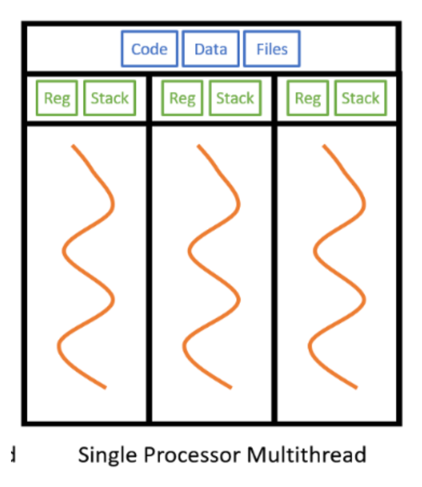

# Node.js의 내부

<details>
<summary>Node..js가 작업을 처리하는 방법</summary>

> 런타임 환경에서 1+1 같은 자바스크립트로 처리할 수 있는 작업은 v8 엔진을 통해서 하게 된다. <br/>
> 하지만 파일을 읽는 것과 같은 작업은 v8 엔진으로 할 수 없다. <br/>
> 그래서 이러한 부분은 libuv를 통해서 작업한다.


#### 만약 인터넷에 있는 어떤 파일을 다운로드해야 한다면?


---

### 간단 요약

- v8이 코드를 해석하고 Node.js APIs들 중 하나의 함수를 호출하고 Node.js 바인딩을 통해 libuv에 의해 원하는 작업을 처리하게 된다.
  

</details>

<details>
<summary>libuv</summary>

### libuv(유티콘 벨로시티랩터 라이브러리)

- 이벤트 루프를 기반으로 하는 비동기 I/O에 대한 지원을 제공하는 다중 플랫폼 C 라이브러리이다.
- 주로 Node.js에서 사용하도록 개발되었지만 Julia, Luvit, pyuv 등과 같은 다른 도구에서도 사용된다.
- Node.js는 이 라이브러리를 사용하여 지원되는 모든 플랫폼에서 통합 인터페이스로 I/O 작업을 추상화한다.
- 즉 libuv를 쓰면 각 플랫폼(window, mac, linux,...)의 가장 빠른 비동기 IO 인터페이스로 통일된 코드로 돌릴 수 있는 장점이 있다.
- 이 라이브러리는 파일 시스템, DNS, 네트워크, 파이프, 신호 처리, 폴링 및 스트리밍을 처리하는 메커니즘을 제공한다.

### [libuv](https://github.com/libuv/libuv) 오픈 소스 코드에서 어떤 식으로 돌아가는지 살펴보면


- 원래 unix랑 window와 파일을 컨트롤하는 방법이 다르지만 이런 식으로 libuv에서 서로 compatible 하게 해주기 때문에 노드를 사용하는 사람은 따로 신경 쓰지 않고 unix, window에서 같은 방법으로 사용할 수 있다.

</details>

<details>
<summary>비동기와 동기란?</summary>

1. 동기 : Synchronous 시간을 맞춤
2. 비동기 : Asynchronous 시간을 맞추지 않음

#### 동기와 비동기의 차이점

- 동기는 먼저 이전의 것이 끝나야 다음 것을 할 수 있지만 비동기는 1번을 하면서 2번을 할 수 있고, 3번, 4번도 할 수 있다.
  

### 코드로 보는 ASYNC & SYNC

#### SYNC

```javascript
console.log("1");
console.log("2");

/* node test.js
1
2
*/
```

#### ASYNC

```javascript
setTimeout(() => {
  console.log("1");
}, 1000);
console.log("2");

/* node test.js
2
1
*/
```

### Node.js에서 비동기를 주로 사용함

- Node.js에서 비동기를 주로 사용한다.
- 데이터베이스에서 데이터를 읽을 때, 저장할 때, 지울 때 등 대부분의 요청이 비동기로 이루어진다.
  - 대부분의 작어빙 어느 정도의 시간을 요하기 때문
- 이로 인해 여러 개의 작업을 해도 다른 작업을 기다리지 않고 빠르게 여러 작업을 처리할 수 있다.

</details>

<details>
<summary>Javascript는 Synchronous 언어</summary>

### Javascript는 동기 언어이다.

- 자바스크립트는 한 줄 실행하고 또 다음 줄 실행하는 동기 언어이다.
- 하지만 콜백 함수를 힐행하는 비동기 코드를 자주 사용하는데 이는 어떻게 된 것일까?

```javascript
setTimeout(() => {
  console.log("1");
}, 1000);
console.log("2");
```

- 위의 코드를 보면 setTimeout은 사실 자바스크립트의 부분이 아니다.
- 브라우저에서 사용 할 경우 브라우저 api(window object)를 사용하고, Node에서 사용할 경우 Node api(global object)를 사용하는 것이다.
- 결과적으로 자바스크립트는 비동기처럼 사용할 수 있지만, 다른 것의 도움을 받아 비동기 처리를 하는 것이다.

</details>

<details>
<summary>Blocking, Non-Blocking in Node.js</summary>

### [Blocking & Non-Blocking](https://nodejs.org/en/docs/guides/blocking-vs-non-blocking/)

#### Blocking

- Blocking은 Node.js 프로세스에서 추가 Javascript 실행이 Javascript가 아닌 작업이 완료될 때까지 기다려야 하는 경우이다.
- 이는 Blocking 작업이 발생하는 동안 이벤트 루프가 Javascript를 계속 실행할 수 없기 때문에 발생한다.
  

#### Blocking Function

- JSON.stringfy 함수와 window.alert는 Blocking 함수이다.
- 해당 작업을 마쳐야 다음 작업을 수행할 수 있다.

#### Node.js에 있는 Blocking 메소드


- Node.js 표준 라이브러리의 모든 I/O 메서드는 non-blocking 및 callback 함수를 허용하는 비동기 버전을 제공한다.
- 일부 메서드에는 이름이 Sync로 끝나는 차단 상대도 있다.

#### Non-Blocking Method 사용


- 첫 번째 예는 두 번째 예보다 간단해 보이지만 두 번째 줄이 전체 파일을 읽을 때까지 추가 JavaScript 실행을 차단하는 단점이 있다.
- 동기식 버전에서는 오류가 발생하면 이를 잡아야 하며 그렇지 않으면 프로세스가 중단된다.
- 비동기 버전에서 표시된 대로 오류를 발생시켜야 하는지 여부는 작성자가 결정한다.

#### Blocking 코드와 Non-Blocking 코드를 함께 사용할 때 발생할 수 있는 문제


- 위의 예제에서 fs.unlinkSync()는 실제로 읽히기 전에 file.md를 삭제하는 fs.readFile()보다 먼저 실행될 가능성이 높다.
  - 의도 : 파일 읽기 -> 파일 지우기
  - 실제 : 파일 지우기 -> 파일 읽기


- 위의 내용은 올바른 작업 순서를 보장하는 fs.readFile()의 콜백 내에서 fs.unlink()에 대한 non-blocking 호출을 배치한다.

#### CPU Non-Blocking

- cpu도 보면 자신이 일을 하는 것보다는 파일을 읽는 것 같은 경우 하드 디스크에게 일을 시키고, 인터넷에서 다른 디바이스들과 소통하는 것들은 네트워크 카드를 통해 일을 처리한다.
- 결국 CPU는 기다리는 일을 하고 직접 일하는 것은 다른 것들이 한다.
- 이게 바로 non-block, asynchronous라 볼 수 있다.
- 이 덕분에 CPU를 더 효율적으로 사용할 수 있게 된다.

</details>

<details>
<summary>프로세스 및 스레드</summary>

> 앞으로 Node.js가 한 번에 여러 가지 일을 처리할 수 있는 방법에 대해 계속해서 알아보자.
> 그 전에 스레드에 대한 개념을 알면 좋다. 따라서 스레드와 프로세스를 함께 알아보도록 하자


### 프로세스와 스레드란 무엇인가?

#### 프로세스(Process)

- 컴퓨터가 구글 크롬 프로그램을 실행하든 카카오톡 프로그램을 실행하든 어떠한 일을 하고 있는 상태를 프로세스라고 한다.
- 프로세서(Processors)가 프로세스(process)를 하나씩 조금씩 빠르게 처리해서 같이 모든 프로세스를 처리하는 것처럼 보이는 동시성과 여러개의 프로세서가 여러 개의 프로세스를 각각 동시에 처리해주는 병렬성을 같이 이용해서 처리해 준다.
  

- 실행파일을 클릭했을 때, 메모리(RAMM) 할당이 이루어지는 순간부터 이 프로그램은 '프로세스'라 불리게 된다.
- 아래 이미지는 메인 메모리 내부 프로세스의 단순화된 레이아웃을 보여준다.
  
- stack : 프로세스 스택에는 메서드 / 함수 매개변수, 반환 주소 및 지역 변수와 같은 임시 데이터가 포함된다.
- heap : 이것은 런타임 동안 프로세스에 동적으로 할당된 메모리이다.
- data : 이 섹션에는 전역 및 정적 변수가 포함되어 있다.
- text : 여기에는 Program Counter 값과 프로세서 레지스터의 내용이 나타내는 현재 활동이 포함된다.
- Heap의 영역이 증가하여 Stack 영역을 침범하는 상황 : Heap Overflow
- Stack의 영역이 증가하여 Heap의 영역을 침범하는 상황 : Stack Overflow
- 이러한 상황이 될 때 사용되는 메모리의 자유 영역 또한 존재한다.
- 프로세스 메모리의 속도는 stack > data > code > heap 순으로 빠르다.

#### 스레드(Thread)

- 카카오 프로그램을 실행해 놓으면 알림도 오고 메시지도 오고 광고도 나와야 한다.
- 결국 한 프로세스 내에서 여러가지 작업이 동시에 이뤄져야 한다.
- 이 때 쓰레드를 이용하게 된다.
- 스레드란 프로세스 내에서 일을 처리하는 세부 실행 단위를 말한다.

#### 스레드는 자원을 공유한다.

- 아래의 그림과 같이 하나의 프로세스 안에서 스레드들은 자원을 공유하게 된다.
- 비슷한 작업에 대해서 자원을 공유하여 처리하는게 효율적이다.
- 하지만 자원을 공유해서 나오는 담점도 있다.
- 공유하는 자원에 여러 개의 쓰레드가 동시 접근할 경우 에러가 발생할 수 있으며 이러한 경우를 위해 코딩 또는 디버깅하기도 어렵다.
  

### 싱글 스레드와 멀티 스레드

#### 싱글 스레드


- 하나의 프로세스에서 하나의 스레드를 실행.
- 그래서 프로세스 내의 작업을 순차적으로 실행한다.
- 위와 같은 특징으로 인해 여러가지 작업 처리가 늦어질 수 있다.

#### 멀티 스레드



- 하나의 프로세스 내에 여러 개의 스레드가 실행된다.
- 각각의 스레드가 다른 작업을 할당받아서, 프로세스가 병렬적으로 여러 작업을 동시에 수행할 수 있다.
- 각각 stack만 따로 할당받고 code, data, heap 영역은 공유한다.

#### 멀티 쓰레딩의 단점

- 공유하는 자원에서 동시에 접근할 때 신경을 써줘야 한다.
- 스레드 간에 데이터와 힙 영역을 공유하기 때문에 변수나 자료 구조에서 겹쳐서 오류가 날 수 있다.
  - 이러한 문제로 동기화 작업이 필요하다.
- 병목 현상이라는 게 생겨 성능을 저하시킬 수 있다.

❗❗ 결론적으로 멀티 스레딩을 관리하는 것은 쉽지 않다.

</details>

<details>
<summary>Node.js가 비동기 작업을 처리하는 방법</summary>

### 자바스크립트는 싱글 스레드

- 자바스크립트는 싱글 스레드이다.
- 그리고 Node.js는 자바스크립트 언어를 사용한다.
- 싱글 스레드면 한 번에 하나의 작업만 할 수 있는데 Node.js를 사용할 때 보면 어떻게 비동기로 파일을 열고 HTTP 리퀘스트도 보낼 수 있을까?

### Node는 LIBUV에서 제공하는 Event Loop를 이용한다.

- 아래 그림과 같이 어떠한 Task가 들어오면 Libuv에 있는 이벤트 루프를 이용하여 처리해준다.
  
  

### 정리

1. 코드가 호출 스택에 쌓인 후 실행하되 그것이 비동기 작업이라면 이벤트 루프는 비동기 작업을 위임한다.
2. Node를 구성하는 libuv는 해당 비동기 작업이 OS 커널에서 할 수 있는지, 아닌지(thread pool에서 처리)를 판단하여 비동기 함수를 처리한다.
3. 비동기 작업을 처리하고 콜백 함수를 호출한다.

- 결론적으로 Node.js는 두 개의 스레드로 구성되어 있다.
  1. 이벤트 루프(메인 스레드)
  2. Thread Pool

</details>

<details>
<summary>Event Loop</summary>


### Event Loop

- 이벤트 루프는 Node.js가 여러 비동기 작업을 관리하기 위한 구현체이다.
- 비동기 작업들을 모아서 관리하고 순서대로 실행할 수 있게 도와준다.

### Event Loop 구조


- 위 그림에서 각 박스 하나하나가 특정 작업을 수행하기 위한 단계 혹은 페이즈(Phase)를 의미한다.
- 한 페이즈에서 다음 페이즈로 넘어가는 것을 틱(Tick)이라고 부른다.
- 각 단계(Phase)에서는 각각의 큐(queue)가 있다.
  - 예를 들어 setTimeout 함수가 불러지면 timer라는 페이즈에 있는 큐에 쌓이게 된다.
  - 그리고 싱글 스레드이기 때문에 timers 페이즈에 있는 일을 끝내거나 최대 콜백 수가 될 때까지 한 후에 다른 단계(페이즈)로 이동하게 된다.(timer가 끝나면 => pending callback로 이동)
- 여기서 만약 poll이라는 단계에 왔는데 큐에 콜백 함수(A) 하나가 쌓여있었는데 그 (A) 콜백 함수 안에 B라는 콜백 함수가 있다면 A 콜백 함수 처리 후 B 콜백 함수를 poll Queue에 또 추가한다.
- 그러면 Node.js가 poll 단계를 다시 보고 Q에 B 콜백 함수가 남아있으니 그것도 처리한다.
- 이런 식으로 큐에 너무 많이 쌓이다 보면 노드가 계속 추가되는 작업을 처리하느라 다음 페이즈로 못 넘어갈 갈 것 같지만, 페이즈는 시스템의 실행 한도가 있기 때문에 어느 정도 이 한도를 넘으면 다른 페이즈로 넘어가게 된다.

### Event Loop 각각의 단계 살펴보기

- Timer : 이 단계는 setTimeout() 및 setInterval()에 의해 예약된 콜백을 실행한다.
- Pending Callbacks : TCP 오류 유형과 같은 일부 시스템 작업에 대한 콜백을 실행한다.
- Idle, Prepare : 내부적으로만 사용된다. 이벤트 루프는 아무 작업도 수행하지 않으며, 유휴 상태이고 다음 단계로 이동할 준비를 한다.
- Poll : 대부분의 I/O 관련 콜백을 실행한다.(close 콜백, 타이머에 의해 예약된 콜백 및 setImmediate()을 제외하고 거의 모두)
- Check : setImmediate() 콜백이 호출된다.
- Close Callbacks : 이벤트 루프 socket.on('close', fn) 또는 process.exit()와 같은 종료 이벤트와 관련된 콜백을 실행한다. 이벤트 루프의 각 실행 사이에 Node.js는 비동기 I/O 또는 타이머를 기다리고 있는지 확인하고 없는 경우 완전히 종료한다.

</details>

<details>
<summary>setImmediate vs setTimeout vs process.NextTick</summary>

```javascript
setTimeout(() => console.log("timeout"), 0);
setImmediate(() => console.log("immediate"));
procee.nextTick(() => console.log("nextTick"));
console.log("current event loop");

/*
current event loop
nexttick
timeout
immediate
*/
```

### 처리되는 단계

- setTimeout(), setInterval()는 Timers 단계에서 처리
- setImmediate()는 Check 단계에서 처리
- Process.nextTick()은 이벤트 루프 시작 시와 이벤트 루프의 각 단계 사이에서 처리

### process.nextTick() 재귀 호출 시 이벤트 루프 block

- 주어진 단계에서 process.nextTick()이 호출되면 이벤트 루프가 계속되기 전에 process.nextTick()에 전달된 모든 콜백이 해결된다.
- 이렇게 process.nextTick()이 재귀적으로 호출하면 이벤트 루프를 차단하게 된다.

```javascript
let count = 0;
const cb = () => {
  console.log(`Processing nextTick cb ${++count}`);
};
setImmediate(() => console.log("setImmediate is called"));
setTimeout(() => console.log("setTimeout executed"), 100);
process.nextTick(cb);
console.log("Start");
```

</details>

<details>
<summary>Node.js Event Emitter</summary>

</details>
