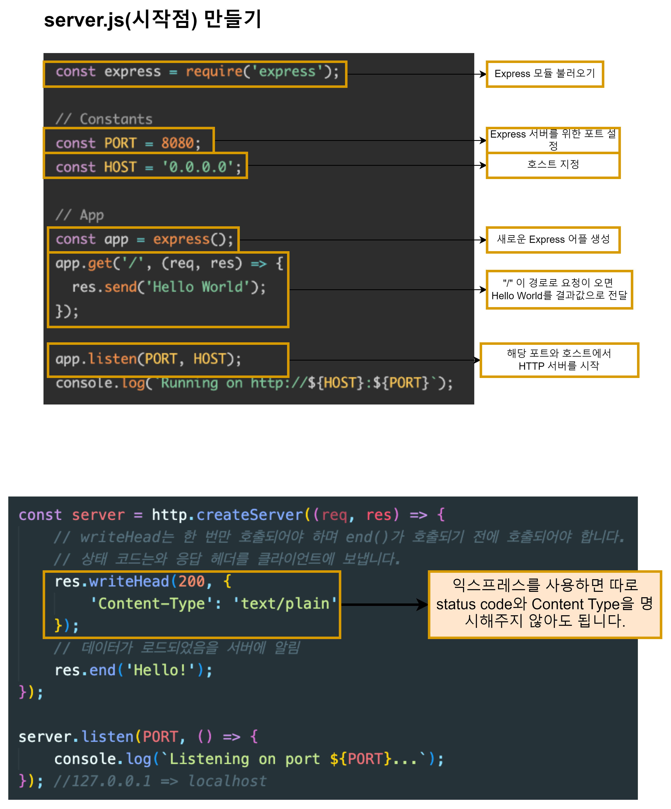

# Studying Express.js

Express를 사용하는 이유

### Express.js란?
- Express는 웹 및 모바일 애플리케이션 구축을 위한 광범위한 기능을 제공하는 Node.js 웹 애플리케이션 프레임워크이다.
- 단일 페이지, 다중 페이지 및 하이브리드 웹 애플리케이션을 빌드하는 데 사용된다.
- 서버와 경로를 관리하는 데 도움이 되는 Node.js 상단에 구축된 레이어이다.
- Node.js의 API를 단순화하고 유용한 기능들은 더 추가 시켜 Node.js를 더 편리하고 유용하게 사용할 수 있게 해주는 프레임워크이다.

### Express.js를 사용하는 이유
- Node.js의 API를 쉽게 사용할 수 있게 해준다.(Expresssjs를 사용하는 법을 쉽게 배울 수 있다.)
- 굉장히 많은 사람들이 사용하고 있다.
- ExpressJS를 기반으로 하는 다른 프레임워크들도 만들어지고 있기 때문에, 이 프레임워크 하나만 배우면 다른 Node.js 프레임 워크도 빠르게 배울 수 있다.

