# Node.js 모듈 시스템

<details>
<summary>Module이란?</summary>

### 모듈이란 무엇인가?

- Node.js에서 module은 필요한 함수들의 집합을 의미한다.
- 사용하고자 하는 모든 기능을 다 자신이 처음부터 만들어서 사용할 수 없기 때문에 누군가가 이미 만들어 놓은 모듈을 이용해서 사용할 수 있다.
- Node.js에서 제공해주는 많은 모듈들을 손쉽게 사용할 수 있다.
- 또한 직접 모듈을 만들어서 사용할 수도 있다.
- 이러한 모듈을 가져와서 사용할 때는 require 함수를 이용해서 다른 모듈들을 가져올 수 있다.

### 모듈 종류

- Core Module
- Local Module
- Third Party Module

### 모듈을 불러오는 법

```javascript
const module = require("module_name");
```

- require() 함수를 이용해서 자바스크립트 파일을 읽고 그 파일을 실행시켜 객체를 반환한다.
- 이렇게 모듀을 가져와서 변수 또는 상수에 할당해서 사용할 수 있다.
  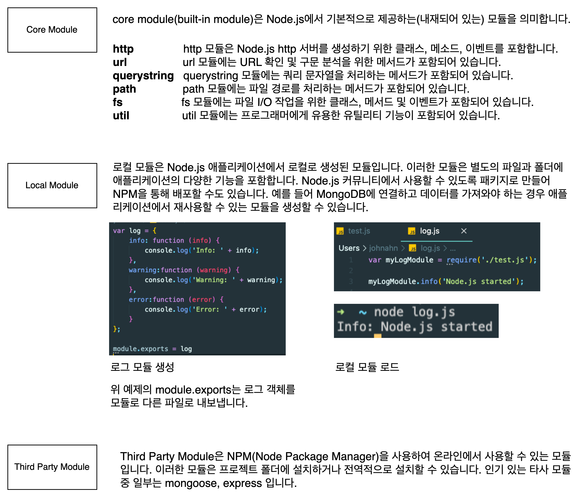

</details>

<details>
<summary>HTTP 서버 구축하기</summary>

### HTTP 모듈 이용하기

- Node.js Built-in 모듈 중에서 HTTP 모듈을 이용해서 서버를 구현해보자.
- 아래와 같이 3000번 포트를 이용하여 로컬 호스트에 브라우저로 접근하면 Hello, World!라는 문구가 나오게 해보면
  

```javascript
const http = require("http");

const port = 3000;

const server = http.createServer((req, res) => {
  res.statusCode = 200;
  res.setHeader("Content-Type", "text/html");
  res.end("<h1>Hello, World!</h1>");
});

server.listen(port, () => {
  console.log(`Server running at port ${port}`);
});
```

- req은 요청 세부 정보를 제공한다.
  - 이를 통해 요청 헤더 및 요청 데이터에 액세스한다.(http.IncomingMessage 객체)
- res는 클라이언트에 반환할 데이터를 채우는데 사용된다.(http.ServerResponse 객체)
- res.status 코드 = 200;
  - 성공적인 응답을 나타내기 위해 statusCode 속성을 200으로 설정한다.
- Content-Type 헤더도 설정한다.
  - res.setHeader('콘텐츠 유형', '텍스트/html');
  - 그리고 end()에 대한 인수로 내용을 추가하여 응답을 종료한다.

</details>

<details>
<summary>모듈을 사용하는 이유</summary>

### 모듈들이 모엿 프로그램이 이루어진다.

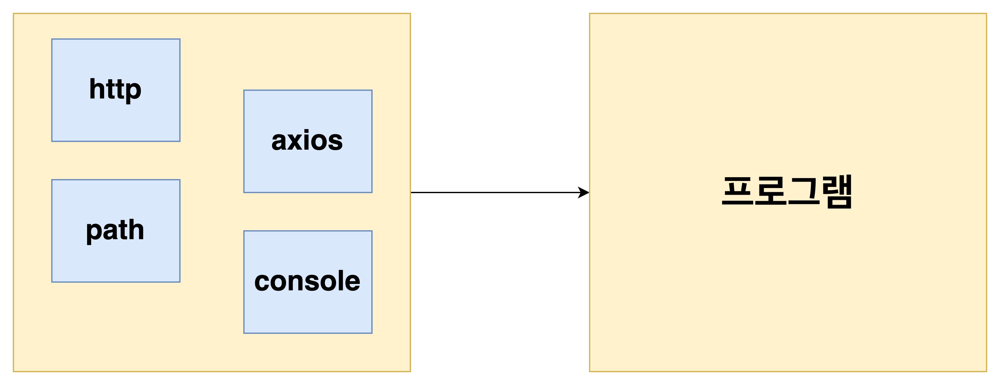

- 이때 모듈 사용의 장점으로는
  - 존재하는(이미 작성한) 코드를 재사용할 수 있다.
  - 관계가 있는 코드끼리 모아 놓아서 코드를 정리할 수 있다.
  - 관계없는 디테일한 부분은 숨기고 직접 사용되는 코드만 가져와서 보여줄 수 있다.(해당 모듈 전체를 가져오는게 아닌 특정 함수나 변수, 클래스만을 가져와서 사용한다.)

</details>

<details>
<summary>모듈 생성하기</summary>

### HTTPS 모듈 생성하기

- 주로 모듈은 이미 만들어져 있는 것을 이용하지만 직접 만들어서 사용할 수도 있다.
- HTTPS 모듈을 생성해보자.

#### Https 모듈

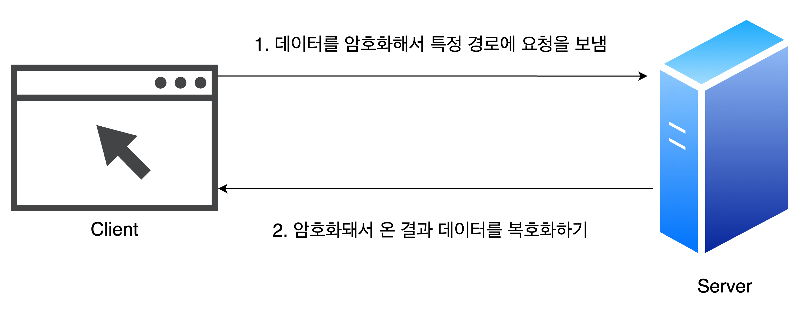

#### 모듈을 위한 파일 생성

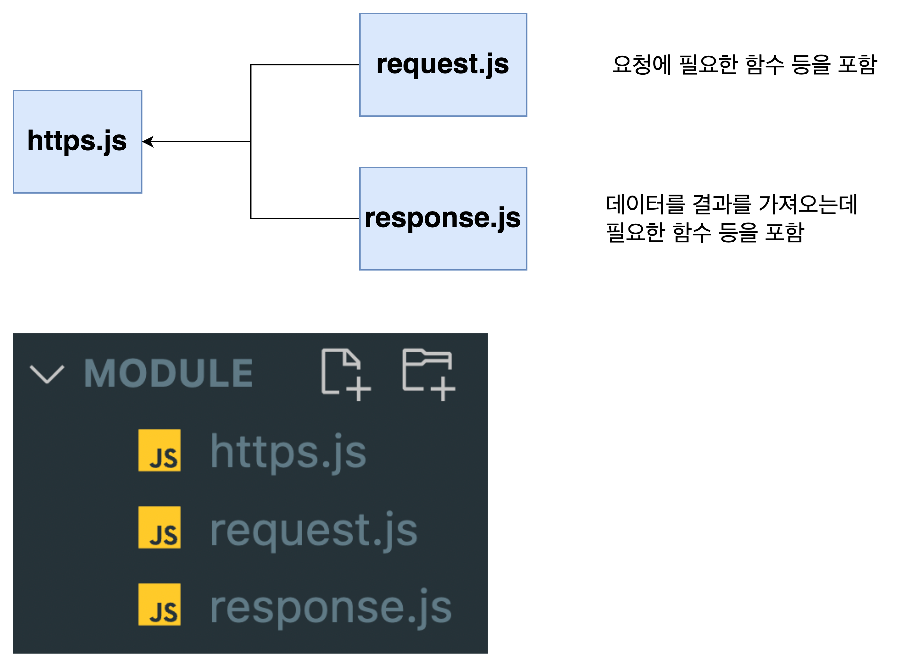

#### https.js

```javascript
function makeRequest(url, data) {
  // 요청을 보내기
  // 데이터를 return 하기
}
```

#### request.js

- 데이터를 암호화해서 특정 경로에 요청을 보냄

```javascript
function encrypt(data) {
  return "encrypted data";
}

function send(url, data) {
  const encryptedData = encrypt(data);
  console.log(`${encryptedData} is being sent to ${url}`);
}
```

#### response.js

- 암호화돼서 온 결과 데이터를 복호화하기

```javascript
function decrypt(data) {
  return "decrypted data";
}

function read() {
  return decrypt("data");
}
```

#### module 키워드를 이용하여 필요한 함수 가져오기

- https에서 request에 있는 함수와 response에 있는 함수를 가져와야 한다.
  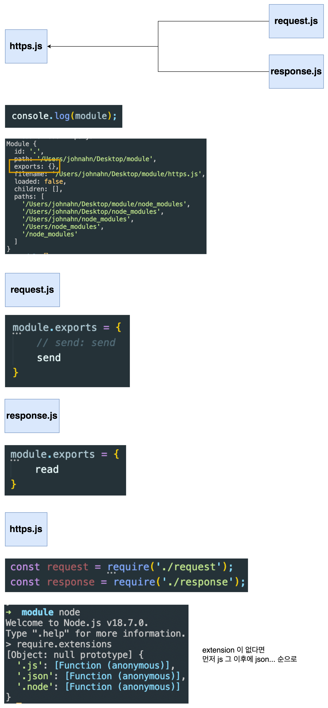

#### 모듈 완성하기

```javascript
const request = require("./request");
const response = require("./response");

function makeRequest(url, data) {
  // 요청을 보내기
  request.send(url);
  //데이터를 return 하기
  return response.read();
}

const responseData = makeRequest("https://naver.com", "any data");
console.log("responseData", responseData);
```

</details>

<details>
<summary>모듈에서 exports 하는 방법</summary>

> 이전에 공부한 module.exports = {} 와 같은 방법을 할 수도 있지만 다른 방법으로 exports 할 수도 있다.

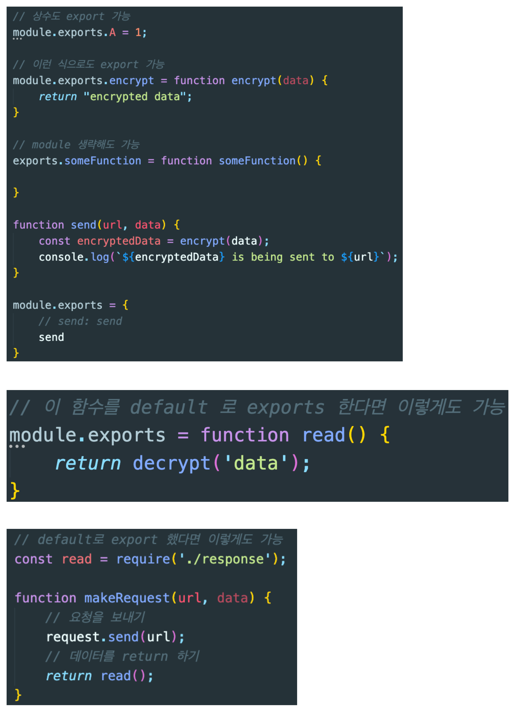

#### 하지만 결국 처음 방법이 가장 좋다.

- 그 이유는 아래와 같이 어떤 모듈이 export 되어 있는지 확인하기 쉽게 정리되어있기 때문이다.
  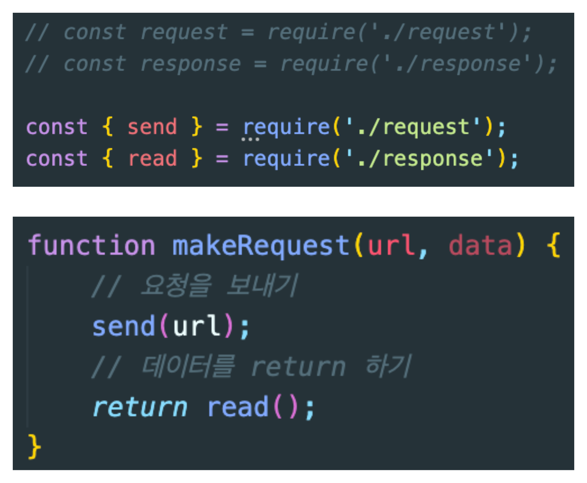

</details>

<details>
<summary>CommonJS와 ECMAScript 모듈의 차이</summary>

### CommonJS Module

- 지금까지 공부한 Node.js의 모듈은 CommonJSdlek.
- 이것은 바로 module.exports로 내보내고 require로 가져오는 것이었다.
- 이 [CommonJS](https://nodejs.org/api/modules.html#modules-commonjs-modules)는 노드 JS에서 기본 모듈로 사용되고 있다.

### ECMAScript Module

- ECMAScript Module은 아래와 같이 export, import를 이용해서 모듈에서 내보내고 가져오는 Syntax를 이용한다.

```javascript
// addTwo.mjs
function addTwo(num) {
  return num + 2;
}

export { addTwo };
```

```javascript
// app.mjs
import { addTwo } from ".addTwo.mjs";

// Prints: 6
console.log(addTwo(4));
```

#### ECMAScript Modeul의 특징

- ES 모듈은 JavaScript의 표준이고 CommonJS는 Node.js의 기본값이다.
- 모든 주요 브라우저는 ES 모듈을 지원하며 React 및 Vue.js와 같은 프레임워크에서도 ES 모듈의 가져오기(import) / 내보내기(Export)를 사용할 수 있다.
- 이러한 프레임워크는 Babel과 같은 transpiler를 사용하여 이전 Node.js 버전이 기본적으로 지원하는 가져오기(Import) / 내보내기(Export) 구문 (syntax)을 require()로 컴파일한다.
- Node.js 13.2.0버전부터 ECMAScript Module을 지원

### ECMAScript란?

- ECMAScript는 ECMA 인터내셔널에 의해 제정된 ECMA-262 기술 규격에 의해 정의된 범용 스크립트 언어이다.
- 또한 JavaScript는 ECMAScript 사양을 준수하는 범용 스크립팅 언어이다.
  
  

### ECMAScript 6란? (ES6, ES2015, ECMAScript 2015)

- 자바스크립트를 사용하다 보면 ES6에 대한 얘기를 많이하게 된다.
- 이 ES6는 ECMAScript 언어의 6번째 버전이다.
- ES6는 ES2015라고도 부르는데 그 이유는 2015년 ECMA 인터내셔널이 ECMAScript를 매년마다 개정하기로 발표했기 때문이다.
- 따라서 앞으로 매년 해의 이름을 딴 ECMAScript가 새로 발표될 예정이다.
- ECMAScript 버전 중에서 이 ES6가 가장 중요한데 그 이유는 ES6에서 추가된 문법들이 기존의 문제들을 매우 깔끔하게 해결하였으며, 가독성 및 유지 보수성을 보강하는 문법도 대거 추가됐기 때문이다.
- 예를 들어 새롭게 추가된 기능으로는 Promise, Class, Arrow Function 등이 있다.

</details>

<details>
<summary>Node.js에서 ECMAScript 모듈 이용하기</summary>

### ECMAScript 모듈 사용하기

- 현재 CommonJS 모듈로 되어 있는 Node.js 앱을 ECMAScript 모듈로 다시 구현해보자.
  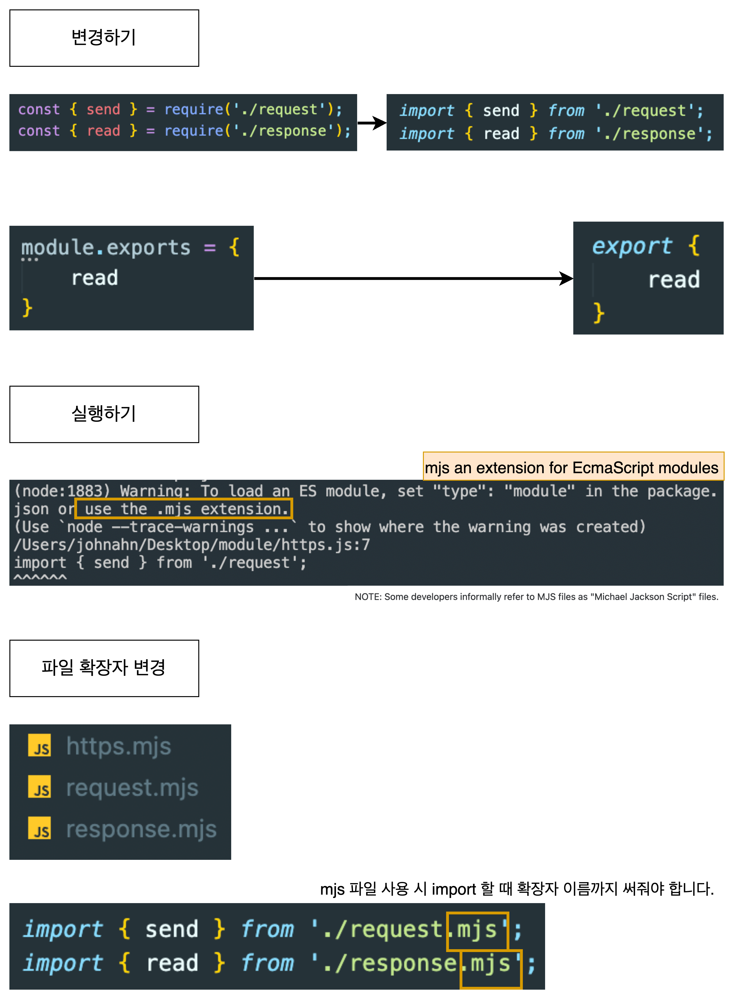

</details>

<details>
<summary>모듈 캐싱에 대해서</summary>

### 모듈 캐싱이란?

- 모듈에서 다른 모듀을 가져올 때 (load) ECMAScript 모듈을 사용하든지 CommonJS 모듈을 사용하든지 해당 모듈을 캐싱하게 된다.

#### 캐싱이 잘 되는지 확인

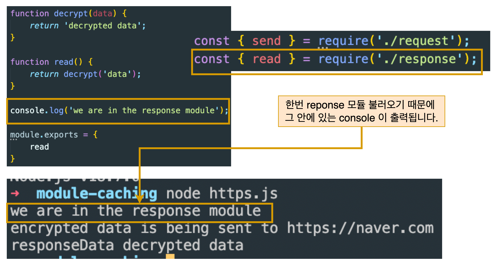

#### 모듈 한번 더 불러온 후 다시 테스트

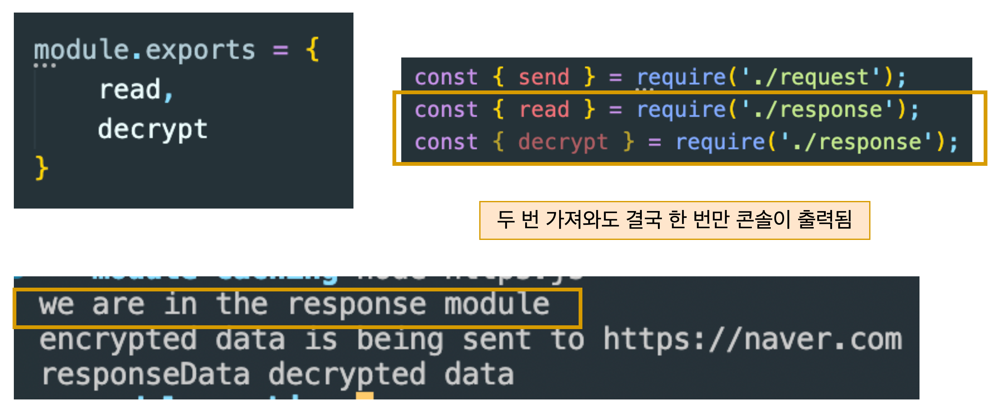

#### 만약 새로운 모듈에서 response 모듈을 또 가져온다면?

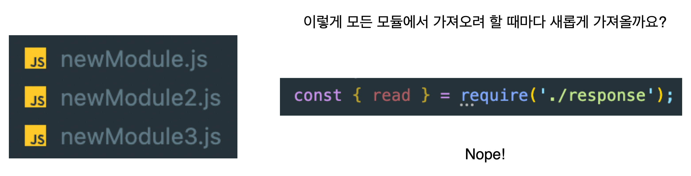

#### caching 된 정보 살펴보기


</details>

<details>
<summary>index.js 파일에 대해서</summary>

### index.js 파일은 무엇인가?

- 불필요하게 복잡한 모듈 로딩 시스템을 만드는 index.js 파일에 대해 알아보자.

</details>
