# Node.js 패키지 관리

<details>
<summary>npm 이란?</summary>

### npm이란 무엇인가?

- 오픈 소스 Node.js 프로젝트 게시를 위한 온라인 리포지토리(저장소)이다.
- 패키지 설치, 버전 관리 및 종속성 관리를 지원하는 해당 저장소와 상호 작용하기 위한 명령줄 유틸리티이다.

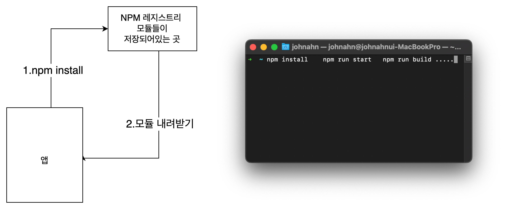

</details>

<details>
<summary>앱에 npm package 설치하기</summary>

### package.json 파일 생성

```bash
npm init -y
```

### axios package 설치하기

```bash
npm install axios
```

</details>

<details>
<summary>node_modules 살펴보기</summary>

### node_modules 폴더란?

- node_modules 디렉터리에는 package.json에 있는 모듈뿐만 아니라, package.json에 있는 모듈이 의존하고 있는 모듈 전부를 포함하고 있다.
  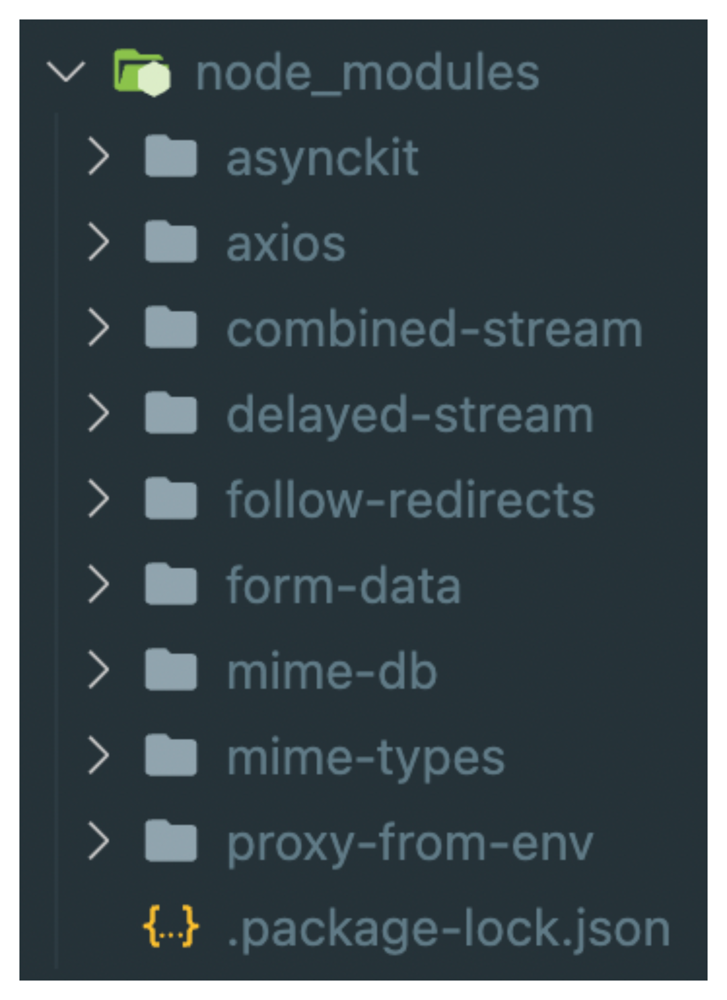
  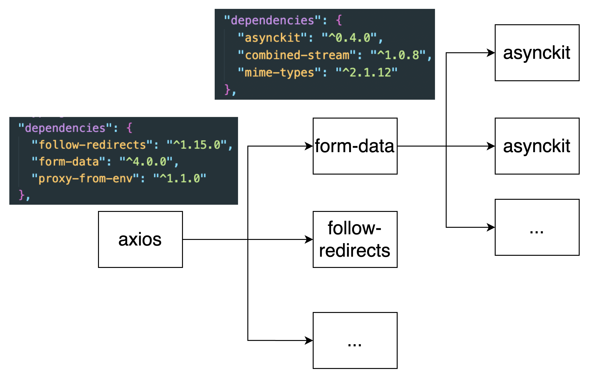

</details>

<details>
<summary>Semantic Versioning</summary>

- 아래와 같이 노드 패키지들의 버전은 세 자리로 되어있다.
- 이는 세 자리가 모두 의미가 있다는 뜻의 Semantic Versioning하며 줄여서 [SemVer](https://semver.npmjs.com/)이라고도 한다.
  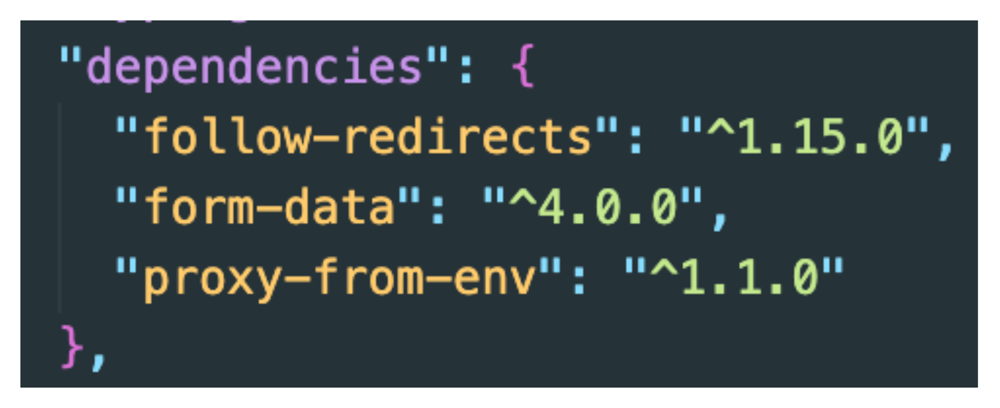
  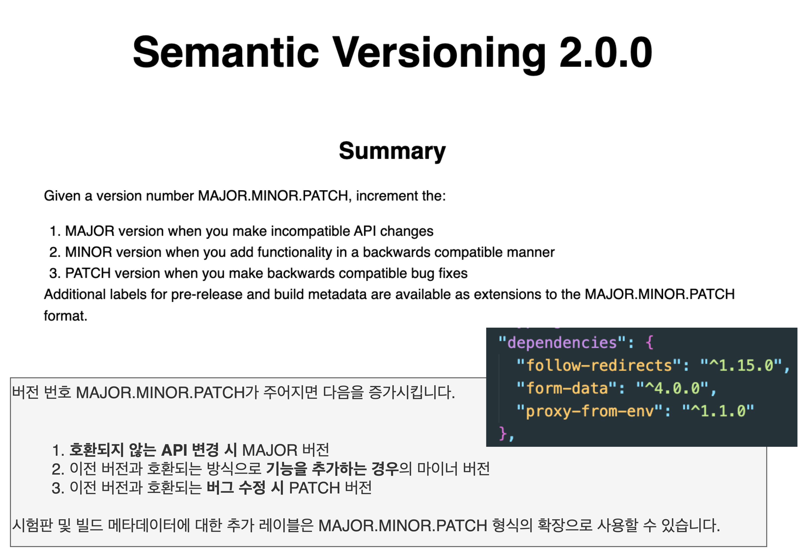
  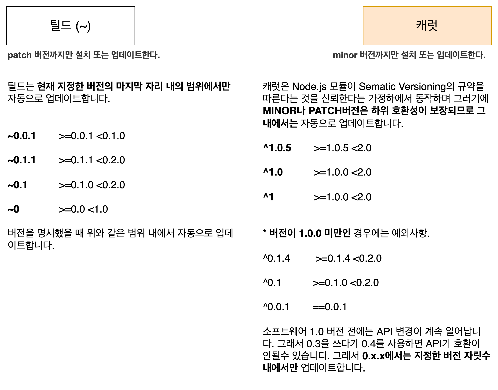

</details>

<details>
<summary>package-lock.json</summary>

### package-lock.json 파일이란?

- package-lock.json 파일은 package-lock.json이 생성되는 시점의 의존성 트리(node_modules)에 대한 정보를 가지고 있는 파일을 말한다.
  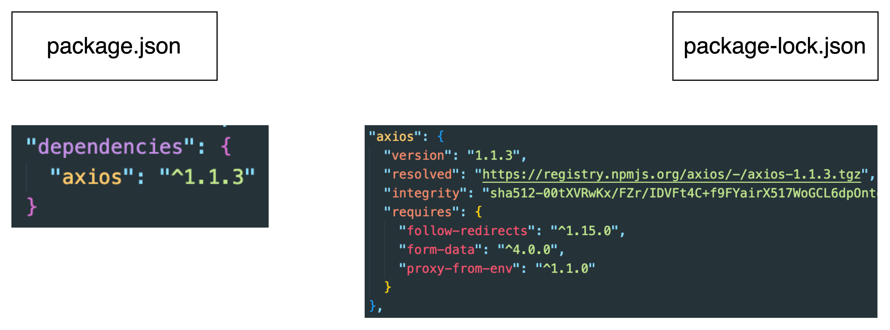

### package-lock.json 파일을 사용하는 이유

- 이 파일은 소스 리포지토리에 커밋하기 위한 것이며 다양한 용도로 사용된다.
- 팀원, 배포 및 지속적 통합이 정확히 동일한 종속성을 설치하도록 보장하는 종속성 트리의 단일 표현을 설명한다.
- 사용자가 디렉토리 자체를 커밋하지 않고도 node_modules의 이전 상태로 "시간 여행"할 수 있는 기능을 제공한다.
- 읽을 수 있는 소스 제어 diff 를 통해 트리 변경 사항을 더 쉽게 볼 수 있다.
- 그리고 npm이 이전에 설치된 패키지에 대해 반복되는 메타데이터 확인을 건너뛸 수 있도록 하여 설치 프로세스를 최적화한다.
  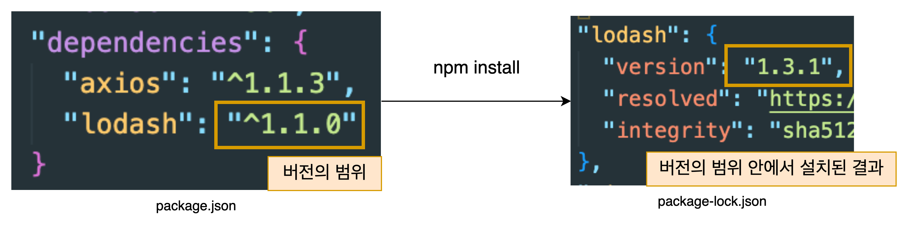
- 이렇게 버전의 범위 안에서 설치가 되면 현재는 1.3.1 버전이 설치되지만, lodash의 버전이 업데이트된 상태로 publish가 된 후에, 동일한 package.json 파일로 npm install을 실행했을 경우, 원래 버전이 아닌, 새로 업데이트 된 버전으로 lodash로 설치가 된다.
- 이렇게 A는 1.3.1을 사용하고 이 package.json 파일을 이용하여 설치한 다른 사람은 다른 버전으로 사용하기에 만약 서로 버전에서 소스코드가 호환이 안된다면 에러가 발생하게 되고 다른 모듈과 버전 충돌이 일어날 수도 있다.
- 이러한 문제를 해결하기 위해 package-lock.json을 사용한다.

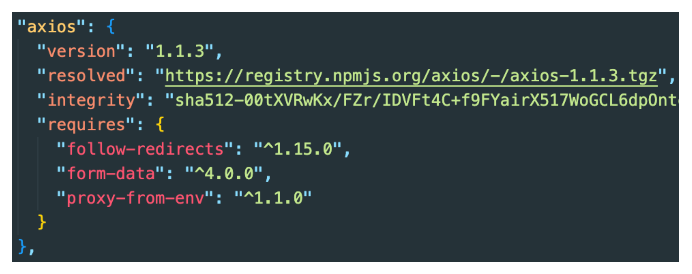

- resolved
  - 번들 정속성의 경우 소스에 관계없이 포함되지 않는다.
  - 레지스트리 소스의 경우 레지스트리 URL과 관련된 tarball의 경로이다.
  - tarball URL이 레지스트리 URL과 동일한 서버에 있지 않으면 완전한 URL이다.
- integrity
  - 이것은 이 자원에 대한 표준 하위 자원 무결성이다.
  - 번들 종속성의 경우 소스에 관계없이 포함되지 않는다.
  - 레지스트리 소스의 경우 이것은 레지스트리가 제공한 무결성이거나 shasum에서 SHA1을 제공하지 않은 경우이다.
  - git 소스의 경우 이것은 우리가 복제한 특정 커밋 해시이다.
  - 원격 tarball 소스의 경우 이는 파일의 SHA512를 기반으로 하는 무결성이다.
  - 로컬 tarball 소스의 경우 이것은 파일의 SHA512를 기반으로 하는 무결성 필드이다.

</details>

<details>
<summary>npm audit</summary>

### npm audit이란?

- audit 명령은 프로젝트에 구성된 종속성에 대한 설명을 기본 레지스트리에 제출하고 알려진 취약성에 대한 보고서를 요청한다.
- 취약점(vulnerabilities)이 발견되면 영향과 적절한 교정이 계산된다.
- fix 인수가 제공되면 수정 사항이 패키지 트리에 적용된다.
  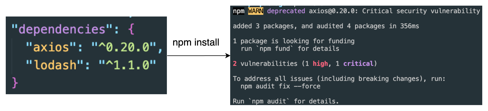

#### npm audit

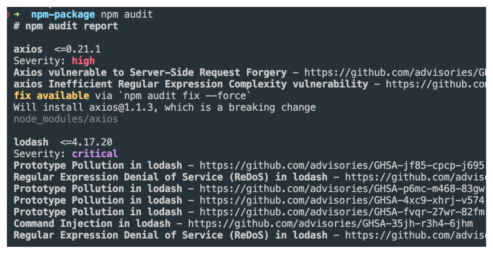

#### npm audit fix --force

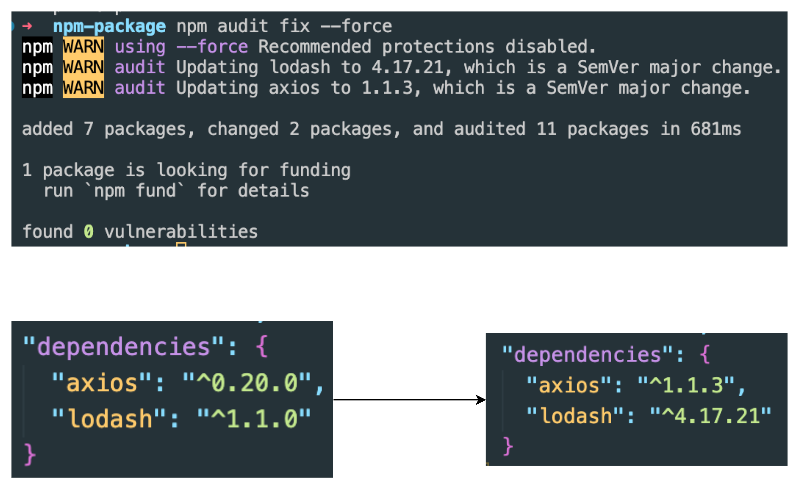

</details>

<details>
<summary>npm install -g</summary>

### npm install -g

- 패키지를 전역(Global)으로 설치하려면 -g flag를 사용하면 된다.
- 전역으로 설치된 패키지는 디렉터리에 관계없이 작동한다.

### npm install [nodemon](https://www.npmjs.com/package/nodemon)

- nodemon은 디렉토리의 파일 변경이 감지되면 노드 응용 프로그램을 자동으로 다시 시작하여 Node.js 기반 응용 프로그램을 개발하는 데 도움이 되는 도구이다.
- nodemon은 코드나 개발 방법을 추가로 변경할 필요가 없다.
- nodemon은 노드의 대체 래퍼이다.
- nodemon을 사용하려면 스크립트를 실행할 때 명령줄에서 node라는 단어를 바꾸면 된다.
  - ex) node index.js => nodemon index.js

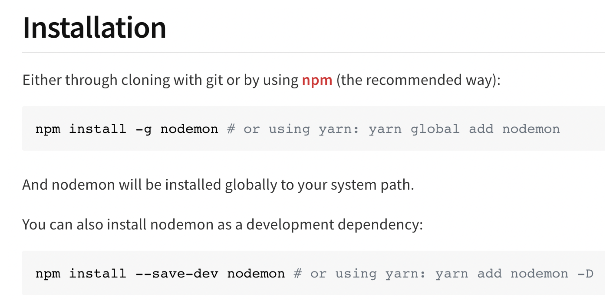

</details>
