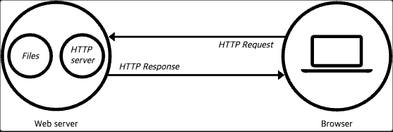
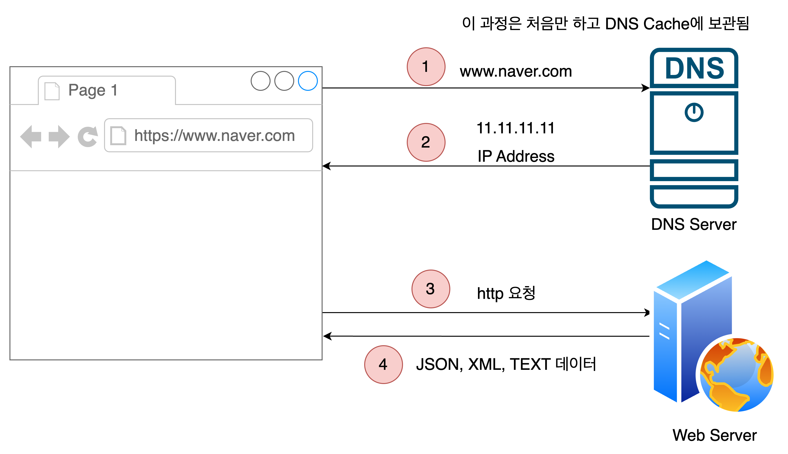
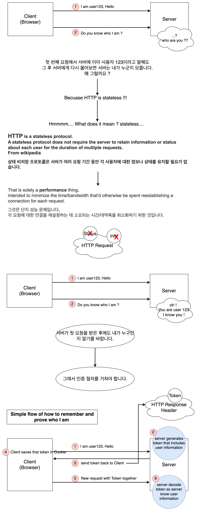
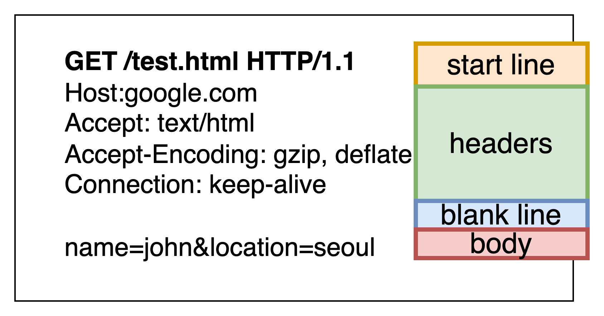
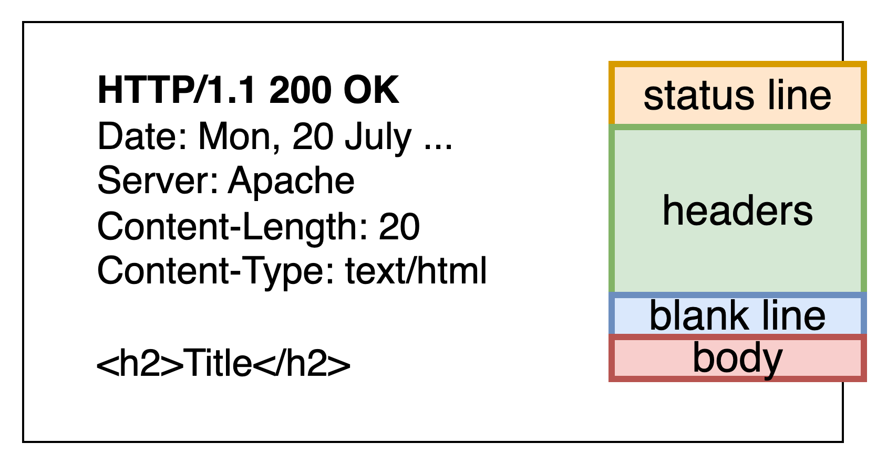
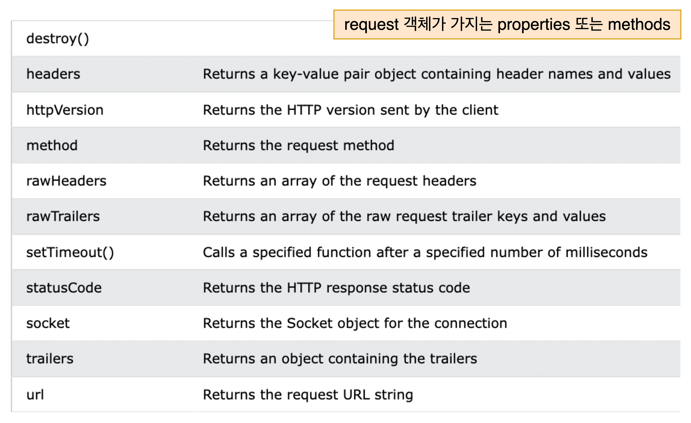
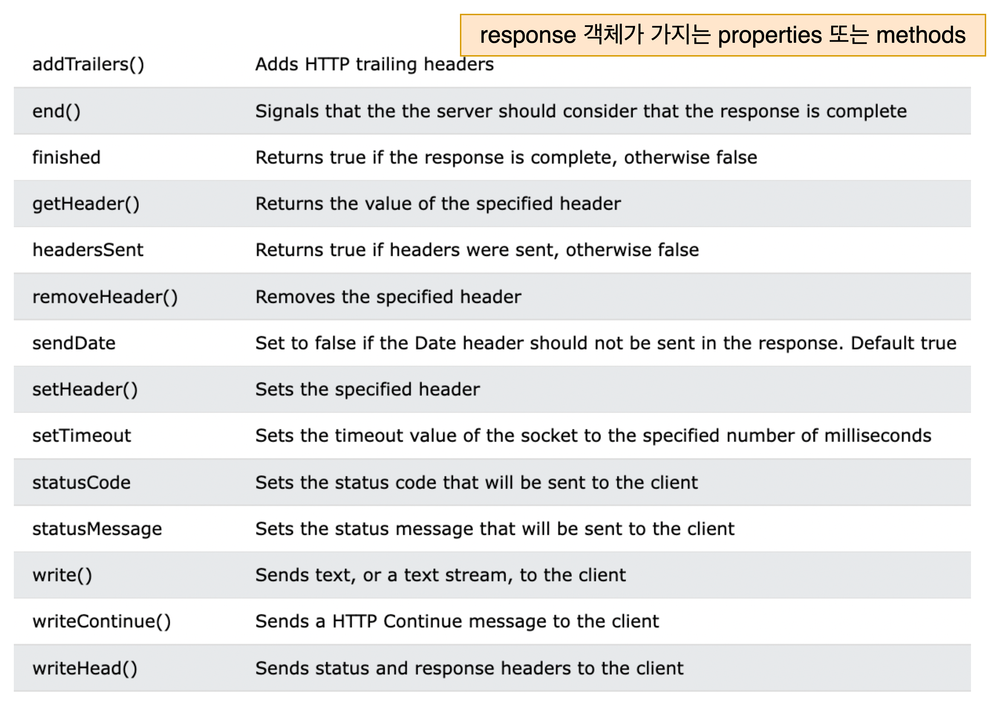

# 웹 서버 만들기

<details>
<server>웹 서버란?</server>

### 웹 서버란?

- 웹 서버는 텍스트, 이미지, 비디오 및 애플리케이션 데이터와 같은 웹 사이트 콘텐츠를 요청하는 클라이언트에 전달한다.
- 가장 일반적인 유형의 클라이언트는 사용자가 링크를 클릭하거나 브라우저에 표시된 페이지에서 문서를 다운로드할 때 웹사이트에서 데이터를 요청하는 웹 브라우저 프로그램이다.
- 웹 서버는 HTTP(Hypertext Transfer Protocol)을 사용하여 웹 브라우저와 통신한다.
- 대부분의 웹 페이지 콘텐츠는 HTML(Hypertext Markup Language)로 인코딩된다.
- 콘텐츠는 정적(예: 텍스트 및 이미지) 또는 동적(예: 게산된 가격 또는 고객이 구매하도록 표시한 항목 록록)일 수 있다.
- 동적 콘텐츠를 제공하기 위해 대부분의 웁 서버는 비즈니스 논리를 통신으로 인코딩하는 서버 측 스크립팅 언어를 지원한다.
- 일반적으로 지원되는 언어에는 ASP(Active Server Pages), Javascript, PHP, Python 및 Ruby가 있다.
- 웹 서버는 일반적으로 요청되는 콘텐츠의 전달 속도를 높이기 위해 콘텐츠를 캐시할 수도 있다.
- 이 프로세스를 웹 가속이라고도 한다.



- 브라우저가 웹 서버에서 호스팅되는 파일을 필요로 할 때마다 브라우저는 HTTP를 통해 파일을 요청한다.
- 요청이 올바른(하드웨어) 웹 서버에 도달하면(소프트웨어) HTTP 서버는 요청을 수락하고 요청된 문서를 찾아 HTTP를 통해 부라우저로 다시 보낸다.
- 서버가 요청한 문서를 찾지 못할 경우 404 응답을 반환한다.
  

</details>

<details>
<summary>HTTP Requests</summary>

### HTTP란? (Hypertext Transfer Protocol)

- HTTP는 HTML 문서와 같은 리소스들을 가져올 수 있도록 해주는 프로토콜(약속)이다.
- HTTP는 웹에서 이루어지는 모든 데이터 교환의 기초이며, 클라이언트-서버 프로토콜이기도 하다.
- 클라이언트-서버 프로토콜이란 (보통 웹브라우저인) 수신자 측에 의해 요청이 초기화되는 프로토콜을 의미한다.
  => 웹 상에서 통신을 할 때 어떤 형식(HTTP)으로 통신을 하자고 정해놓은 약속

### [HTTP Method](https://developer.mozilla.org/en-US/docs/Web/HTTP/Methods)란?

- HTTP 메서드는 수행할 작업의 종류를 나타내기 위해 서버에 보내는 메시지이다.
- 이러한 방법을 사용하면 브라우저와 서버 간의 풍부한 통신이 가능하다.
- 가장 일반적으로 사용되는 방법은 GET 및 POST이다.
- GET : 어떠한 데이터를 서버로부터 받아올 때 사용하는 Method이다.
- POST : 일반적으로 무언가를 생성하기 위해 서버에 데이터 블록을 수락하도록 요청한다.
- PUT : 데이터를 업데이트할 때 사용한다.
- DELETE : 데이터를 서버에서 삭제할 때 사용한다.

#### GET Method

- GET 메소드는 URL 매개변수를 사용하여 서버에서 데이터를 요청한다.
- 웹에서 가장 일반적으로 사용되는 HTTP 방법이다.
- GET 요청 매개변수는 이름-값 쌍으로 형식이 지정된다.
- www.google.com/search?q=nodejs
  - 이 예에서는 쿼리 매개변수를 q를 사용하여 노드js에 대한 결과를 가져오도록 Google에 지시한다.
  - 이에 대한 응답으로 Google은 검색 결과가 포함된 페이지를 반환한다.
- GET 요청은 다음 사항들을 수행할 수 있다.
  - 서버에서 데이터 검색 - 일반적으로 웹 페이지
  - 길이 제한이 있는 서버로 데이터 보내기
  - 브라우저 기록에 남음
  - 캐시가 됨
- GET 요청은 다음 사항들을 수행할 수 없다.
  - 민감한 데이터(예: 비밀번호, 신용 카드 정보)를 처리
  - 서버에서 데이터 수정

#### POST Method

- POST Mehotd는 리소스(종종 데이터베이스 레코드)를 변경하기 위해 서버에 데이터를 보낸다.
- POST 데이터는 사용자가 볼 수 없는 요청 본문으로 전송된다.
- POST 요청의 예시 : POST /posts/1 HTTP/1.1
- POST 요청은 다음을 수행할 수 있다.
  - 리소스 데이터, 즉 서버의 데이터 수정
  - 민감한 데이터를 처리하는 데 사용
  - 길이 제한 없이 데이터 보내기
- POST 요청은 다음을 수행할 수 없다.
  - 캐시에 저장
  - 브라우저 기록에 남기기

#### PUT Method vs PATCH Method

- 공통점
  - 둘 다 어떠한 데이터를 수정하기 위해서 사용된다.
- 차이점
  - PUT : 데이터 전체 교체, 데이터 교체 시 모든 필드 필요
  - PATCH : 데이터의 부분 교체, 데이터 교체 시 일부 필드 필요

</details>

<details>
<summary>Stateless Protocol</summary>

### Stateless가 무엇인지



</details>

<details>
<summary>HTTP Request, Response 구조</summary>

### Request 구조



#### HTTP Request의 구조

1. Starter line
   - http method 종류, request target(url), http version 정보를 담고 있다.
2. Headers
   - Key: Value 값으로 해당 request에 대한 추가 정보를 담고 있다.
3. Body
   - 해당 request가 전송하는 데이터가 담겨있는 부분이다.
   - 전송하려는 데이터가 없다면 비어있게 된다.

- Host : 요청하려는 서버 호스트 이름, 포트 번호
- User-agent : 클라이언트 프로그램 정보
- Referrer : 바로 직전에 머물렀던 웹 링크 주소
- Accept : 클라이언트가 처리 가능한 미디어 타입 종류 나열
- If-Modified-Since : 여기에 쓰인 시간 이후로 변경된 리소스 취득으로 페이지가 수정되었으면 최신 페이지로 교체
- Authorization : 인증 토큰을 서버로 보낼 때 쓰이는 Header
- Origin : 서버로 Post 요청을 보낼 때 요청이 어느 주소에 시작되었는지 나타내는 값. 이 값으로 요청을 보낸 주소와 받는 주소가 다르면 CORS 에러가 발생
- Cookie : 쿠키 값 key-value로 표현된다. Set-Cookie 헤더와 함께 서버로부터 이전에 전송됐던 저장된 HTTP 쿠키를 포함

### Response 구조



#### HTTP Response의 구조

1. status line
   - HTTP version, Status Code, Status Text를 나타낸다.
2. headers
   - Request의 headers와 동일하다. 하지만 Response Headers에서만 쓰이는 값도 있다.
3. body
   - Response의 body와 일반적으로 동일하다.

- Server : 웹서버의 종류
- Age : max-age 시간 내에서 얼마나 흘렀는지 초 단위로 알려주는 값
- Referrer-policy : 서버 referrer 정책을 알려주는 값 ex) origin, no-referrer, unsafe-url
- WWW-Authenticate : 사용자 인증이 필요한 자원을 요구할 시, 서버가 제공하는 인증 ㅂ아식
- Proxy-Authenticate : 요청한 서버가 프록시 서버인 경우 유저 인증을 위한 값
- Set-Cookie : 서버 측에서 클라이언트에게 세션 쿠키 정보를 설정(RFC 2965에서 규정)

</details>

<details>
<summary>HTTP Status Code</summary>

### HTTP Status Code

- HTTP 상태 코드는 브라우저 요청에 따라 서버에서 반환되는 코드이다.
- 이 코드 번호는 요청이 성공했는지 또는 오류가 있었는지 나타낸다.
- 오류 상태 코드는 또한 찾을 수 없음, 액세스할 수 없음 또는 이동됨과 같은 오류 유형을 지정한다.
- 예를 들어 200 OK = 성공적인 HTTP 요청을 위한 코드이고 404 Not Found = 요청된 페이지에 대한 코드를 찾을 수 없는 경우를 위한 코드이다.

#### 코드 정리

- 100 ~ 199 : 정보 코드(informational codes)
- 200 ~ 299 : 성공 코드(success codes)
- 300 ~ 399 : 리다이렉션 코드(redirection codes)
- 400 ~ 499 : 클라이언트 에러 코드(client error codes)
- 500 ~ 599 : 서버 에러 코드(server error codes)

#### 100 ~ 199 정보 코드

- 요청에 대한 정보 메시지를 반환하는 상태 코드이다.
- 100 Continue Server는 요청 헤더를 수신했으며 클라이언트가 요청 본문을 보낼 수 있도록 한다.
- 101 Switching Protocols 요청자가 프로토콜의 서버 전환을 요청한다.
- 103 Checkpoint 중단된 PUT 또는 POST 요청을 재개하기 위한 재개 가능한 요청 옵션을 표시한다.

#### 200 ~ 299 성공 코드

- 성공적인 요청을 나타내는 상태 코드이다.
- 200 OK 성공적인 HTTP 요청에 대한 표준 응답이다.
- 201 Created 요청이 성공적이었으며 그 결과로 새로운 리소스가 생성되었다. 이 응답은 일반적으로 POST 요청 또는 일부 PUT 요청 이후에 따라온다.
- 202 Accepted 요청은 처리를 위해 수락되지만 완료되지는 않는다.
- - 203 Non-Authoritative Information 요청이 성공했지만 다른 소스에서 정보를 반환한다.
- 204 No Content 반환된 콘텐츠 없이 요청이 성공했다.
- 205 Reset Content 요청은 반환된 콘텐츠 없이 성공했으며 요청자가 문서를 새로 고칠 것을 요구한다.
- 206 Partial Content 요청자가 보낸 범위 헤더로 인해 서버가 리소스의 일부만 반환하고 있다.

#### 300 ~ 399 리다이렉션 코드

- 리디렉션과 관련된 알림인 상태 코드이다.
- 300 Multiple Choices 사용자가 링크를 선택하고 해당 위치로 이동할 수 있는 링크 목록을 표시한다.
- 301 Moved Permanently 이 응답 코드는 요청한 리소스의 URI가 변경되었음을 의미한다. 새로운 URI가 응답에서 아마도 주어질 수 있다.
- 302 Found 요청한 페이지가 일시적으로 새 URL로 이동되었다.
- 303 See Other 요청한 페이지는 다른 URL에서 찾을 수 있다.
- 304 Not Modified 요청된 페이지는 마지막 요청 이후 수정되지 않았다.
- 307 Temporary Redirect 요청한 페이지가 일시적으로 새 URL로 이동되었다.
- 308 Resume Incomplete 중단된 PUT 또는 POST 요청을 재개하기 위한 재개 가능한 요청에 사용된다.

#### 400 ~ 499 클라이언트 에러 코드

- 클라이언트로 인해 발생한 오류를 나타내는 상태 코드입니다.
- 400 Bad Request 이 응답은 잘못된 문법으로 인하여 서버가 요청을 이해할 수 없음을 의미합니다.
- 401 Unauthorized 요청은 유효하지만 서버가 응답하지 않습니다. 일반적으로 실패한 인증에 사용됩니다.
- 403 Forbidden 클라이언트는 콘텐츠에 접근할 권리를 가지고 있지 않습니다. 예를 들어 그들은 미승인이어서 서버는 거절을 위한 적절한 응답을 보냅니다. 401과 다른 점은 서버가 클라이언트가 누구인지 알고 있습니다.
- 404 Not Found 요청한 페이지를 서버에서 찾을 수 없습니다.
- 405 Method Not Allowed 요청한 메서드가 페이지에서 지원되지 않습니다.
- 406 Not Acceptable 서버가 클라이언트가 수락하지 않은 응답을 생성합니다.
- 407 Proxy Authentication 클라이언트는 요청하기 전에 프록시로 인증해야 합니다.
- 408 Request Timeout 서버가 요청을 기다리는 시간이 초과되었습니다.
- 409 Conflict 이 응답은 요청이 현재 서버의 상태와 충돌될 때 보냅니다.
- 410 Gone 요청한 페이지를 더 이상 사용할 수 없습니다.
- '411 Length Required "Content-Length"가 정의되지 않았습니다. 서버는 그것 없이는 요청을 수락하지 않습니다
- 412 Precondition Failed 서버에서 요청 전제 조건 결과가 거짓
- 413 Request Entity Too Large 요청 엔터티가 너무 커서 서버가 요청을 수락하지 않습니다.
- 414 Request-URI Too Long URL이 너무 길어 서버가 요청을 수락하지 않습니다. 이것은 POST 요청이 긴 쿼리를 유발하는 GET 요청으로 변환되는 경우 발생할 수 있습니다.
- 415 Unsupported Media Type 지원되지 않는 미디어 유형으로 인해 서버가 요청을 수락하지 않습니다.
- 416 Requested Range Not Satisfiable 요청자가 서버에서 제공할 수 없는 파일의 일부를 서버에 요청했습니다.
- 417 Expectation Failed 서버가 예상 요청 헤더 필드의 요구 사항을 충족할 수 없습니다

#### 500 ~ 599 서버 에러 코드

- 서버에서 오류가 발생했음을 나타내는 상태 코드입니다.
- 500 Internal Server Error 특정 오류 메시지를 사용할 수 없을 때 표시되는 일반 오류 메시지
- 501 Not Implemented 서버가 요청 방법을 인식하지 못하거나 요청을 완료할 수 없습니다
- 502 Bad Gateway 서버가 게이트웨이 또는 프록시 역할을 하고 업스트림 서버에서 잘못된 응답을 받았습니다.
- 503 Service Unavailable 서버가 요청을 처리할 준비가 되지 않았습니다. 일반적인 원인은 유지보수를 위해 작동이 중단되거나 과부하가 걸렸을 때입니다.
- 504 Gateway Timeout 서버가 게이트웨이 또는 프록시 역할을 하고 업스트림 서버에서 적시에 응답을 받지 못했습니다.
- 505 HTTP Version Not Supported 서버가 요청에 사용된 HTTP 프로토콜 버전을 지원하지 않습니다.
- 511 Network Authentication Required 클라이언트는 네트워크 액세스를 얻기 위해 인증해야 합니다.

</details>

<details>
<summary>웹 서버 생성하기</summary>

### 웹 서버 생성해보기

```javascript
const http = require("http");

const PORT = 3000;

const server = http.createServer((req, res) => {
  res.writeHead(200, {
    "Content-Type": "text/plain",
  });
  res.end("Hello!");
});

server.listen(PORT, () => {
  console.log(`Listening on port ${PORT}...`);
});
```

#### CreateServer 메소드

- http.createServer() 메소드는 server 객체를 생성한다.
- server 객체는 EventEmitter를 기반으로 만들어졌다. server.on('request', 콜백 함수);

#### server 객체

- server 객체는 컴퓨터의 포트를 수신하고 요청이 만들어질 때마다 requestListener라는 함수를 실행할 수 있다.
- server.listen() => 서버 실행, server.close() => 서버 종료
- server 객체는 EventEmitter를 기반으로 만들어졌다.
- server.on('request', 콜백 함수), server.on('connection', 콜백 함수)...(close, upgrade...)
- HTTP 서버 객체는 컴퓨터의 포트를 수신하고 요청이 만들어질 때마다 requestListener라는 함수를 실행할 수 있다.

#### RequestListener 함수

- requestListener는 서버가 요청을 받을 때마다 호출되는 함수이다.
- requestListener 함수는 사용자의 요청과 사용자에 대한 응답을 처리한다.

#### req

- req(request), res(response) 객체는 노드가 전달해준다.
- request 객체는 IncomingMessage의 인스턴스이다.
- IncomingMessage 객체는 서버에 대한 요청을 나타낸다.
  

#### res

- ServerResponse 객체는 requestListener 함수의 두 번재 매개변수로 전달된다.
- 클라이언트에 웹 페이지를 제공하기 위해 response 객체를 사용한다.
  

</details>
