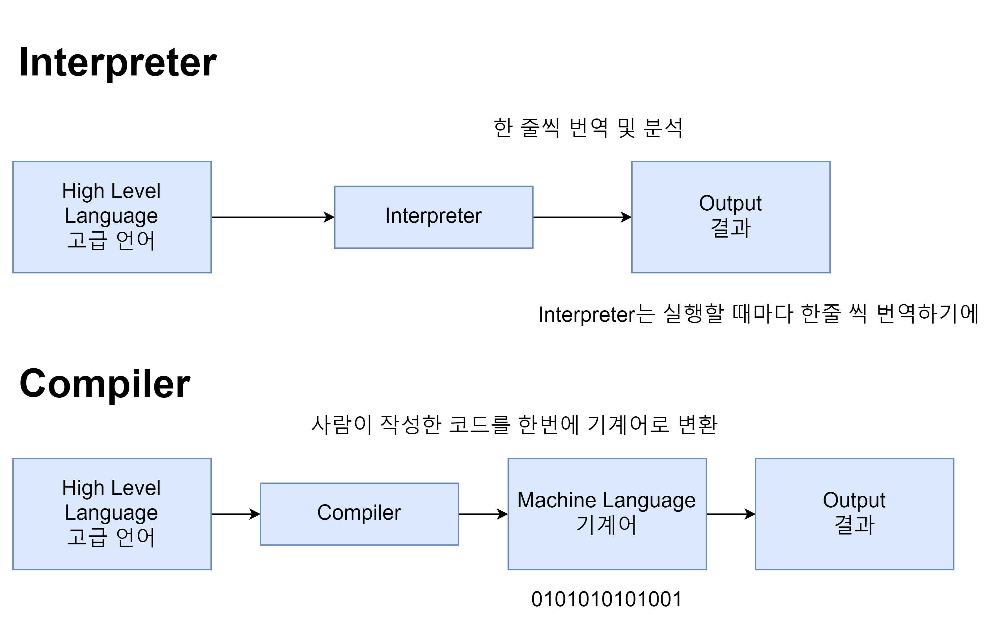
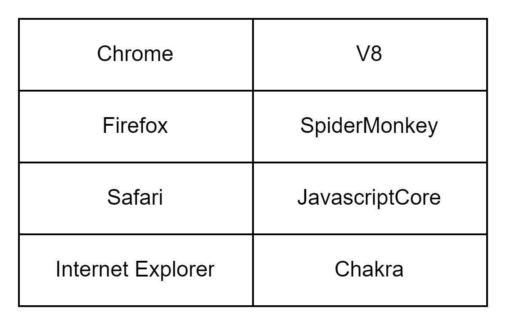
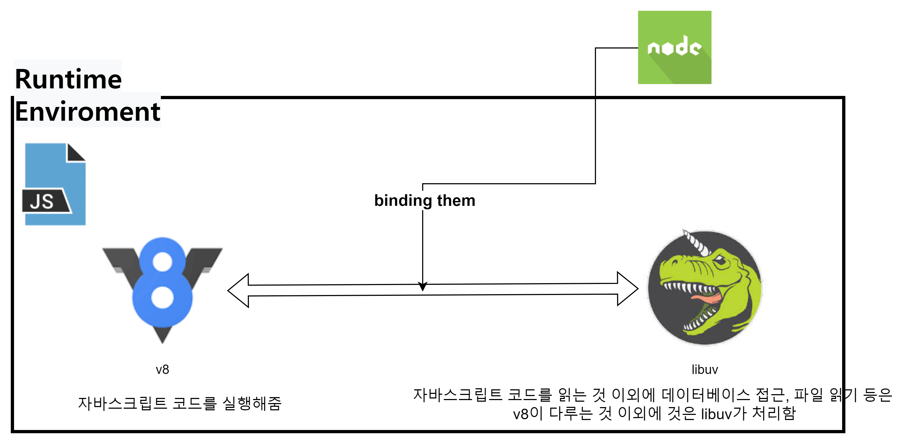
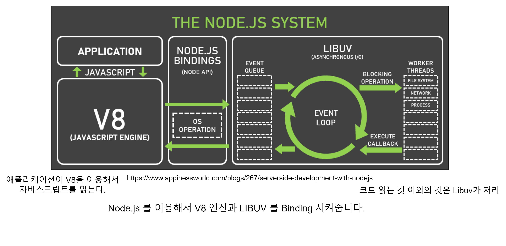
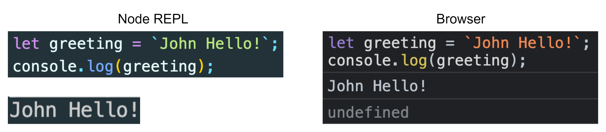
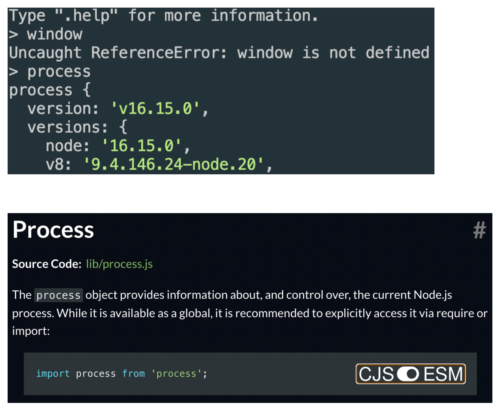
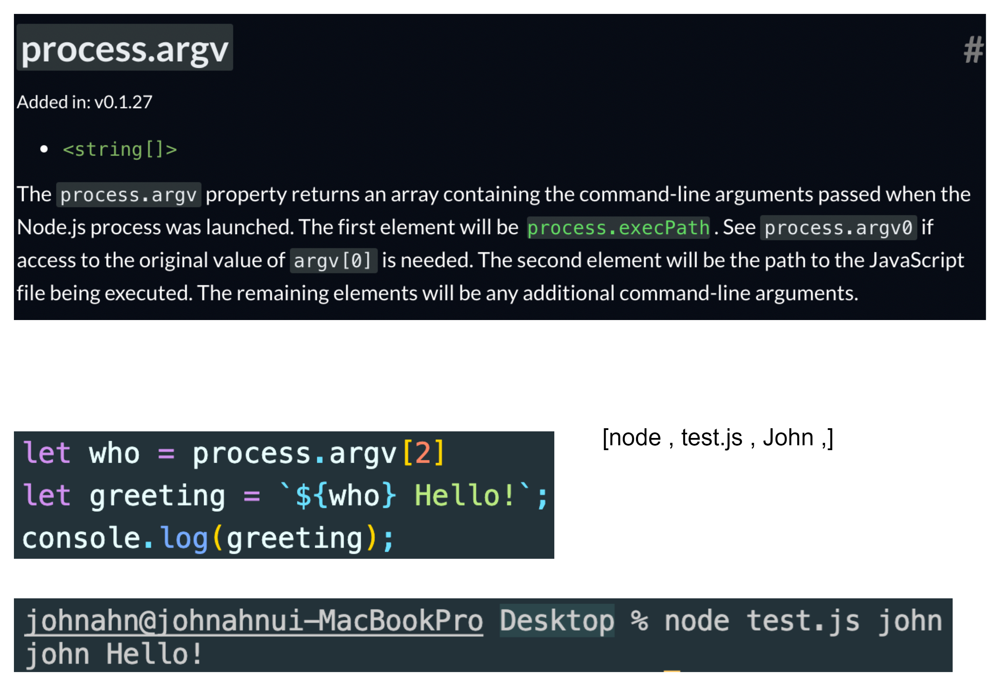
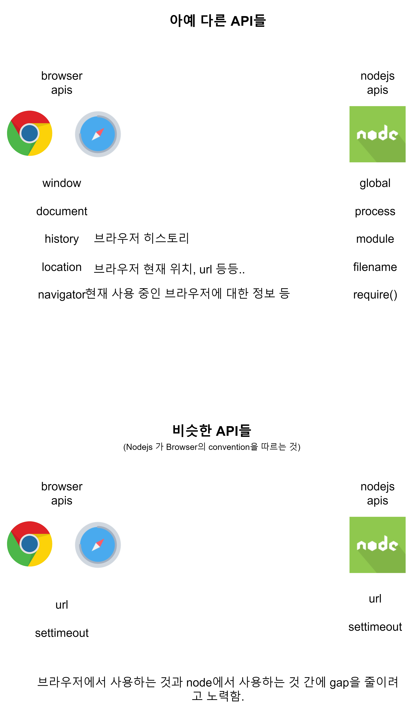

# NodeJS란?

자바스크립트 엔진

### 자바스크립트를 실행하려면?
- 컴퓨터에서 자바스크립트를 실행할 수 있나?
  - 자바스크립트를 브라우저에서는 실행할 수 있다.
  - 하지만 브라우저가 없으면 자바스크립트를 실행할 수는 없다.

#### 자바스크립트를 실행하려면 자바스크립트 엔진이 필요하다.
- 브라우저에는 이미 자바스크립트 엔진이 있기에 자바스크립트를 실행할 수 있다.
- 자바스크립트 엔진은 자바스크립트 코드를 실행하는 소프트웨어 구성 요소이다.
- 최초의 자바스크립트 엔진은 단순한 interpreter 였지만 모든 관련 최신 엔진은 성능 향상을 위해 Just-In-Time 컴파일을 사용한다.
- 자바스크립트 엔진은 일반적으로 웹 브라우저 공급업체에서 개발하며 모든 주요 브라우저에 하나가 있다.

---

### 컴퓨터가 소스 코드를 이해하려면?
- 컴퓨터 프로세서는 오직 0과 1만 이해할 수 있기 때문에 우리가 작성한 소스 코드를 머신 코드로 변환해 줘야 한다.
- 이 변환 과정은 Compiler와 Interprreter를 통해 일어난다.

---

### JIT Compiliation(Just In Time)
- 초기에 자바스크립트 엔진은 그저 인터프리터였다면 현재는 JIT Compiliation을 이용하고 있다.
- 왜냐하면 인터프리터 언어는 컴파일 되는 다른 언어보다 한줄 한줄 해석하고 실행하기 때문에 매우 느리기 때문이다.
- 하지만 현재 웹에서는 지도 기능 등 굉장히 Heavy한 기능들도 수행하고 있기에 현재는 더 나은 퍼포먼스를 위해 JIT 컴파일을 이용하고 있다.

---

### 자바스크립트 엔진
- 구글의 V8은 가장 많이 사용되는 자바스크립트 엔진이다.
- SpiderMonkey는 Firefox 및 해당 포크에서 사용하기 위해 Mozillia에서 개발했다.
- JavaScriptCore는 Apple의 Safari 브라우저용 엔진이다. 다른 Webkit 기반 브라우저에서도 사용한다.
- Chakra는 Internet Explorer 브라우저의 엔진이다. 또한 원래 Edge 브라우저 용으로 Microsoft에 의해 분기되었지만 Edge는 나중에 Chronium 기반 브라우저로 재구축되어 현재 V8을 사용한다.

Node.js History

#### 자바스크립트를 브라우저 밖에서 실행하려면?
- 결론적으로 Node.js를 이용하면 자바스크립트를 브라우저 밖에서도 사용할 수 있게 된다.

Node.js Runtime

### Runtime(환경)이란?
- 런타임이란 프로그래밍 언어가 구동되는 환경을 말한다.
- 그러기에 Node.js나 크롬 등의 여러 브라우저들에서 자바스크립트가 구동이 되기에 Node.js나 브라우저들도 자바스크립트 런타임이다.
- Node.js는 프로그래밍 언어도 프레임워크도 아닌 자바스크립트 런타임이다.

#### 브라우저도 자바스크립트 런타임인가?
- 런타임이란 프로그래밍 언어가 구동되는 환경이며, 브라우저에서 자바스크립트가 구동되기 때문에 런타임이라고 할 수 있다.

Node.js REPL

### REPL이란?
- REPL은 Read-Eval(evaluation)-Print Loop의 약어로 사용자가 특정 코드를 입력하면 그 코드를 평가하고 코드의 실행결과를 출력해주는 것을 반복재후는 환경을 말한다.
- REPLL 환경은 자바스크립트 학습 중에 간단한 자바스크립트 코드 등을 즉석에서 바로 실행해 결과를 확인해 볼 때 주로 사용한다.
- REPL 환경에서 나오는 방법은 .exit로 하거나 Ctrl+C를 두 번 해주면 된다.

Browser API & Node.js API

### 브라우저와 Node.js 모두에서 사용하는 API
- 대표적으로 console api가 있다.

- Node.JS 는 최신 버전의 자바스크립트 문법 사용이 가능하다.
  - 그 이유는 Node.JS는 V8엔진을 사용하며 V8엔진은 최신 ECMAScript 기준으로 계속 업데이트하기 때문이다.

### 브라우저 API인 window 객체
- window 객체는 자바스크립트가 아닌 브라우저에서 제공해주는 객체이다.
- 그러므로 node.js repl 환경에서 사용할 수 없다.

### Node.js API인 Process 객체
- process 객체는 자바스크립트가 아닌 node.js에서 제공해주는 객체이다.

#### Process.argv 프로퍼티 사용해보기
- Process 객체 안에 있는 argv 프로퍼티를 사용해보면 

global 객체에 대해서

