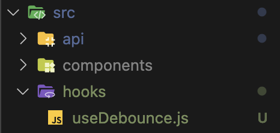

# 디즈니 플러스 클론 코딩

<details>
<summary>The Moive DB API 요청을 위한 Axios 인스턴스 생성 및 요청 보내기</summary>

### Axios란 무엇인가?

- Axios는 브라우저, Node.js를 위한 Promise API를 활용하는 HTTP 비동기 통신 라이브러리이다.
- 쉽게 말해 백엔드랑 프론트엔드 통신을 쉽게 하기 위해 Ajax와 더불어 사용한다.
- fetch보다 훨씬 더 많이 사용됨(기능이 많고 바로 Json으로 받을 수 있음)

#### Axios 사용 방법

- axios 모듈 설치

```bash
npm install axios --save
```

#### Axios 인스턴스화 하는 이유

- 중복된 부분을 계속 입력하지 않아도 되기 때문에

#### Axios 인스턴스 만드는 순서

1. 인스턴스 생성할 폴더 파일 생성
2. axios.js 파일 생성

```javascript
import axios from "axios";

const instance = axios.create({
  baseURL: "https://api.themoviedb.org/3",
  params: {
    api_key: "my key",
    language: "ko-KR",
  },
});

export default instance;
```

</details>
<details>
<summary>Styled Component에 대해 알아보기</summary>

### Styled Component란?

- Styled Component란 Css-in-JS라고 하는 Javascript 파일 안에서 CSS를 처리할 수 있게 해주는 대표적인 라이브러리이다.

#### 설치 방법

```bash
# with npm
npm install --save styled-components

# with yarn
yarn add styled-components
```

</details>

<details>
<summary>CSS 관련</summary>

### Position 속성

- 태그를 어떻게 위치시킬지를 정의하며, 아래의 5가지 값을 갖는다.
  - static : 기본값, 다른 태그와의 관계에 의해 자동으로 배치되며 위치를 임의로 설정해 줄수 없다.
  - relative : 요소 자기 자신을 기준으로 배치(원래 있던 위치를 기준으로 좌표를 지정한다.)
  - absolute : 부모(조상) 요소를 기준으로 배치.(절대 좌표와 함께 위치를 지정해 줄 수 있다.)부모 요소에 position: static이 아닌 것이 있으면 그것을 기준으로 배치한다. 하지만 position: static이 아닌 것이 없다면 body를 기준으로 배치한다.
  - fixed : 스크롤과 상관없이 항상 문서 최 좌측 상단을 기준으로 좌표를 고정한다.(스크롤이 있을 때 스크롤을 내리면 해당 요소도 같이 내려간다.)
  - sticky : 스크롤 영역 기준으로 배치한다.

### 가상요소 ::before ::after

- 가상 클래스(Pseudo-Class)는 별도의 class를 지정하지 않아도 지정한 것처럼 요소를 선택할 수 있다.
- 가상 요소(Pseudo-Element)는 가상 클래스처럼 선택자(selector)에 추가되며, 존재하지 않는 요소를 존재하는 것처럼 부여하여 문서의 특정 부분 선택이 가능하다.

  - ::before : 요소의 콘텐츠 시작부분에 생성된 콘텐츠를 추가한다.
  - ::after : 요소의 컨텐츠 끝 부분에 생성된 콘텐츠를 추가한다.
  - ::before와 ::after는 꼭 'content'와 같이 사용되야 한다. -> 이 content는 가짜 속성이다.
  - HTML 문서에 정보로 포함되지 않은 요소를 CSS에서 새롭게 생성시켜주는 역할을 한다.

</details>

<details>
<summary>async await</summary>

- Promise{<pending>}이라고 나오는 이유는?
   - 비동기 처리하는 중이기 때문

#### 해결 방법은??

- 아직 Response가 오지 않은 (Pending) 한 상태가 아닌 결과값을 받은 이후에 값을 처리해주면 된다.

  1. async request .then
  2. async await


 </details>
<details>
<summary>미디어 쿼리</summary>

- 미디어 쿼리는 화면 해상도, 기기 방향 등의 조건으로 HTML에 적용하는 스타일을 전환할 수 있는 CSS3의 속성 중 하나이다.
- 반응형 웹 디자인에서는 미디어 쿼리를 사용해 적용하는 스타일을 기기마다(화면 크기마다) 저노한할 수 있다.

```css
@media(조건) {
    스타일
}
```

</details>
<details>
<summary>IFrame</summary>

- 아이프레임은 HTML Inline Frame 요소이며 inline frame의 약자이다.
- 효과적으로 다른 HTML 페이지를 현재 페이지에 포함시키는 중첩된 브라우저로 iframe 요소를 이용하면 해당 웹 페이지 안에 어떠한 제한 없이 다른 페이지를 불러와서 삽입 할 수 있다.
</details>

<details>
<summary>transition 속성</summary>

- 스타일 변경 시 부드럽게 전환하게 한다.(흔히 호버링할 때 사용)
- 선택자가 변환되는 것을 시간의 흐름을 줘서 변화시키는 속성
- transition: 속성 시간 속도 지연시간;
  - 속도 부분의 속성 값들 - ease : 기본값, 느리게 시작한 다음 빠르게 전환한 다음 천천히 종료 - linear : 처음부터 끝까지 같은 속도로 전환 - ease-in : 가속, 느린 시작으로 빠른 끝, 느린 느낌을 받을 수 있다. - ease-out : 감속, 빠른 시작으로 느린 끝, 빠른 느낌을 받을 수 있다. - ease-in-out : 느린 시작과 느린 끝으로 전환 효과 지정 - cubic-bezier(n, n, n, n) : 3차 베지어 함수에서 자신의 값을 임의적으로 정함
  </details>

<details>
<summary>Grid CSS</summary>

- Flexible Box는 단순한 1차원 레이아웃을 제공(행 Row 또는 열 Column 하나씩)
- 이에 비해 Css Crid는 2차원(행과 열) 레이아웃 시스템을 제고함(god Row와 열 Column을 같이)
  - gap
  - gid-template-column : 공백으로 구분된 값 목록으로 그리드의 열과 행을 정의. 값은 트랙 크기를 나타내고 그 사이의 공간은 grid line 격자선을 나타냄

```css
.container {
  grid-template-columns: 48px 50px auto 50px 40px;
  // auto : 남은 부분을 동적으로 차지함
}
```

- repeat : 행이나 열을 특정 px만큼 반복

```css
.container {
  grid-template-columns: repeat(5, 10px);
}
```

- fr : fraction의 약자. 1fr은 사용 가능한 공간의 1 부분을 의미함(사용 가능한 공간에 대한 비율)

```css
.container {
  grid-template-columns: repeat(5, 1fr);
}

.container {
  width: 800px
  grid-template-columns: 300px 10% 1fr 1fr;
  // 300 80 210 210 픽셀을 가져가게 됨
}
```

</details>

<details>
<summary>background-clip</summary>

- background-clip 속성은 요소 내에서 배경(색상 또는 이미지)이 확장되어야 하는 거리를 정의한다.
  - border-box : 테두리 영역과 그 안쪽 영역을 채운다.
  - padding-box : 안쪽 여백 영역과 그 안쪽 영역을 채운다.
  - content-box : 내용 영역과 그 안쪽 영역을 채운다.
  - initial : 기본값으로 설정한다.
  - inherit : 부모 요소의 속성 값을 상속받는다.

</details>

<details>
<summary>animation CSS</summary>

- 애니메이션을 사용하려면 요소를 한 스타일에서 다른 스타일로 점진적으로 변경할 수 있다.
- CSS 애니메이션을 사용하려면 먼저 애니메이션에 대한 몇 가지 키프레임 keyframes을 지정해야 한다.
- 키프레임(keyframe)은 특정 시간에 요소의 스타일을 유지한다.

#### animation 속성 값

- animation-name : @keyframes 애니메이션의 이름을 지정한다.
- animation-duration : 애니메이션이 한 주기를 완료하는 데 걸리는 시간을 지정한다.
- animation-timing-function : 애니메이션의 속도 곡선을 지정한다.(ex. linear, ease, ease-in...)
- animation-delay : 애니메이션 시작 지연을 지정한다.
- animation-iteration-count : 애니메이션을 재생해야 하는 횟수를 지정한다.
- animation-direction : 애니메이션을 앞으로, 뒤로 또는 번갈아 재생해야 하는지 여부를 지정한다.(ex. normal, alternate, reverse...)
  - normal : 기본값. 애니메이션이 정상적으로 재생된다.(forwards)
  - reverse : 애니메이션이 역방향으로 재생된다.(backwards)
  - alternate : 애니메이션이 먼저 앞으로 재생된 다음 뒤로 재생된다.
  - alternate-reverse : 애니메이션이 먼저 뒤로 재생된 다음 앞으로 재생된다.
- animation : 모든 애니메이션 속성을 설정하기 위한 약식 속성
</details>

<details>
<summary>React Router Dom</summary>

### React Router Dom이란?

- React Router Dom을 사용하면 웹 앱에서 동적 라우팅을 구현할 수 있다.
- 라우팅이 실행 중인 앱 외부의 구성에서 처리되는 기존 라우팅 아키텍처와 달리 React Router Dom은 앱 및 플랫폼의 요구 사항에 따라 컴포넌트 기반 라윙을 용이하게 한다.

### Single page Application(SPA)

- 리액트는 SPA이기 때문에 하나의 index.html 탬플릿 파일을 가지고 있다.
- 이 하나의 템플릿에 자바스크립트를 이용해서 다른 컴포넌트를 이 index.html 템플릿에 넣으므로 페이지를 변경해주게 된다.
- 이때 이 React Router Dom 라이브러리가 새 컴포넌트로 라우팅/탐색을 하고 렌더링하는데 도움을 주게 된다.

#### React Router Dom 설치하기

```bash
# npm
npm install react-router-dom --save

# yarn
yarn add react-router-dom
```

#### React Router 설정하기

- 설치가 완료된 후 가장 먼저 할 일은 앱 어디에서나 React Router를 사용할 수 있도록 하는 것
- 이렇게 하려면 src 폴더에서 index.js 파일을 열고 react-router-dom에서 BrowserRouter를 가져온 다음 루트 구성요소(App 구성 요소)를 그 안에 래핑한다.

```javascript
// 기존
ReactDOM.render(
  <React.StrictMode>
    <App />
  </React.StrictMode>
  document.getElementById('root')
);

// BrowserRouter 적용
import { BrowserRouter } from 'react-router-dom';

ReactDOM.render(
    <BrowserRouter>
        <App/>
    </BrowserRouter>
    document.getElementById('root')
);
```

- BrowserRouter : HTML5 History API(pushState, replaceState 및 popstate 이벤트)를 사용하여 UI를 URL과 동기화된 상태로 유지해준다.

#### 여러 컴포넌트 생성 및 라우트 정의학

```javascript
function App() {
  return (
    <div className="App">
      <Routes>
        <Route path="/" element={<Home />} />
        <Route path="about" element={<About />} />
        <Route path="contact" element={<Contact />} />
      </Routes>
    </div>
  );
}
```

- Routes : 앱에서 생성될 모든 개별 경로에 대한 컨테이너/상위 역할을 한다. Route로 생성된 자식 컴포넌트 중에서 매칭되는 첫번째 Route를 렌더링 해줌
- Route : 단일 경로를 만드는 데 사용됨. 두 가지 속성을 취합한다.
  - path : 원하는 컴포넌트의 URL 경로를 지정. 이 경로 이름을 원하는 대로 정할 수 있다. 위에서 첫 번째 경로 이름이 백슬래시(/)임을 알 수 있다. 경로 이름이 백슬래시인 커모넌트는 앱이 처음 로드되리 때마다 먼저 렌더링된다. 이는 홈 구성 요소가 렌더링되는 첫 번째 구송 요소가 됨을 의미한다.
  - element : 경로에 맞게 렌더링되어야 하는 컴포넌트를 지정한다.

#### <Link />를 이용해 경로를 이동하기

```javascript
import { Link } from "react-router-dom";

function Home() {
  return (
    <div>
      <h1>홈페이지</h1>
      <Link to="about">About 페이지를 보여주기</Link>
      <Link to="contact">Contact 페이지를 보여주기</Link>
    </div>
  );
}

export default Home;
```

- Link 구성 요소는 HTML의 앵커 요소(<a/>)와 유사하다. 그것의 to 속성은 링크가 당신을 데려가는 경로를 지정한다.
- 앱 구성 요소에 나열된 경로 이름을 생성했기 때문에 링크를 클릭하면 경로를 살펴보고 해당 경로 이름으로 구성 요소를 렌더링한다.
</details>

<details>
<summary>React Router Dom APIs</summary>

### 중첩 라우팅(Nested Routing)

- React Router의 가장 강력한 기능 중 하나이므로 복잡한 레이아웃 코드를 어지럽힐 필요가 없다.
- 대부분의 레이아웃은 URL의 세그먼트에 연결되며 React Router는 이를 완전히 수용한다.

```javascript
<BrowserRouter>
  <Routes>
    <Route path="/" element={<App />}>
      {/* localhost:3000/ 경로 => Home 컴포넌트 */}
      <Route index element={<Hoome />} />
      {/* localhost:3000/teams 경로 => Teams 컴포넌트가 Layout */}
      <Route path="teams" element={<Teams />}>
        {/* localhost:3000/teams/26 경로 => Team 컴포넌트 */}
        <Route path=":teamId" element={<Team />} />
      </Route>
    </Route>
  </Routes>
</BrowserRouter>
```

### Outlet

- 자식 경로 요소를 렌더링하려면 부모 경로 요소에서 <Outlet>을 사용해야 한다.
- 이렇게 하면 하위 경로가 렌더링될 때 중첩된 UI가 표시될 수 있다.
- 부모 라우트가 정확히 일치하면 자식 인덱스 라우트를 렌더링하거나 인덱스 라우트가 없으면 아무것도 렌더링하지 않는다.
- react-router-dom에서 가져와서 사용한다.

```javascript
function App() {
  return (
    <div>
      <h1>Welcome to the app!</h1>
      <nav>
        <Link to="/">Home</Link> | <Link to="teams">Teams</Link>
      </nav>
      <div className="content">
        <Outlet />
      </div>
    </div>
  );
}
```

### useNavigate

- 경로를 바꿔준다.
- navigate('/home') ===> localhost:3000/home으로 간다.

```javascript
import { useNavigate } from "react-router-dom";

function SignupForm() {
  let navigate = useNavigate();

  async function handleSubmit(event) {
    event.preventDefault();
    await submitForm(event.target);
    navigate("../success", { replace: true });
  }

  return <form onSubmit={handleSubmit}>{/*...*/}</form>;
}
```

### useParams

- :style 문법을 path 경로에 사용하였다면 useParams()로 읽을 수 있다.
- 아래는 :invoiceId가 무엇인지 알기위해 useParams를 사용했다.

```javascript
import { Routes, Route, useParams } from "react-router-dom";

function App() {
  return (
    <Routes>
      <Route path="invoices/:invoiceId" element={<Invoice />} />
    </Routes>
  );
}

function Invoice() {
  let params = useParams();
  return <h1>Invoice {params.invoiceId}</h1>;
}
```

### useLocation

- 현재 위치 객체를 반환한다.
- 이것은 현재 위치가 변경될 때마다 일부 side effect를 수행하려는 경우에 유용할 수 있다.

```javascript
import * as React from "react";
import { useLocation } from "react-router-dom";

function App() {
    let location = useLocation();

    React.useEffect(() => {
        ga('send', 'pageView');
    }, [location]);

    return (
        // ...
    );
}
```

### useRoutes

- <Routes>와 기능적으로 동일하지만 <Route>요소 대신 JavaScript 객체를 사욧ㅇ하여 경로를 정의한다.
- 이러한 객체는 일반 <Route> 요소와 동일한 속성을 갖지만 JSX가 필요하지 않다.

```javascript
import * as React from "react";
import { useRoutes } from "react-router-dom";

function App() {
  let element = useRoutes([
    {
      path: "/",
      element: <Dashboard />,
      children: [
        {
          path: "messages",
          element: <DashboardMessages />,
        },
        {
          path: "tasks",
          element: <DashboardTasks />,
        },
      ],
    },
    {
      path: "team",
      element: <AboutPage />,
    },
  ]);

  return element;
}
```

</details>

<details>
<summary>useDebounce Custom Hooks 만들기</summary>

### Debounce가 무엇인가?

- 검색 입력에 값을 입력할 때 입력 결과가 나타날 때까지 지연이 있다.
- 이 기능은 debounce라는 Function에 의해 제어된다.
- debounce function 은 사용자가 미리 결정된 시간 동안 타이핑을 멈출 때까지 keyup 이벤트의 처리를 지연시킨다.
- 이렇게 하면 UI 코드가 모든 이벤트를 처리할 필요가 없고 서버로 전송되는 API 호출 수도 크게 줄어든다.
  - 입력된 모든 문자를 처리하면 성능이 저하되고 백엔드에 불필요한 로드가 추가될 수 있다.

#### useDebounce Custom Hooks 적용해보기

1. hooks 폴더 및 파일 생성
   
2. useDebounce Hooks 생성

```javascript
import { useState, useEffect } from "react";

export const useDebounce = (value, delay) => {
  const [debouncedValue, setDebouncedValue] = useState(value);

  useEffect(() => {
    const handler = setTimeout(() => {
      setDebouncedValue(value);
    }, delay);

    return () => {
      clearTimeout(handler);
    };
  }, [value, delay]);

  return debouncedValue;
};
```

</details>
