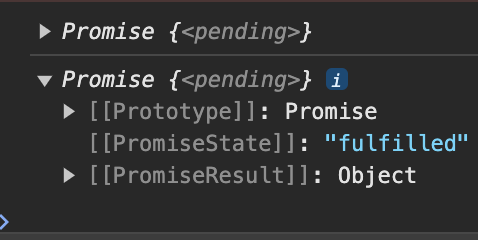
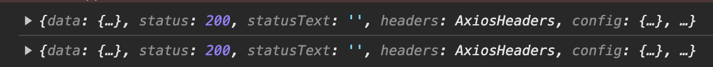

# 디즈니 플러스 클론 코딩

<details>
<summary>The Moive DB API 요청을 위한 Axios 인스턴스 생성 및 요청 보내기</summary>

### Axios란 무엇인가?

- Axios는 브라우저, Node.js를 위한 Promise API를 활용하는 HTTP 비동기 통신 라이브러리이다.
- 쉽게 말해 백엔드랑 프론트엔드 통신을 쉽게 하기 위해 Ajax와 더불어 사용한다.
- fetch보다 훨씬 더 많이 사용됨(기능이 많고 바로 Json으로 받을 수 있음)

#### Axios 사용 방법

- axios 모듈 설치

```bash
npm install axios --save
```

#### Axios 인스턴스화 하는 이유

- 중복된 부분을 계속 입력하지 않아도 되기 때문에

#### Axios 인스턴스 만드는 순서

1. 인스턴스 생성할 폴더 파일 생성
2. axios.js 파일 생성

```javascript
import axios from "axios";

const instance = axios.create({
  baseURL: "https://api.themoviedb.org/3",
  params: {
    api_key: "my key",
    language: "ko-KR",
  },
});

export default instance;
```

</details>
<details>
<summary>Styled Component에 대해 알아보기</summary>

### Styled Component란?

- Styled Component란 Css-in-JS라고 하는 Javascript 파일 안에서 CSS를 처리할 수 있게 해주는 대표적인 라이브러리이다.

#### 설치 방법

```bash
# with npm
npm install --save styled-components

# with yarn
yarn add styled-components
```

</details>

<details>
<summary>CSS 관련</summary>

### Position 속성

- 태그를 어떻게 위치시킬지를 정의하며, 아래의 5가지 값을 갖는다.
  - static : 기본값, 다른 태그와의 관계에 의해 자동으로 배치되며 위치를 임의로 설정해 줄수 없다.
  - relative : 요소 자기 자신을 기준으로 배치(원래 있던 위치를 기준으로 좌표를 지정한다.)
  - absolute : 부모(조상) 요소를 기준으로 배치.(절대 좌표와 함께 위치를 지정해 줄 수 있다.)부모 요소에 position: static이 아닌 것이 있으면 그것을 기준으로 배치한다. 하지만 position: static이 아닌 것이 없다면 body를 기준으로 배치한다.
  - fixed : 스크롤과 상관없이 항상 문서 최 좌측 상단을 기준으로 좌표를 고정한다.(스크롤이 있을 때 스크롤을 내리면 해당 요소도 같이 내려간다.)
  - sticky : 스크롤 영역 기준으로 배치한다.

### 가상요소 ::before ::after

- 가상 클래스(Pseudo-Class)는 별도의 class를 지정하지 않아도 지정한 것처럼 요소를 선택할 수 있다.
- 가상 요소(Pseudo-Element)는 가상 클래스처럼 선택자(selector)에 추가되며, 존재하지 않는 요소를 존재하는 것처럼 부여하여 문서의 특정 부분 선택이 가능하다.

  - ::before : 요소의 콘텐츠 시작부분에 생성된 콘텐츠를 추가한다.
  - ::after : 요소의 컨텐츠 끝 부분에 생성된 콘텐츠를 추가한다.
  - ::before와 ::after는 꼭 'content'와 같이 사용되야 한다. -> 이 content는 가짜 속성이다.
  - HTML 문서에 정보로 포함되지 않은 요소를 CSS에서 새롭게 생성시켜주는 역할을 한다.

</details>

<details>
<summary>async await</summary>

- Promise{<pending>}이라고 나오는 이유는?
   - 비동기 처리하는 중이기 때문

#### 해결 방법은??

- 아직 Response가 오지 않은 (Pending) 한 상태가 아닌 결과값을 받은 이후에 값을 처리해주면 된다.

  1. async request .then
  2. async await



 </details>
<details>
<summary>미디어 쿼리</summary>

- 미디어 쿼리는 화면 해상도, 기기 방향 등의 조건으로 HTML에 적용하는 스타일을 전환할 수 있는 CSS3의 속성 중 하나이다.
- 반응형 웹 디자인에서는 미디어 쿼리를 사용해 적용하는 스타일을 기기마다(화면 크기마다) 저노한할 수 있다.

```css
@media(조건) {
    스타일
}
```

</details>
<details>
<summary>IFrame</summary>

- 아이프레임은 HTML Inline Frame 요소이며 inline frame의 약자이다.
- 효과적으로 다른 HTML 페이지를 현재 페이지에 포함시키는 중첩된 브라우저로 iframe 요소를 이용하면 해당 웹 페이지 안에 어떠한 제한 없이 다른 페이지를 불러와서 삽입 할 수 있다.
</details>

<details>
<summary>transition 속성</summary>

- 스타일 변경 시 부드럽게 전환하게 한다.(흔히 호버링할 때 사용)
- 선택자가 변환되는 것을 시간의 흐름을 줘서 변화시키는 속성
- transition: 속성 시간 속도 지연시간;
  - 속도 부분의 속성 값들
    - ease : 기본값, 느리게 시작한 다음 빠르게 전환한 다음 천천히 종료
    - linear : 처음부터 끝까지 같은 속도로 전환
    - ease-in : 가속, 느린 시작으로 빠른 끝, 느린 느낌을 받을 수 있다.
    - ease-out : 감속, 빠른 시작으로 느린 끝, 빠른 느낌을 받을 수 있다.
    - ease-in-out : 느린 시작과 느린 끝으로 전환 효과 지정
    - cubic-bezier(n, n, n, n) : 3차 베지어 함수에서 자신의 값을 임의적으로 정함
</details>

<details>
<summary>Grid CSS</summary>

- Flexible Box는 단순한 1차원 레이아웃을 제공(행 Row 또는 열 Column 하나씩)
- 이에 비해 Css Crid는 2차원(행과 열) 레이아웃 시스템을 제고함(god Row와 열 Column을 같이)
  - gap
  - gid-template-column : 공백으로 구분된 값 목록으로 그리드의 열과 행을 정의. 값은 트랙 크기를 나타내고 그 사이의 공간은 grid line 격자선을 나타냄
```css
.container {
  grid-template-columns : 48px 50px auto 50px 40px;
  // auto : 남은 부분을 동적으로 차지함
}
```
  - repeat : 행이나 열을 특정 px만큼 반복
```css
.container {
  grid-template-columns: repeat(5, 10px);
}
```
  - fr : fraction의 약자. 1fr은 사용 가능한 공간의 1 부분을 의미함(사용 가능한 공간에 대한 비율)
```css
.container {
  grid-template-columns: repeat(5, 1fr);
}

.container {
  width: 800px
  grid-template-columns: 300px 10% 1fr 1fr;
  // 300 80 210 210 픽셀을 가져가게 됨
}
```
</details>