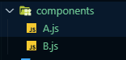
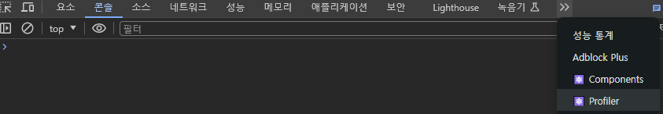
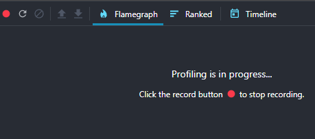
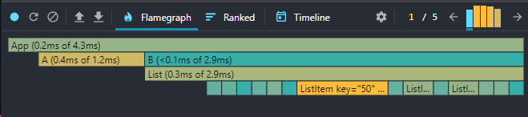

# 리액트 앱 성틍 개선하는 방법

<details>
<summary>React Profiler</summary>

### 리액트 프로파일러란?
- React-Profilers는 React16.5에서 새로운 DevTools 프로파일러 플러그인에 대한 지원을 추가한다.
- 이 플러그인은 React의 Profiler API를 사용하여 React 애플리케이션의 성능 병목 현상을 식별하기 위해 렌더링되는 각 구성 요소에 대한 타이밍 정보를 수집한다.

#### 리액트 프로파일러를 이용한 성능 측정하기
- React Profilers를 이용하여 성능을 측정하기 위해 두 개의 컴포넌트를 생성 후 성능 비교를 해보자

- A.js : 모든 요소를 하나의 컴포넌트에
- B.js : 여러 컴포넌트로 나눠주기
```javascript
// A.js
import React from 'react'

const A = ({message, posts}) => {
  return (
    <div>
        <h1>A Component</h1>
        <p>{message}</p>
        <ul>
            {posts.map(post => {
                return (
                    <li key={post.id}>
                        <p>{post.title}</p>
                    </li>
                )
            })}
        </ul>
    </div>
  )
}

export default A

// B.js
import React from 'react'

const Message = ({message}) => {
    return (
        <p>{message}</p>
    )
}

const ListItem = ({post}) => {
    return (
        <li key={post.id}>
            <p>{post.title}</p>
        </li>
    )
}

const List = ({posts}) => {
    return (
        <ul>
            {posts.map(post => (
                <ListItem key={post.id} post={post}/>
            ))}
        </ul>
    )
}

const B = ({message, posts}) => {
  return (
    <div>
        <h1>B Component</h1>
        <Message message={message}/>
        <List posts={posts}/>/
    </div>
  )
}

export default B
```

#### 가짜 데이터 가져오기
- 성능을 측정하기 위해 어느 정도 많은 데이터가 있을 시에 측정이 가능하기 때문에 가짜 데이터를 전달해주는 곳에 요청을 보내서 데이터를 받아온다.
```javascript
useEffect(() => {
    fetch('https://jsonplaceholder.typicode.com/posts')
        .then(response => response.json())
        .then(posts => setPosts(posts));
}, []);
```
- Response는 HTTP 응답 전체를 나타내는 객체로, JSON 본문 콘텐츠를 추출하기 위해서는 json()(en-US)메서드를 호출해야 한다.

#### useEffect
- 컴포는트가 랜더링될 때 특정 작업을 실행할 수 있도록 하는 Hook
- 여기서 App 컴포넌트가 한번 렌더링 된 후 jsonplaceholder라는 곳의 서버에 비동기 요청을 보내어 posts 데이터를 가져오기 위해 사용되었다.
- 현재는 profiler를 살펴보는 부분에 집중하기 위해 나중에 더 자세히 알아보도록 하자.

#### fetch() 메소드
- 원격 API에 요청을 보내기 위해 사용할 수 있는 메소드
- 전역 fetch() 메소드는 네트워크에서 리소스를 가져오는 프로세스를 시작하여 Response응답을 사용할 수 있게 되면 이행된 Promise 약속을 Return한다.

#### jsonplaceholder
- JSONPlaceholder는 가짜 데이터가 필요할 때마다 사용할 수 있는 무료 온라인 REST API
- posts, users, photos 등 여러 가지 가짜 데이터를 가져올 수 있다.
</details>
<details>
<summary>React Profiler로 앱 성능 측정하기</summary>

- 성능을 측정하기 위해 크롬 개발자 도구를 열고 Profiler 탭으로 이동


- 여기서 프로파일링을 수행하여 성능 데이터를 기록하고 측정할 수 있다.
- 프로 파일링을 수행하려면 레코드 버튼을 클릭한다.
- Profiler는 컴포넌트가 재렌더링이 될 때마다 성능을 기록한다.


- hello 입력했을 때 비교


- A보다 B의 처리 시간이 더 느린 것을 확인할 수 있음
</details>
<details>
<summary>React.memo를 이용한 성능 최적화</summary>

</details>