# 중고마켓 클론코딩

<details>
<summary>Prisma, Postgres 설정하기</summary>

### Prisma, Postgres 설정하기
- NextJS로 개발 시 Prisma랑 Postgres를 많이 사용함

#### [Prisma](https://www.prisma.io/nextjs)
```bash
# install
npm install -D prisma

# init
npx prisma init
```

#### Postgres
- 사용법으로 [Railway](https://railway.app/)와 [Superbase](https://supabase.com/)를 사용하는 방법이 있음
- Docker를 활용하여 사용하는 것 권장
</details>

<details>
<summary>ORM에 대해서</summary>

> 데이터베이스를 사용할 때 ORM을 많이 사용하게 되는데 ORM이 무엇인지 살펴보자

### ORM(Object Relational Mapping)이란?
- 객체와 관계형 데이터베이스의 데이터를 자동으로 변형 및 연결하는 작업이다.
- ORM을 이용한 개발은 객체와 데이터베이스의 변형에 유연하게 사용할 수 있다.
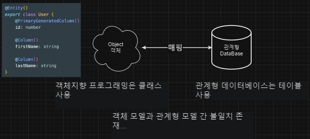

### ORM vs Pure Javascript
- ORM을 사용해서 board 테이블에서 데이터를 가져오는 방법과 orm 사용하지 않고 가져오는 방법을 비교해보면 다음과 같다.
```javascript
/* orm 사용 */
const boards = Board.find({ title: 'Hello', status: 'PUBLIC'});

/* pure javascript */
db.query('SELECT * FROM boards WHERE title = "Hello" AND status="PUBLIC", (err, result) => {
    if(err) {
        throw new Error(err);
    }
    boards = result.rows;
})
```

### ORM과 Node.js 추상화 계층
- 개발에서 추상화라는 것은 추상화를 많이 하면 할수록 어떠한 복잡한 로직을 알지 못하더라도 그 로직을 간단하게 사용할 수 있게 해준다.
  - 불필요한 정보는 숨기고 중요한 정보만을 표현해서 프로그램을 간단하게 해준다.
- 예를 들어 커피를 마시기 위해 커피머신을 이용할 줄 안다면 커피 머신이 어떻게 작동하는지 몰라도 커피를 마실 수 있는 것과 같다.
- 데이터베이스도 사용하는 방법에 따라 추상화가 많이 되어있는 라이브러리를 사용할수도 있고 그렇지 않은 라이브러리를 사용해서 데이터베이스를 컨트롤 할 수도 있다.
- 그래서 추상화 정도를 3단계로 나눠서 살펴보자

#### 저수준 : 데이터베이스 드라이버
- 데이터베이스 드라이버는 데이터베이스 연결(때때로 연결 풀링)을 처리한다.
- 이 수준에서는 원시 SQL 문자열을 작성하여 데이터베이스에 전달하고 데이터베이스에서 응답을 받는다.
- Node.js 생태계에서는 이 계층에서 작동하는 많은 라이브러리가 있다.
- 다음은 세 가지 인기 있는 라이브러리이다.
  - mysql : MySQL(mysql을 위한 데이터베이스 드라이버)
  - pg : PostgresSQL(postgres를 위한 데이터베이스 드라이버)
  - sqlite3 : SQLite(sqlite를 위한 데이터베이스 드라이버)
- 이러한 각각 라이브러리는 기본적으로 동일한 방식으로 작동한다.
- 데이터베이스 인증 정보를 가져오고, 새 데이터베이스 인스턴스를 인스턴스화하고, 데이터베이스에 연결하고, 문자열 형식으로 쿼리를 보내고 결과를 비동기적으로 처리한다.
```javascript
const {Client} = require('pg');
const connection = require('./connection.json');
const client = new Client(connection);

client.connect();

const query = `SELECT
    ingredient.*, item.name AS item_name, item.type AS item_type
FROM
    ingredient
LEFT JOIN
    item On item.id = ingredient.item_id
WHERE
    ingredient.dish_id = $1`;

client.query(query, [1])
    .then(res => {
        console.log('Ingredients:');
        for (let row of res.rows) {
            console.log(`${row.item_name}: ${row.quantity} ${row.unit}`);
        }

        client.end();
    })
```

#### 중간 수준 : 쿼리 빌더
- 이것은 단순한 데이터베이스 드라이버 모듈과 완전한 ORM을 사용하는 것의 중간 수준이다.
- 이 계층에서 작동하는 가장 주목할만한 모듈은 Knex이다.
- 이 모듈은 몇 가지 다른 SQL 언어에 대한 쿼리를 생성할 수 있다.
- 이 모듈은 앞서 언급한 라이브러리 중 하나에 의존한다.
  - Knex와 함께 사용하려는 특정 라이브러리를 설치(knex: Query, Builder)
- 여기서 작성하는 쿼리는 기본 SQL 쿼리와 매우 유사하다.
- 또한 한 가지 좋은 점은 문자열을 연결하여 SQL을 형성하는 경우(종종 보안 취약점이 발생함)보다 훨씬 더 편리한 방식으로 프로그래밍 방식으로 동적 쿼리를 생성할 수 있다는 것
```javascript
// 기본 SQL 쿼리와 비슷하지만 위에 문자열을 사용하는 예제와는 차이가 있다.

const knex = require('knex');
const connection = require('./connection.json');
const client = knex({
    client: 'pg',
    connection
});

client
    .select([
        '*',
        client.ref('item.name').as('item_name')
        client.ref('item.type').as('item_type')
    ])
    .from('ingredient')
    .leftJoin('item', 'item.id', 'ingredient.item_id')
    .where('dish_id', '=', 1)
    .debug()
    .then(rows => {
        console.log('Ingredients:');
        for(let row of rows) {
            console.log(`${row.item_name}: ${row.quantity} ${row.unit}`)
        }

        client.destroy();
    })
```

#### 고수준: ORM
- 최고 수준의 추상화이다.
- ORM으로 작업할 때 일반적으로 더 많은 설정을 사전에 수행해야 한다.
- ORM의 요점은 이름(object relational mapping)에서 알 수 있듯이 관계형 데이터베이스의 데이터를 애플리케이션의 객체(클래스 인스턴스)에 매핑하는 것이다.
- 많이 사용하는 ORM으로는 다음과 같이 있다.
  -  typeorm
  -  sequelize
  -  prisma
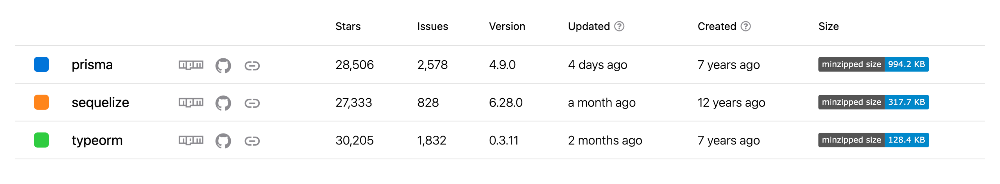
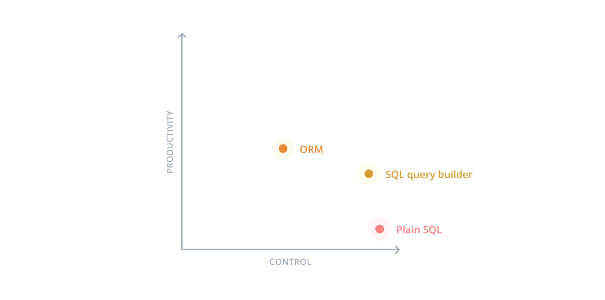

### ORM 사용의 단점
- SQL이 아닌 ORM 자체를 배우게 된다.(각각 특정 ORM 자체를 배우는 시간도 오래걸리며 ORM들 마다 다른 문법을 사용하는 곳도 많다.)
- ORM을 이용해서 복잡한 호출을 하면 성능이 좋지 않을 수 있다.

### ORM 사용의 장점
- 하나의 소스 코드를 이용해서 여러 데이터베이스로 쉽게 교체 가능하다.
- 중복 코드 방지
- SQL 인젝션 취약점으로부터 보호
- 모델 유효성 검사 지원
- TypeScript 지원
</details>

<details>
<summary>pgAdmin 사용법</summary>

> pgAdmin은 데이터베이스를 보는 툴(Tool)이다.

### Window에서 PostgresSQL 설치하기(이 프로젝트에서는 Docker 사용)
[Link](https://www.postgresql.org/download/windows/)

### Mac에서 PostgresSQL 설치하기(이 프로젝트에서는 Docker 사용)
[Link](https://postgresapp.com/downloads.html)

### Window & Mac에서 pgAdmin 설치하기
[Link](https://www.pgadmin.org/download/)

</details>

<details>
<summary>채팅을 구현하는 여러 가지 방법</summary>

#### http polling(이번 강의에서는 http polling 활용 예정)

#### websocket

#### redis

#### pusher ....등등

</details>
<details>
<summary>Rest vs WebSocket</summary>
- 두 가지를 활용하여 채팅앱을 구현할 때 어떻게 다른지 비교하며 Websocket이 무엇인지 알아보자.

### REST API vs WebSocket
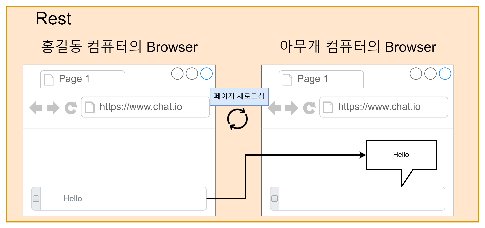
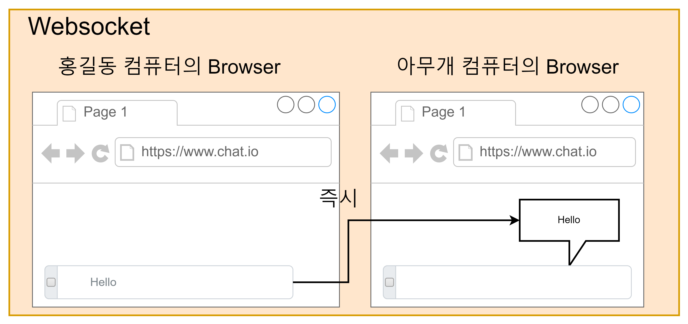
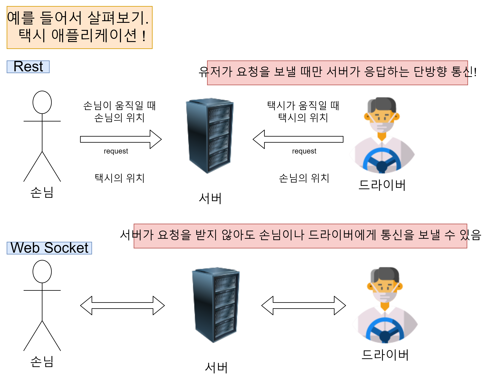

- REST API같은 경우는 계속 한 방향으로 손님이 서버에 드라이버가 어디에 있는지 지속해서 요청을 보내 드라이버의 위치를 알 수가 있다.
- 하지만 Web Socket 같은 경우는 양방향으로 드라이버가 자신의 위치를 나타내서 바로 손님에게 그 정보가 가게 할 수 있다.

</details>

<details>
<summary>Polling에 대해서</summary>

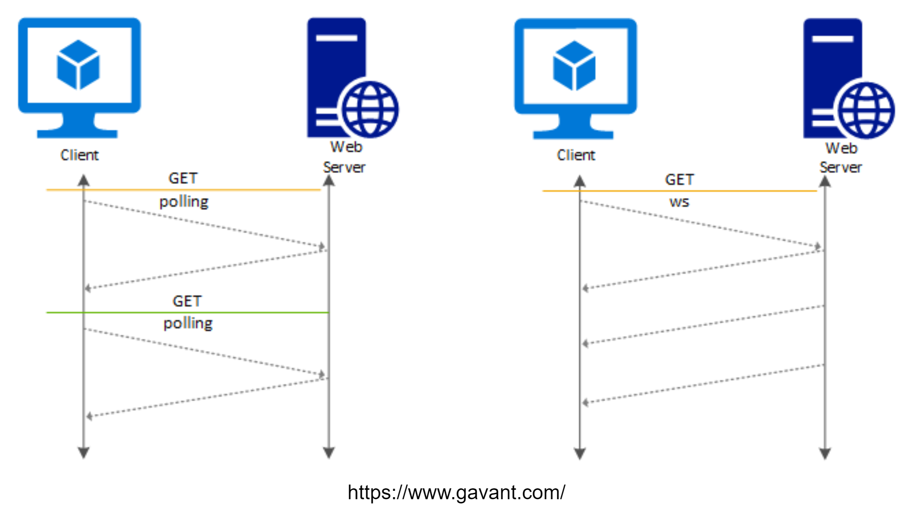

### Polling(폴링)이란
- 클라이언트가 일정한 간격으로 서버에 요청을 보내서 결과를 전달받는 방식이다.
```typescript
const POLL_TIME = 1000;
setInterval(() => {
    fetch('https://text.com/location');
}, POLL_TIME); // 이렇게 일정한 간격으로 요청을 보내서 택시의 위치가 어딘지 알 수 있다.
```

- 이러한 방법은 구현이 쉽다는 장점이 있지만 서버의 상태가 변하지 않았을 때도 계속 요청을 보내서 받아와야 하기에 필요 없는 요청이 많아지며, 또한 요청 간격을 정하기도 쉽지 않다.
- 또한 폴링의 주기가 짧으면 서버의 성능에 부담을 줄 수 있다.
- 또한 주기가 길면 실시간성이 떨어지게 된다.
- 그리고 서버에서 바뀐 데이터가 없어도 계속 요청을 해야하고 결과를 줘야 한다.


#### Long Polling(폴링)이란?
- Polling의 단점으로 인해 새롭게 고안해 낸 것이 Long Polling이다.
- 롱 폴링도 폴링처럼 계속 요청을 보내지만 차이점은 일반 폴링은 주기적으로 요청을 보낸다면 롱 폴링은 요청을 보내면 서버가 대기하고 있다가 이벤트가 발생했거나 타임아웃이 발생할 때까지 기다린 후에 응답을 주게 된다.
- 이렇게 클라이언트는 응답을 받자마자 다시 요청을 보내게 된다.
- 서버의 상태 변화가 많이 없다면 폴링 방식보다 서버의 부담이 줄어들게 된다.
- 이러한 특징으로 롱 폴링은 실시간 메시지 전달이 중요하지만, 서버의 상태 변화가 자주 발생하지 않는 서비스에 적합하다.
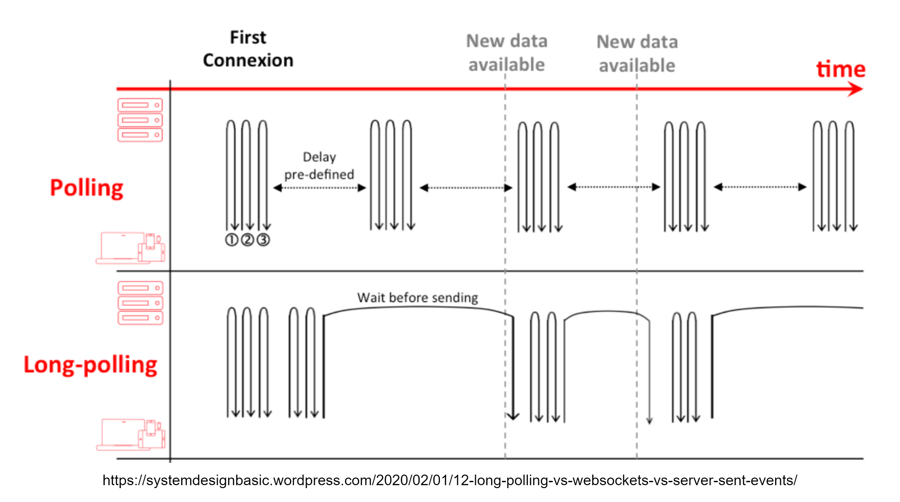

#### Streaming 이란?
- 클라이언트에서 서버에 요청을 보내고 끊기지 않는 연결상태에서 계속 데이터를 수신한다.
- 양방향 소통보다는 서버에서 계속 요청을 받는 것에 더 유용하다.
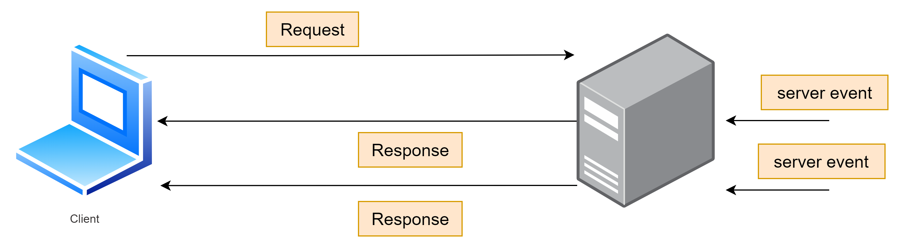

- Polling, Long Polling, HTTP Streaming 이 세가지의 공통점은 결국 HTTP 프로토콜을 이용하며 이 HTTP 요청과 응답에 Header가 같이 전달되는데 이 Header에 많은 데이터가 들어 있어서 너무 ㅁ낳은 요청과 응답의 교환은 부담을 주게 된다는 것이다.
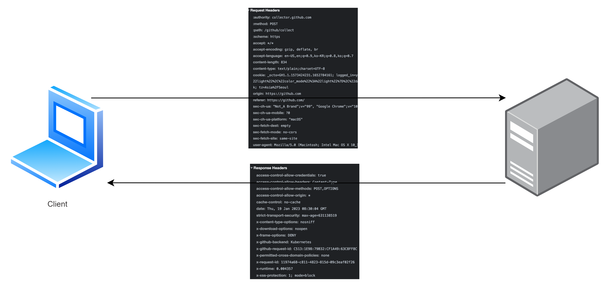

#### HTTP 통신 방법과 WebSocket의 차이점
- Websocket은 처음에 접속 확립(Handshake)을 위해서만 HTTP 프로토콜을 이용하고 그 이후 부터는 독립적인 프로토콜 ws를 사용하게 된다.
- 또한 HTTP 요청은 응답이 온 후 연결이 끊기게 되지만 Websocket은 핸드 쉐이크가 완료되고 임의로 연결을 끊기 전까지는 계속 연결이 되어 있다.
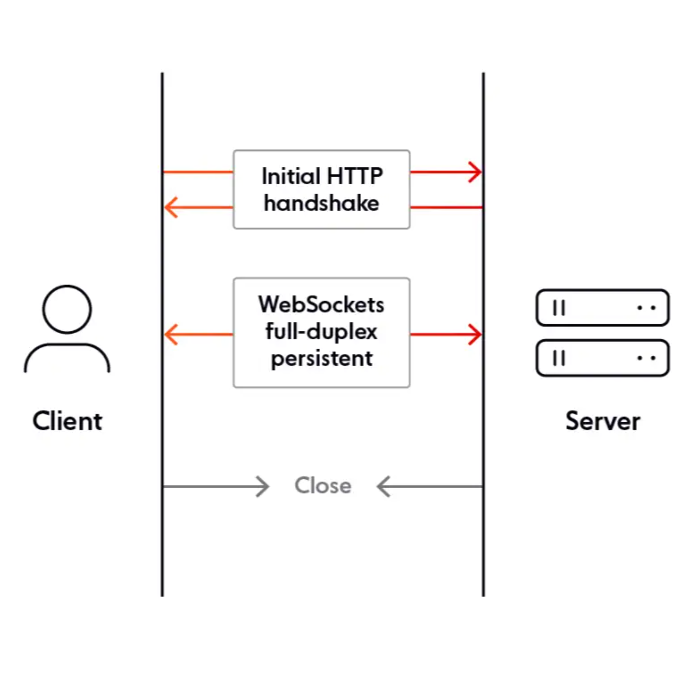

</details>