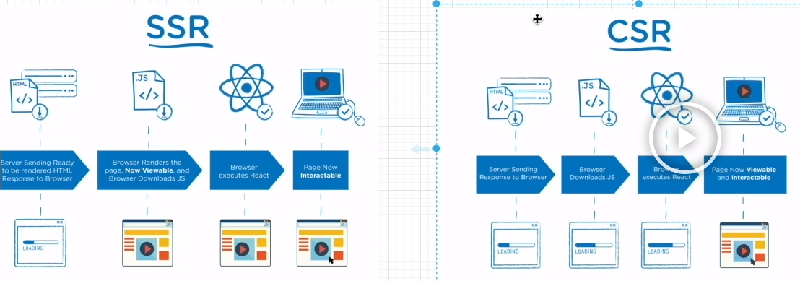

# Next.js로 블로그 만들기

<details>
<summary>Next JS란?</summary>

### Next JS란?
- React의 SSR(Server Side Rendering)을 쉽게 구현할 수 있게 도와 주는 간단한 프레임워크이다.
- 리액트로 개발할 때 SPA(Single Page Application)을 이용하면 CSR(Client Side Rendering)을 하기 때문에 좋은 점도 있지만 단점도 있는데 그 부분이 바로 검색엔진 최적화(SEO) 부분이다.
- CSR을 하면 첫 페이지에서 빈 html을 가져와 js 파일을 해석하여 화면을 구성하기 때문에 포털 검색에 거의 노출 될 일이 없다.
- 하지만 Next.js에서는 Pre-Rendering을 통해 페이지를 미리 렌더링 하여 완성된 HTML을 가져오기 때문에 사용자와 검색 엔진 크롤러에게 바로 렌더링 된 페이지를 전달할 수 있게 된다.
- 리액트에서도 SSR을 지원하면서 이를 구현하기에 굉장히 복잡하기 때문에 Next.js를 통해 이 문제를 해결해주게 된다.



#### Server Side Rendering
- 클라이언트 대신 서버에서 페이지를 준비하는 원리이다.
- 원래 리액트에서는 클라이언트 사이드 렌더링하기 때문에 서버에 영향을 미치지 않고, 서버에서 클라이언트로 응답해서 보낸 html도 거의 비어있다.
  - 이러한 방식은 서버에서 데이터를 가져올 때 지연 시간 발생으로 UX 측면에서 좋지 않을 수 있다.
  - 검색 엔진에 검색 시 웹크롤링이 동작할 때 내용을 제대로 가져와 읽을 수 없기에 검색엔진 최적화에 문제가 된다.
- Next.js에서는 서버 사이드 렌더링을 이용하므로 사용자와 검색 엔진 크롤러에게 바로 렌더링 된 페이지를 전달 할 수 있어서 검색엔진 최적화에 좋은 영향을 준다.

#### 설치 방법
```bash
# npm
npx create-next-app@latest

# yarn
yarn create next-app
```

</details>

<details>
<summary>NextJS 기본 파일 구조</summary>


</details>