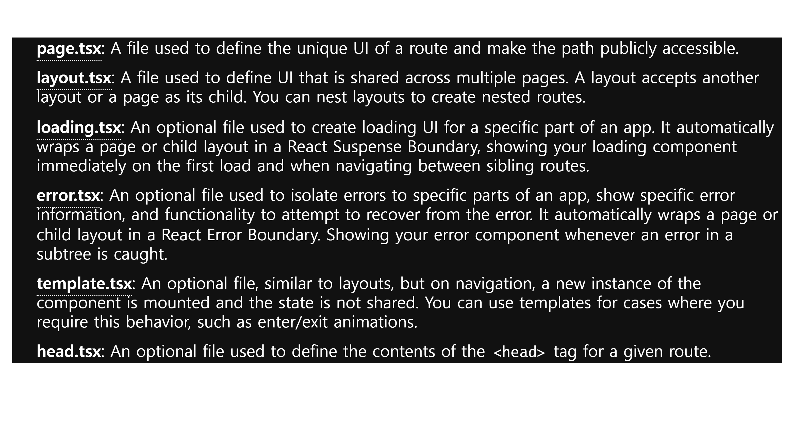
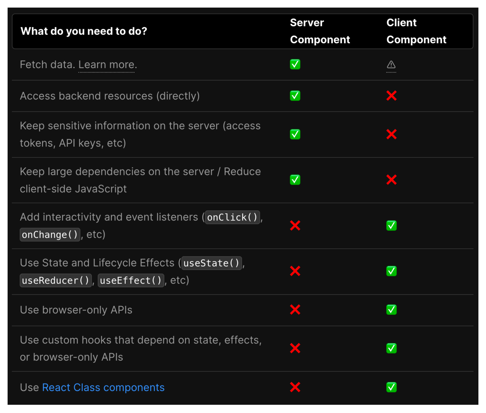

# NextJS 13 확인하기

### 간단한 게시판 만들어보기

#### next app 설치
```bash
# 현재 경로에 설치
npx create-next-app@latest --ts ./  
```

#### 백엔드 서비스를 위한 [포켓베이스](https://pocketbase.io/docs/) 이용하기

#### 예약된 파일 이름들(Special Files)


<br />

### Server Component
- NextJS 컴포넌트는 기본적으로 Server Component

[Link1](https://reactjs.org/blog/2020/12/21/data-fetching-with-react-server-components.html)
[Link2](https://beta.nextjs.org/docs/rendering/server-and-client-components#server-components)

- React18 이전에는 React를 사용하여 애플리케이션을 렌더링하는 기본 방법은 전적으로 클라이언트에서였다. => React18 이후 서버 컴포넌트 사용 가능
- Next.js는 HTML을 생성하고 React에 의해 rehydrate 되도록 클라이언트에 전송함으로써 애플리케이션을 페이지로 나누고 서버에서 미리 렌더링하는 더 쉬운 방법을 제공했다.
- 그러나 이로 인해 초기 HTML을 대화식(interactive)으로 만들기 위해 클라이언트에 추가 Javascript가 필요했다.
  - 서버에서 미리 렌더링하기 위해 사용했던 SSR도 문제가 있었다.
- 하지만 이제 서버 및 클라이언트 Component를 사용하여 React는 클라이언트와 서버에서 렌더링할 수 있으므로 구성 요소 수준에서 렌더링 환경을 선택할 수 있다.
- 기본적으로 App 디렉터리는 서버 구성 요소를 사용하므로 서버에서 구성 요소를 쉽게 렌더링하고 클라이언트에 전송되는 Javascript의 양을 줄일 수 있다.
- 그러나 App 내에서 클라이언트 구성 요소를 사용하고 클라이언트에서 렌더링할 수 있는 옵션이 있다.
  - Server Component, Client Component 같이 사용


