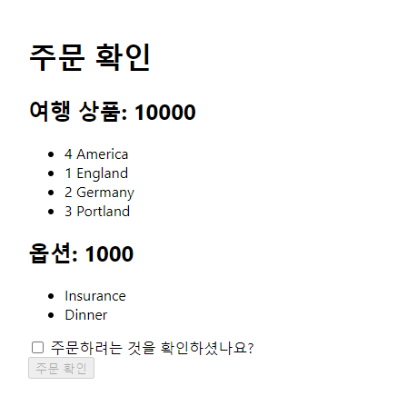
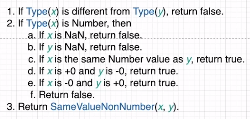

# 리액트 Context를 활용한 간단한 앱 만들기

<details>
<summary>리액트 Context란?</summary>

- 리액트에서 한 컴포넌트 안에서 데이터를 생성하거나 업데이트하거나 다른 컴포넌트와 데이터를 공유해서 사용하는 방법은 여러가지가 있다.
  - 리액트에서 데이터 흐름 컨트롤 하는 법(state 관리하는 법)
  - state와 props를 사용해서 컴포넌트 간에 전달
  - React Context 사용
  - mobx 사용 : 리액트에서 데이터 흐름 컨트롤 하는 법(state 관리하는 법)
  - redux를 사용
  - 등등...

### React Context
- 컨텍스트는 모든 수준에서 수동으로 props를 전달하지 않고도 구성 요소 트리를 통해 데이터를 전달할 수 있는 방법을 제공한다.
- React Context는 Component 트리의 깊이에 관계없이 props를 전달하지 않고도 Component에 데이터를 제공한다.
- Context는 전역 데이터를 관리하는 데 사용된다.(ex. 전역 상태, 테마, 서비스, 사용자 설정 등)

### React.createContext
```javascript
const MyContext = React.createContext(defaultValue);
```
- Context 객체를 만든다.
- React가 이 Context 객체를 구독하는 구성 요소를 렌더링할 때 트리에서 그 위에 가장 근접하게 일치하는 Provider에서 현재 Context 값을 읽는다.
- defaultValue 인수는 트리에서 구성 요소 위에 일치하는 공급자가 없는 경우에만 사용된다.


### Context.Provider
```javascript
<MyContext.Provider value={/* some value */}>
```
- 모든 Context 객체에는 Consumer Component가 컨텍스트 변경 사항을 구독할 수 있도록 하는 Provider React 구성 요소가 함께 제공된다.

```javascript
<MyContext.Provider value={/* some value */}>
  <AComponent />
  <BComponent />
  <CComponent />
</MyContext.Provider>
```
- A, B, C Component 모두 다 Context를 구독중
- 그래서 Context value에 변경 사항이 생기면 컴포넌트를 다시 렌더링 한다.
- 변경 사항은 Object.is와 동일한 알고리즘을 사용하여 새 값과 이전 값을 비교하여 결정된다.
- 만약 createContext를 할 때 defaultValue를 {userName: "John"}이라고 했더라도 Context.Provider value props에서 {userName: "Han"}이라고 전달해주면 두 번째 value가 Consumer Component들에 전달된다. {Provider 사용으로 Context의 value를 변경해줄 수 있음}
```javascript
const MyContext = React.createContext({userName:"John"});

<MyContext.Provider value={{ userName: "Han" }}>
```

### Class.contextType
```javascript
class MyClass extends React.Component {
  componentDidMount() {
    let value = this.context;
    /* perform a side-effect at mount using the value of MyContext */
  }
  componentDidUpdate() {
    let value = this.context;
    /* ... */
  }
  componentWilUnmount() {
    let value = this.context;
    /* ... */
  }
  render() {
    let value = this.context;
    /* render something based on the value of MyContext */
  }
}

MyClass.contextType = MyContext;
```
- 클래스의 contextType 속성에는 React.createContext()에 의해 생성된 Context 객체가 할당될 수 있다.
- 이 속성을 사용하면 this.context를 사용하여 해당 컨텍스트 유형의 가장 가까운 현재 value를 사용할 수 있다.
- 렌더링 기능을 포함한 모든 수명 주기 메서드에서 이를 참조할 수 있다.

### object.is vs ===
- Objet.is 는 Same Value Algorithm
- === 는 Strict Equality Algorithm
- Object.is

- ===


- Object.is()와 ===의 유일한 차이는 부호 있는 0과 Nan 값들의 처리이다.
  - === 연산자(및 == 연산)은 숫자값 -0과 +0을 같게 처리하지만, Object.is는 다르다고 처리한다.
  - Nan은 서로 같지 않게 처리한다.
```javascript
+0 === -0 // true

Object.is(+0, -0) // false

Number.NaN === NaN // false
Object.is(Number.NaN, NaN) // true

NaN === 0 / 0 // false
Object.is(NaN, 90 / 0) // true
```

</details>

<details>
<summary>useContext Hook 사용하기</summary>

- 클래스 Component에서 context value를 사용하려면 contextType property를 사용했다.
- 그렇다면 함수형 Component에서 context value를 사용하려면 어떻게 해야 될까?

### useContext
```javascript
const value = useContext(MyContext);
```
- Context 객체(React.createContext에서 반환된 값)를 인수로 가지고 현재 Context Value를 반환한다.
- 현재 Context Value는 트리에서 호출 구성 요소 위에 가장 가까운 <MyContext.Provider>의 value prop에 의해 결정된다.
- Component 위의 가장 가까운 <MyContext.Provider>가 업데이트되면 이 Hook은 해당 MyContext Provider 에게 전달된 최신 Context value로 다시 렌더링을 트리거한다.

```javascript
const themes = {
  light: {
    foreground: "#000000",
    background: "#eeeeee",
  },
  dark: {
    foreground: "#ffffff",
    background: "#222222"
  }
};

const ThereContext = React.createContext(themes.light); // 1

function App() {
  return (
    <ThereContext.Provider value={themes.dark}> // 2
      <Toolbar />
    </ThereContext.Provider>
  );
}

function Toolbar(props) {
  return (
    <div>
      <ThemedButton>
    </div>
  )
}

function ThemedButton() {
  const theme = useContext(ThereContext); // 3
  return (
    <button style={{ background: there.background, color: there.foreground }}>
      I am styled by there context!
    </button>
  )
}
```
- 1 : createContext API를 이용해서 Context 생성하기
- 2 : context value를 공유하기 원하는 Component를 Context.Provider로 감싸주기, 또한 공유하기 원하는 value를 value props으로 전달하기
- 3 : 해당 컴포넌트에서 context value를 사용하기 위해 useContext hook을 이용해주기
</details>

<details>
<summary>Context를 사용해서 데이터 제공하기</summary>

- 이번 프로젝트에서 Context를 사용해서 해야할 일
  1. 어떠한 컴포넌트에서 총 가격을 Update해주는 것
  2. 어떠한 컴포넌트에서 총 가격을 보여주는 것

#### Context를 사용하는 방법
1. Context를 생성
  - react 제공 (createContext 사용)
  - const OrderContext = createContext();
2. Context는 Provider안에서 사용 가능하기 때문에 Provider 생성
  - <OrderContext.Provider value={???}><App /></OrderContext.Provider>
  - value에 들어갈 값 : App 컴포넌트에서 사용할 데이터 혹은, 데이터를 업데이트하는 함수
3. 더 복잡한 로직을 구현하기 위해 Provider를 위한 함수 생성(OrderContextProvider)
  - 함수 생성 후 Provider 리턴
    - value로 넣을 데이터를 만들어조기(필요한 데이터와, 데이터를 업데이트 해줄 함수)
  - 상품 Count를 이용한 가격 계산

4. OrderContextProvider 함수로 orderContext 사용할 컴포넌트 감싸기
5. orderContext 사용하기
</details>

<details>
<summary>Context를 사용해서 가격 계산하기</summary>

### 해야 할 일
- 여행 상품의 총 가격, 옵션의 총 가격 구하기
  - 여행 가격은 각 상품의 숫자를 올리거나 내릴 때 : Products 컴포넌트
  - 옵션은 각 옵션의 체크 박스를 체크하거나 제거할 때 : Options 컴포넌트
- 여행 상품의 총 가격, 옵션의 총 가격 보여주기
</details>