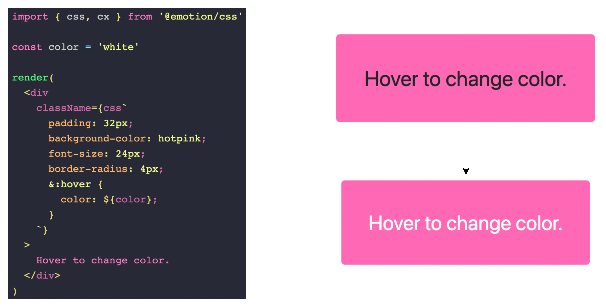
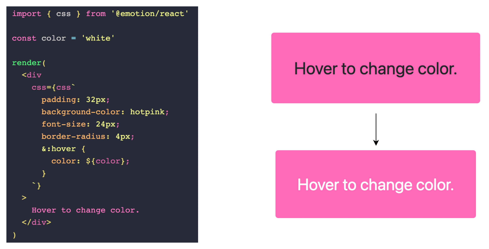
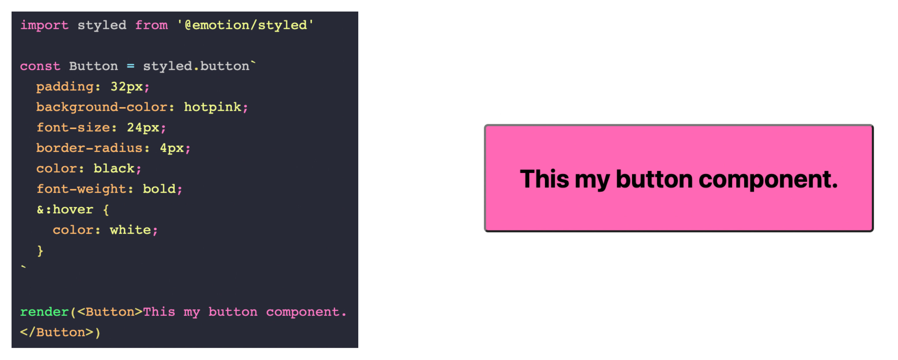
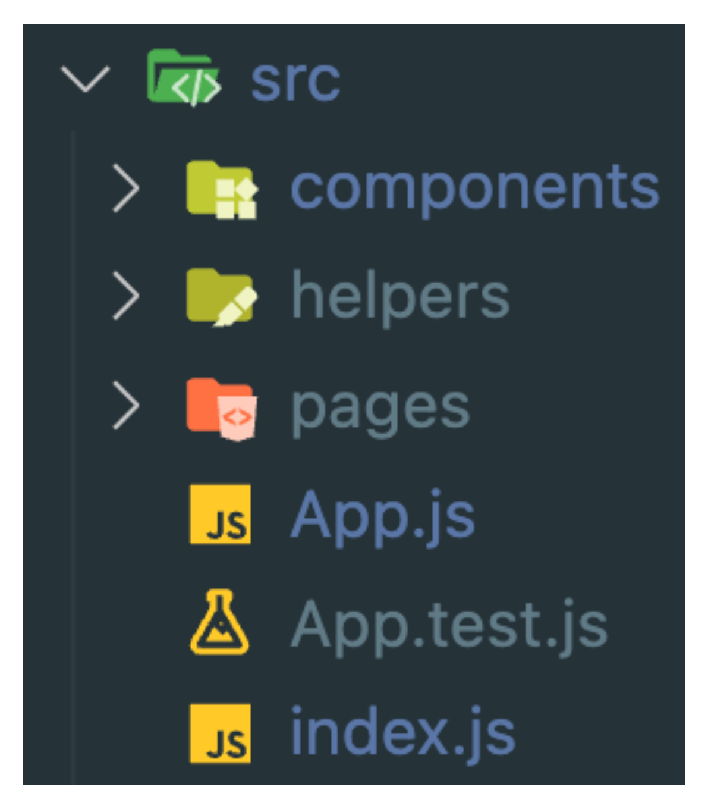
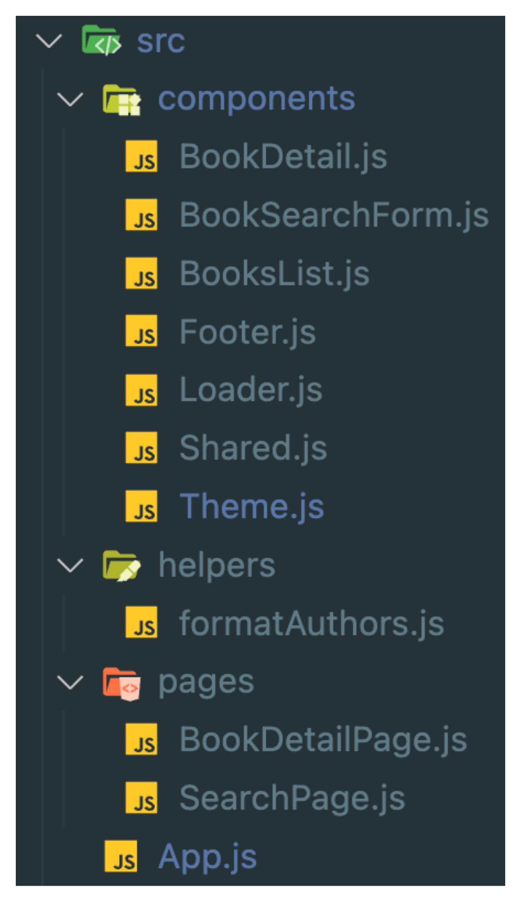
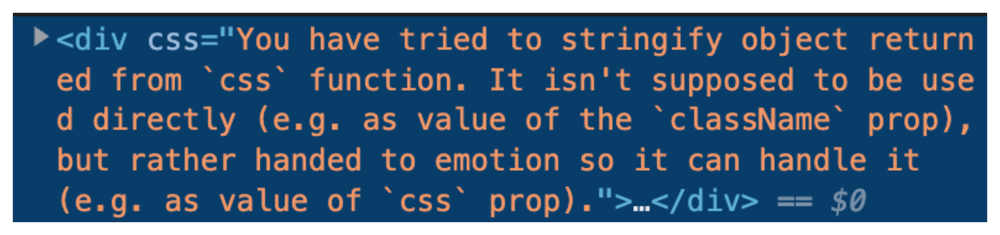
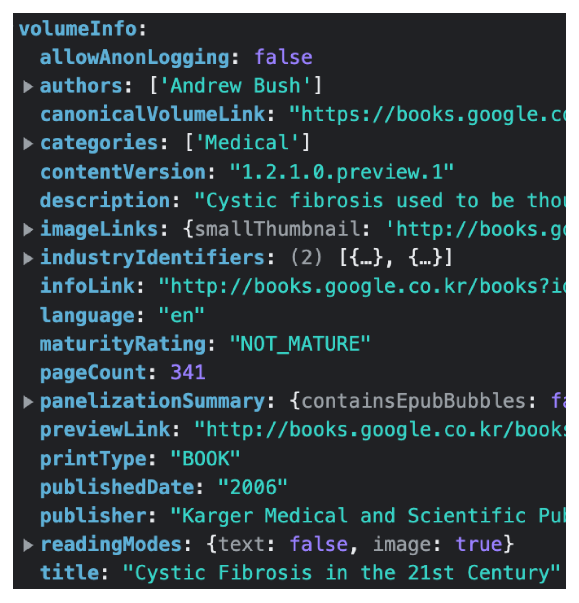
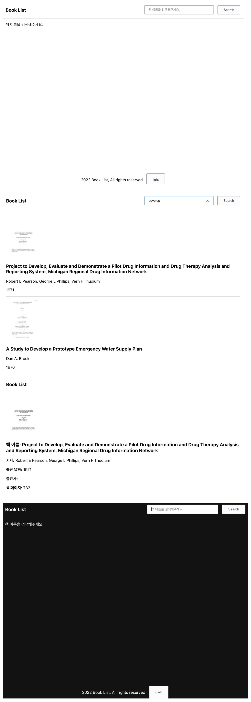

# CSS Framework 공부하기 - Emotion CSS

<details>
<summary>Emtion이란?</summary>

> Emotion js는 JavaScript로 CSS 스타일을 작성하도록 설계된 라이브러리이다. <br />
> 소스 맵, 레이블 및 테스트 유틸리티와 같은 기능을 통해 뛰어난 개발자 경험과 함께 강력하고 예측 가능한 스타일 구성을 제공한다. <br />
> 문자열 및 개체 스타일이 모두 지원된다.;

#### Emotion js는 주로 Framework Agnostic과 React 두 가지 방식으로 사용된다.
- Agnotic은 일반화되어 다양한 시스템 간에 상호 운용할 수 있는 것을 말한다.

#### Framework Agnostic
- Emotino은 프레임워크에 구애받지 않는 라이브러리이다. 
  - 즉, 다양한 프레임워크 및 라이브러리에서 사용할 수 있다. 
  - 동일한 강력한 API와 기능으로 원하는 모든 곳에서 사용할 수 있다.
- @emotion/css 패키지는 프레임워크에 구애받지 않으며 Emotion을 사용하는 가장 간단한 방법이다.
- 추가 설정, babel 플러그인 또는 기타 구성 변경이 필요하지 않다.
- vendor-prefixing, nested selector 및 미디어 쿼리(media queries)를 지원한다.
- css 함수를 사용하여 클래스 이름을 생성하고 cx를 사용하여 구성하는 것을 선호한다.


<br />

#### React
- @emotion/react 패키지는 React가 필요하며 가능한 경우 해당 프레임워크 사용자에게 권장된다.
- 구성 가능한 빌드 환경에서 React를 사용할 때 가장 좋다.
- CSS Prop
  - style prop과 유사하며, vendor-prefixing, nested selector 및 미디어 쿼리(media queries)를 지원한다.
  - 개발자가 스타일이 지정된 API 추상화를 건너뛰고 구성 요소와 요소를 직접 스타일 지정할 수 있다.
  - css prop은 또한 개발자가 공통 및 사용자 정의 가능한 값에 쉽게 액세스할 수 있도록 하는 인수로 테마와 함께 호출되는 함수를 허용한다.
- 아무런 configuration 없이 서버 사이드 렌더링을 지원한다.
- 테마 기능을 기본적으로 사용할 수 있다.
- 적절한 패턴과 구성이 설정되었는지 확인하기 위해 ESLint 플러그인을 사용할 수 있다.


- [@emotion/styled](https://emotion.sh/docs/styled) 패키지는 구성 요소를 만들기 위해 styled.div 스타일 API를 사용하는 것을 선호하는 사람들을 위한 것이다.


#### 전체 폴더 생성


<br />

#### 전체 파일 생성


<br />

#### 필요 패키지 설치
```bash
npm install @emotion/react @emotion/styled axios react-router-dom
```

</details>

<details>
<summary> React Router Dom 적용하기</summary>

### React Router Dom 이란?
- 리액트를 사용할 때 페이지를 이동할 수 있도록 도와주는 라이브러리이다.
- 리액트는 SPA(Single Page Application)를 기본으로 하기 때문에 하나의 페이지에서 동적으로 화면을 바꿔간다.
- BrowserRouter : History API를 사용해 URL과 UI를 동기화하는 라우터
- Routes : Route에 매치되는 첫번째 요소를 렌더링
- Route : 컴포넌트 속성에 설정된 URL과 현재 경로가 일치하면 해당하는 컴포넌트를 렌더링
- Link : a 태그와 비슷하며 to 속성에 설정된 링크로 이동, 기록이 history 객체에 저장된다.

```javascript
import './App.css';
import { BrowserRouter, Outlet } from 'react-router-dom';
import { Routes } from 'react-router-dom';
import { Route } from 'react-router-dom';
import SearchPage from './pages/SearchPage';
import BookDetailPage from './pages/BookDetailPage';

const Layout = () => {
  <div>
    <Outlet />
  </div>
}

function App() {
  return (
    <BrowserRouter>
      <Routes>
        <Route path="/" element={<Layout />}>
          <Route index element={<SearchPage />} />
          <Route path='/book:bookId' element={<BookDetailPage />} />
        </Route>
      </Routes>
    </BrowserRouter>
  );
}

export default App;

```

</details>

<details>
<summary>Global Style 적용하기</summary>

### [Global Style](https://emotion.sh/docs/globals)
- 우리는 폰트 설정과 같은 글로벌 CSS를 삽입하고 싶을 때가 있을 수 있다.
- 이를 위해 Global 컴포넌트를 사용할 수 있다. 
- 이 컴포넌트는 동일한 값들을 받는 styles 프롭을 허용하며, css 프롭과 동일한 값을 받지만 전역적으로 스타일을 삽입한다. 
- 전역 스타일은 스타일이 변경되거나 Global 컴포넌트가 언마운트될 때 제거된다.

```javascript
const Layout = () => {
  <div>
    <Global 
      styles={css`
        body {
          background-color: white;
          color: black;
          transition-duration: 0.2s;
          transition-property: background-color, color;
        }
        a {
          color: black;
          text-decoration: none;
        }
        ul {
          list-style:none;
          padding: 0;
        }
      `}
    />
    <Outlet />
  </div>
}
```

</details>

<details>
<summary>Footer 컴포넌트 생성 및 Theme 적용하기</summary>

```javascript
/** @jsxImportSource @emotion/react */

import React from "react";
import { css } from "@emotion/react";

const Footer = () => {
  return (
    <div
      css={css`
        margin: 1rem 0;
        display: flex;
        justify-content: center;
      `}
    >
      <p>Book List Inc, All rights reserved.</p>

      <button
        css={css`
          background-color: #fcfcfd;
          color: #36395a;
          border: 1px solid rgba(34, 36, 38, 0.5);
          padding: 0.6rem 1.5rem;
          margin-left: 15px;
          border-radius: 3px;
          cursor: pointer;

          &:hover {
            transform: translateY(-2px);
          }
        `}
      >
        dark
      </button>
    </div>
  );
};

export default Footer;

```
#### 에러 및 해결방법

- App.js / Footer.js에 /** @jsxImportSource @emotion/react */ 추가
  
<br />

### 버튼을 눌렀을 때 테마 변경하기
#### [테마](https://emotion.sh/docs/theming) 생성
```javascript
export const themeLight = {
  text: "#000",
  background: "#fff",
};

export const themeDark = {
  text: "#fff",
  background: "#121212",
}
```

#### ThemeProvider로 감싸주기
```javascript
function App() {
  const [isDark, setIsDark] = useState(false);
  return (
    <BrowserRouter>
      <ThemeProvider theme={isDark ? themeDark : themeLight}>
        <Routes>
          <Route path="/" element={<Layout isDark={isDark} setIsDark={setIsDark} />}>
            <Route index element={<SearchPage />} />
            <Route path="/book:bookId" element={<BookDetailPage />} />
          </Route>
        </Routes>
      </ThemeProvider>
    </BrowserRouter>
  );
}
```

#### Theme 사용하기
```javascript
const Layout = ({isDark, setIsDark}) => {
  const theme = useTheme();
  
  return (
    <div>
      <Global
        styles={css`
          body {
            background-color: ${theme.background};
            color: ${theme.text};
            transition-duration: 0.2s;
            transition-property: background-color, color;
          }
          a {
            color: ${theme.text};
            text-decoration: none;
          }
          ul {
            list-style: none;
            padding: 0;
          }
        `}
      />
      <div
        css={css`
          min-height: 90vh;
        `}
      >
        <Outlet />
      </div>
      <Footer isDark={isDark} setIsDark={setIsDark} />
    </div>
  );
};
```

#### 버튼 눌러서 테마 변경하기
```javascript
/** @jsxImportSource @emotion/react */

import React from "react";
import { css } from "@emotion/react";

const Footer = ({isDark, setIsDark}) => {
  return (
    <div
      css={css`
        margin: 1rem 0;
        display: flex;
        justify-content: center;
      `}
    >
      <p>Book List Inc, All rights reserved.</p>

      <button
        css={css`
          background-color: #fcfcfd;
          color: #36395a;
          border: 1px solid rgba(34, 36, 38, 0.5);
          padding: 0.6rem 1.5rem;
          margin-left: 15px;
          border-radius: 3px;
          cursor: pointer;

          &:hover {
            transform: translateY(-2px);
          }
        `}
        onClick={() => setIsDark(!isDark)}
      >
        {isDark ? "dark" : "light"}
      </button>
    </div>
  );
};

export default Footer;

```


</details>

<details>
<summary>Search Page 생성하기</summary>

### Header UI(SearchPage) 생성
```javascript
import React from "react";
import styled from "@emotion/styled";
import BookSearchForm from './../components/BookSearchForm';

export const LogoText = styled.h3`
  margin: 0;
`;

const Container = styled.div`
  max-width: 960px;
  padding: 15px;
  margin: 0 auto;
`;

const Header = styled.header`
  border-bottom: 1px solid gray;
`;

const HeaderContainer = styled(Container)`
  display: flex;
  align-items: center;
  @media (max-width: 778px) {
    flex-direction: column;
    align-items: flex-start;
  }
`;

const HeaderSearchForm = styled.div`
  margin-left: auto;
`;

const SearchPage = () => {
  console.log("hello search");
  return (
    <Header>
      <HeaderContainer>
        <LogoText>Book List</LogoText>
        <HeaderSearchForm>
          <BookSearchForm />
        </HeaderSearchForm>
      </HeaderContainer>
    </Header>
  );
};

export default SearchPage;

```

### BookSearch Form 컴포넌트 생성
```javascript
import React from "react";
import styled from "@emotion/styled";

const Input = styled.input`
  outline: 0;
  padding: 0.6rem 1rem;
  border: 1px solid rgba(34, 36, 38, 0.5);
  border-radius: 3px;
  min-width: 280px;
  &:focus,
  &:active {
    border-color: #85b7d9;
  }
  @media (max-width: 778px) {
    margin-top: 10px;
  }
`;

const Button = styled.button`
  background-color: #fcfcfd;
  color: 36395a;
  border: 1px solid rgba(34, 36, 38, 0.5);
  padding: 0.6rem 1.5rem;
  margin-left: 15px;
  border-radius: 3px;
  cursor: pointer;

  &:hover {
    transform: translateY(-2px);
  }
`;

const Form = styled.form``;

const BookSearchForm = () => {
  return (
    <Form>
      <Input type="search" placeholder="책 이름을 검색해주세요." />
      <Button type="submit">Search</Button>
    </Form>
  );
};

export default BookSearchForm;

```

</details>

<details>
<summary>Google API를 통해 책 데이터 가져오기</summary>

### 검색 로직 작성(SearchPage)
```javascript
// SearchPage.js
import React from "react";
import styled from "@emotion/styled";
import BookSearchForm from './../components/BookSearchForm';
import {useState} from "react";
import axios from 'axios';

export const LogoText = styled.h3`
  margin: 0;
`;

const Container = styled.div`
  max-width: 960px;
  padding: 15px;
  margin: 0 auto;
`;

const Header = styled.header`
  border-bottom: 1px solid gray;
`;

const HeaderContainer = styled(Container)`
  display: flex;
  align-items: center;
  @media (max-width: 778px) {
    flex-direction: column;
    align-items: flex-start;
  }
`;

const HeaderSearchForm = styled.div`
  margin-left: auto;
`;

const SearchPage = () => {
  const [searchTerm, setSearchTerm] = useState("");
  const [books, setBooks] = useState({});
  const [loading, setLoading] = useState(false);

  const API_BASE_URL = `https://www.googleapis.com/books`;

  const fetchBooks = async () => {
    setLoading(true);
    try {
      const result = await axios.get(`${API_BASE_URL}/v1/volumes?q=${searchTerm}`);
      setBooks(result.data);
    } catch(error) {
      console.log(error);
    }

  }

  const handleChange = e => {
    setSearchTerm(e.target.value);
  }

  const handleSubmit = e => {
    e.preventDefault();
    fetchBooks();
  }

  return (
    <Header>
      <HeaderContainer>
        <LogoText>Book List</LogoText>
        <HeaderSearchForm>
          <BookSearchForm onChange={handleChange} onSubmit={handleSubmit} searchTerm={searchTerm}/>
        </HeaderSearchForm>
      </HeaderContainer>
    </Header>
  );
};

export default SearchPage;

```

```javascript
// BookSearchForm.js
import React from "react";
import styled from "@emotion/styled";

const Input = styled.input`
  outline: 0;
  padding: 0.6rem 1rem;
  border: 1px solid rgba(34, 36, 38, 0.5);
  border-radius: 3px;
  min-width: 280px;
  &:focus,
  &:active {
    border-color: #85b7d9;
  }
  @media (max-width: 778px) {
    margin-top: 10px;
  }
`;

const Button = styled.button`
  background-color: #fcfcfd;
  color: 36395a;
  border: 1px solid rgba(34, 36, 38, 0.5);
  padding: 0.6rem 1.5rem;
  margin-left: 15px;
  border-radius: 3px;
  cursor: pointer;

  &:hover {
    transform: translateY(-2px);
  }
`;

const Form = styled.form``;

const BookSearchForm = ({ onChange, onSubmit, searchTerm }) => {
  return (
    <Form onSubmit={onSubmit}>
      <Input
        type="search"
        placeholder="책 이름을 검색해주세요."
        onChange={onChange}
        value={searchTerm}
      />
      <Button type="submit">Search</Button>
    </Form>
  );
};

export default BookSearchForm;

```

</details>

<details>
<summary>책 리스트 UI 작성하기</summary>

### 책 데이터 가져올 때 loader 보여주기
```javascript
// Loader.js
/** @jsxImportSource @emotion/react */

import { useTheme } from "@emotion/react";
import React from "react";
import { css } from "@emotion/react";

const Loader = ({ loading, children }) => {
  const theme = useTheme();

  return (
    <>
      {loading ? (
        <div
          css={css`
            color: ${theme.text};
            text-align: center;
            padding: 20px 0;
          `}
        >
          {children}
        </div>
      ) : null}
    </>
  );
};

export default Loader;
```

### BookList UI 생성하기
```javascript
import React from "react";
import { Link } from "react-router-dom";
import formatAuthors from "../helpers/formatAuthors";

const Book = ({ book }) => {
  return (
    <li>
      <div>
        
        <div>
          <Link to={`/book${book.id}`}>
            <h3>{book.volumeInfo.title}</h3>
          </Link>
          <p>{formatAuthors(book.volumeInfo.authors)}</p>
          <p>{book.volumeInfo.publishedDate}</p>
        </div>
      </div>
    </li>
  );
};

const BookList = ({ books }) => {
  if (!books.totalItems) {
    return <div>책 이름을 검색해주세요.</div>;
  } else if (books.totalItems === 0) {
    return <div>찾고 있는 책이 없습니다.</div>;
  } else {
    return (
      <ul>
        {books.items.map((book, index) => {
          return <Book book={book} key={index} />;
        })}
      </ul>
    );
  }
};

export default BookList;

```



### formatAuthors 함수 작성하기
```javascript
const formatAuthors = authors => {
    if(!authors){
        authors = '';
    } else {
        authors = authors.join(', ')
    }
    return authors;
}

export default formatAuthors;
```

</details>


