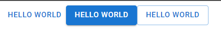
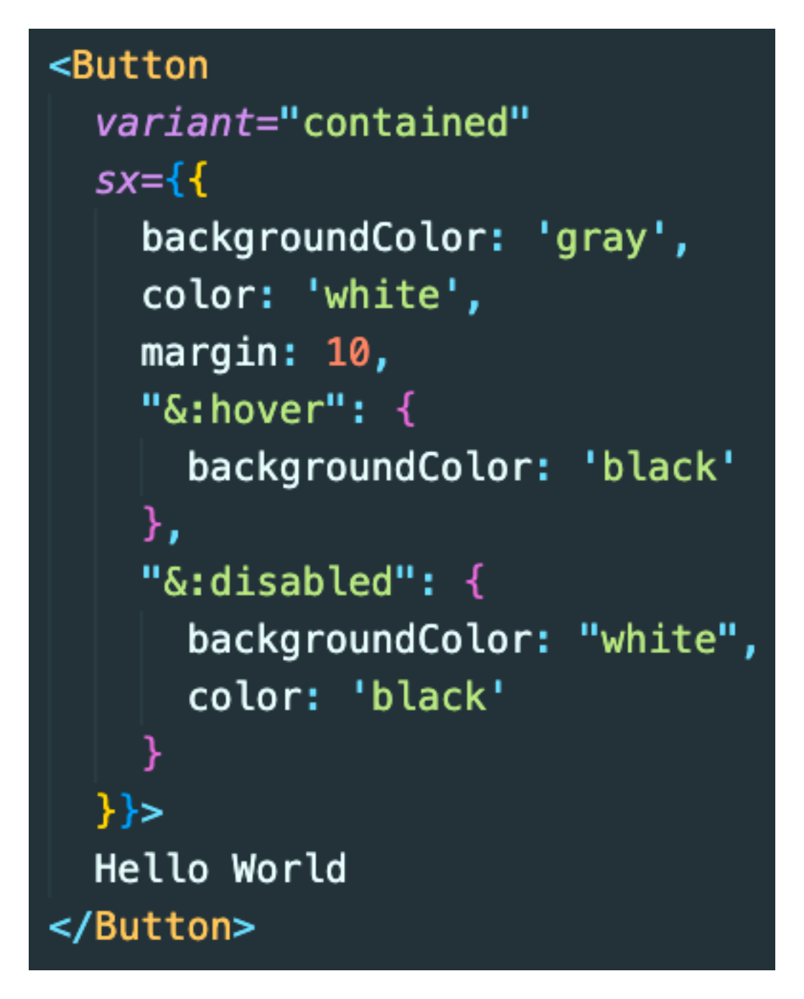
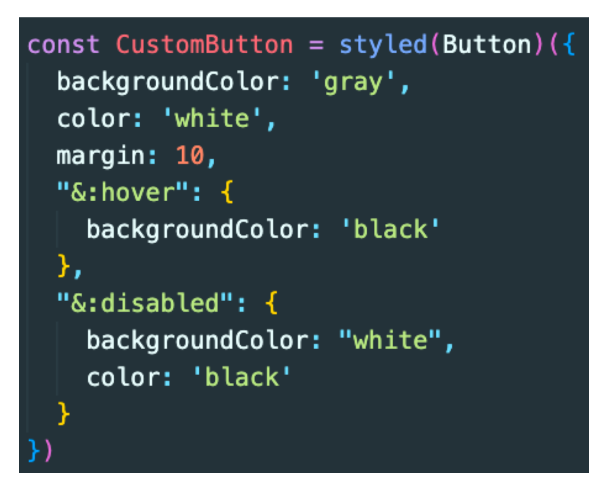
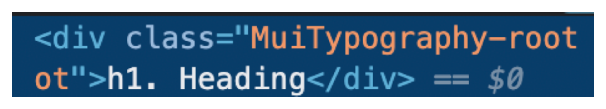
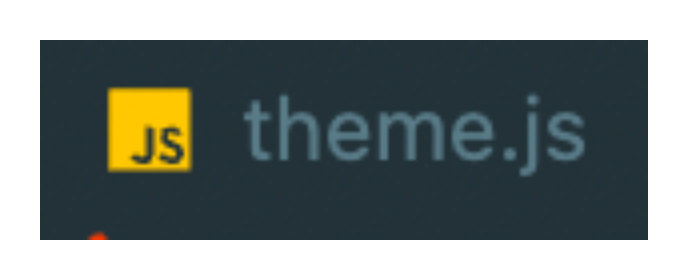
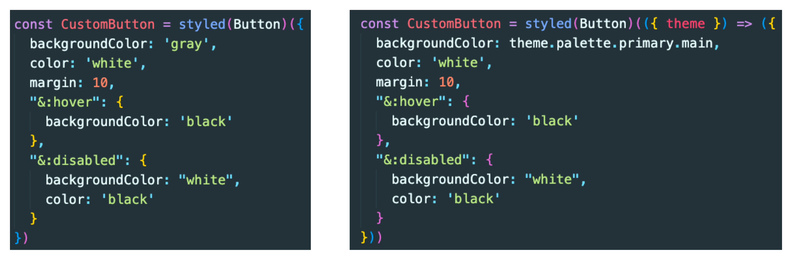
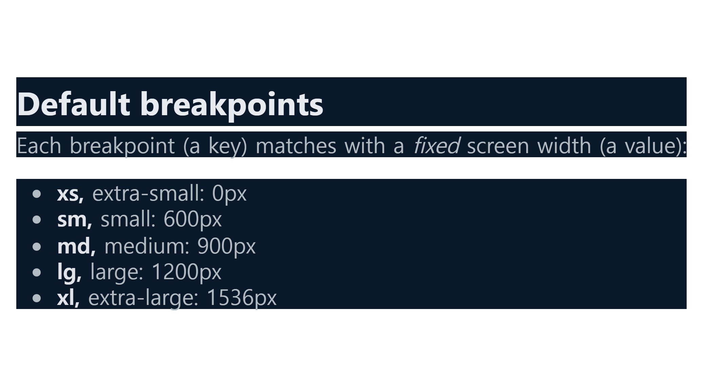
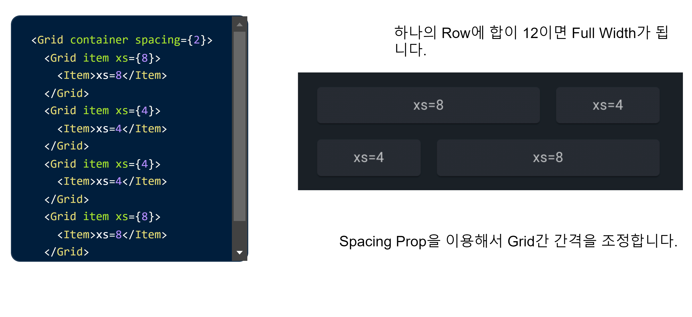
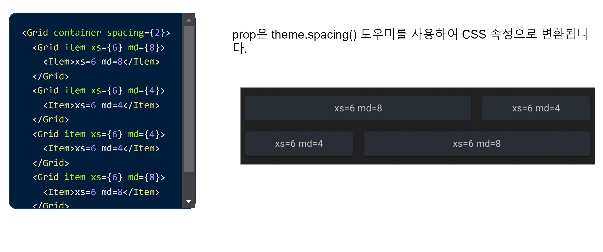
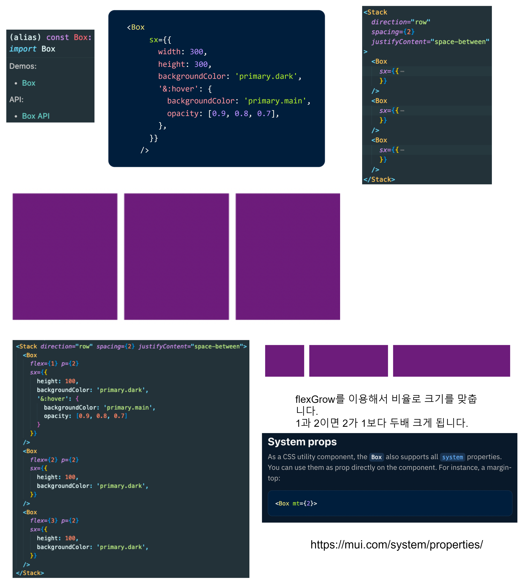

# CSS Framework 공부하기 - Material UI

<details>
<summary>MUI 설치하기</summary>

> Material UI는 Google의 Material Design을 구현하는 오픈 소스 React Component 라이브러리이다.;

#### 설치 방법
```bash
npm install @mui/material @emotion/react @emotion/styled

npm install @mui/material @mui/styled-engine-sc styled-components
```
- 두 개의 설치 방법이 있지만 기본적으로 MUI 컴포넌트를 위한 스타일링을 생성할 때 사용되는 기본 스타일 라이브러리는 emotion이다.
  - 왜냐하면 SSR 환경에서 styled component를 MUI를 위한 엔진으로 사용할 때 아직 에러가 있을 수 있기 때문

```html
<link
    rel="stylesheet"
    href="https://fonts.googleapis.com/css?family=Roboto:300,400,500,700&display=swap"
/>
<style>
      * {
        font-family: "Roboto", sans-serif;
      }
    </style>
```
- 폰트는 index.html에 넣어서 적용해준다.

- 아이콘을 위한 모듈 설치
```bash
npm install @mui/icons-material
```
</details>

<details>
<summary>MUI 기본 사용법</summary>

### 버튼 사용법

- MUI에서 제공하는 버튼을 사용하고 싶은 경우 Button을 import 해서 사용하면 된다.



- variant props에 따라서 스타일링이 차이가 난다.
- variant뿐 아니라 아주 많은 props가 존재하는데 그것은 페이지 아래로 내려가보면 API에 자세히 나와있다. [...Go!](https://mui.com/material-ui/api/button/#props)

### [버튼에 아이콘](https://mui.com/material-ui/react-button/#buttons-with-icons-and-label)을 넣으려면?

### 버튼 색깔 바꾸기


> 커스텀 버튼을 만드려면?
>

### TypoGraphy 사용법
- 한 번에 너무 많은 유형의 크기와 스타일을 사용하면 레이아웃이 손상될 수 있다.
- Typographic scale에는 레이아웃 그리드와 함께 잘 작동하는 제한된 유형 크기 세트가 있다.
```javascript
<Typography variant="h1" component="div" gutterBottom>
    h1. Heading
</Typography>
```
- h1 스타일을 사용하고 div 태그를 사용한다.


</details>

<details>
<summary>Theme 사용하기</summary>

> 테마는 구성 요소의 색상, 표면의 어두움, 그림자 수준, 잉크 요소의 적절한 불투명도 등을 지정한다. <br />
> 테마를 사용하면 앱에 일관된 톤을 적용할 수 있으며 이를 통해 비즈니스 또는 브랜드의 특정 요구 사항을 충족하기 위해 프로젝트의 모든 디자인 측면을 사용자 지정할 수 있다. <br />
> 앱 간의 일관성을 높이기 위해 밝은 테마와 어두운 테마를 선택할 수 있다. 기본적으로 구성 요소는 밝은 테마 유형을 사용한다.

### 커스텀 테마를 만들어 사용하기

```javascript
import { createTheme } from '@mui/material/styles';
import { green, purple } from '@mui/material/colors';

export const theme = createTheme({
  palette: {
    primary: {
      main: purple[500], 
    },
    secondary: {
      main: green[500],
    }
  }
})
```

#### 커스텀 버튼에 테마 적용


</details>

<details>
<summary>BreakPoints & Grid & Stack & Box</summary>

### [Breakpoints](https://mui.com/material-ui/customization/breakpoints/)를 이용한 반응형 구현하기
- 최적의 사용자 경험을 위해 MUI 인터페이스는 다양한 중단점에서 레이아웃을 조정할 수 있어야 한다.
- 중단점은 반응형으로 만들기 위해 다양한 구성 요소에서 내부적으로 사용되지만 Grid 구성 요소를 통해 응용 프로그램의 레이아웃을 제어하는 데 사용할 수도 있다.


#### 테마를 이용한 커스텀 breakpoint 생성
```javascript
const theme = createTheme({
  breakpoints: {
    values: {
      xs: 0,
      sm: 600,
      md: 900,
      lg: 1200,
      xl: 1536,
    }
  }
})
```

<br />

### [Grid](https://mui.com/material-ui/react-grid/#main-content)
- MUI 디자인 반응형 레이아웃 그리드는 화면 크기와 방향에 맞게 조정되어 레이아웃 전체에서 일관성을 보장한다.



<br />

### [Stack](https://mui.com/material-ui/react-stack/)
- Stack 구성 요소는 각 자식 사이에 선택적 간격 또는 구분선을 사용하여 수직 또는 수평 축을 따라 직계 자식의 레이아웃을 관리한다.
- 스택은 1차원 레이아웃과 관련된 반면 그리드는 2차원 레이아웃을 처리한다.
- 기본 방향은 자식을 세트로 쌓는 열이다.
[Title](.gitignore)

<br />

### [Box](https://mui.com/material-ui/react-box/)
- Box 구성 요소는 대부분의 CSS 유틸리티 요구 사항에 대한 래퍼 구성 요소 역할을 한다.



</details>