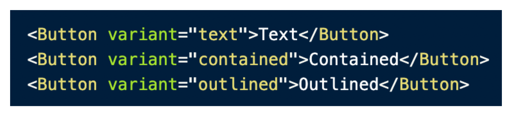

# CSS Framework 공부하기 - Material UI

<details>
<summary>MUI 설치하기</summary>

> Material UI는 Google의 Material Design을 구현하는 오픈 소스 React Component 라이브러리이다.;

#### 설치 방법
```bash
npm install @mui/material @emotion/react @emotion/styled

npm install @mui/material @mui/styled-engine-sc styled-components
```
- 두 개의 설치 방법이 있지만 기본적으로 MUI 컴포넌트를 위한 스타일링을 생성할 때 사용되는 기본 스타일 라이브러리는 emotion이다.
  - 왜냐하면 SSR 환경에서 styled component를 MUI를 위한 엔진으로 사용할 때 아직 에러가 있을 수 있기 때문

```html
<link
    rel="stylesheet"
    href="https://fonts.googleapis.com/css?family=Roboto:300,400,500,700&display=swap"
/>
<style>
      * {
        font-family: "Roboto", sans-serif;
      }
    </style>
```
- 폰트는 index.html에 넣어서 적용해준다.

- 아이콘을 위한 모듈 설치
```bash
npm install @mui/icons-material
```
</details>

<details>
<summary>MUI 기본 사용법</summary>

### 버튼 사용법

- MUI에서 제공하는 버튼을 사용하고 싶은 경우 Button을 import 해서 사용하면 된다.



- variant props에 따라서 스타일링이 차이가 난다.
- variant뿐 아니라 아주 많은 props가 존재하는데 그것은 페이지 아래로 내려가보면 API에 자세히 나와있다. [...Go!](https://mui.com/material-ui/api/button/#props)

### [버튼에 아이콘](https://mui.com/material-ui/react-button/#buttons-with-icons-and-label)을 넣으려면?

### 버튼 색깔 바꾸기


> 커스텀 버튼을 만드려면?
>

### TypoGraphy 사용법
- 한 번에 너무 많은 유형의 크기와 스타일을 사용하면 레이아웃이 손상될 수 있다.
- Typographic scale에는 레이아웃 그리드와 함께 잘 작동하는 제한된 유형 크기 세트가 있다.
```javascript
<Typography variant="h1" component="div" gutterBottom>
    h1. Heading
</Typography>
```
- h1 스타일을 사용하고 div 태그를 사용한다.


</details>

<details>
<summary>Theme 사용하기</summary>

> 테마는 구성 요소의 색상, 표면의 어두움, 그림자 수준, 잉크 요소의 적절한 불투명도 등을 지정한다. <br />
> 테마를 사용하면 앱에 일관된 톤을 적용할 수 있으며 이를 통해 비즈니스 또는 브랜드의 특정 요구 사항을 충족하기 위해 프로젝트의 모든 디자인 측면을 사용자 지정할 수 있다. <br />
> 앱 간의 일관성을 높이기 위해 밝은 테마와 어두운 테마를 선택할 수 있다. 기본적으로 구성 요소는 밝은 테마 유형을 사용한다.

### 커스텀 테마를 만들어 사용하기

```javascript
import { createTheme } from '@mui/material/styles';
import { green, purple } from '@mui/material/colors';

export const theme = createTheme({
  palette: {
    primary: {
      main: purple[500], 
    },
    secondary: {
      main: green[500],
    }
  }
})
```

#### 커스텀 버튼에 테마 적용


</details>

<details>
<summary>BreakPoints & Grid & Stack & Box</summary>

### [Breakpoints](https://mui.com/material-ui/customization/breakpoints/)를 이용한 반응형 구현하기
- 최적의 사용자 경험을 위해 MUI 인터페이스는 다양한 중단점에서 레이아웃을 조정할 수 있어야 한다.
- 중단점은 반응형으로 만들기 위해 다양한 구성 요소에서 내부적으로 사용되지만 Grid 구성 요소를 통해 응용 프로그램의 레이아웃을 제어하는 데 사용할 수도 있다.


#### 테마를 이용한 커스텀 breakpoint 생성
```javascript
const theme = createTheme({
  breakpoints: {
    values: {
      xs: 0,
      sm: 600,
      md: 900,
      lg: 1200,
      xl: 1536,
    }
  }
})
```

<br />

### [Grid](https://mui.com/material-ui/react-grid/#main-content)
- MUI 디자인 반응형 레이아웃 그리드는 화면 크기와 방향에 맞게 조정되어 레이아웃 전체에서 일관성을 보장한다.


<br />

### [Stack](https://mui.com/material-ui/react-stack/)
- Stack 구성 요소는 각 자식 사이에 선택적 간격 또는 구분선을 사용하여 수직 또는 수평 축을 따라 직계 자식의 레이아웃을 관리한다.
- 스택은 1차원 레이아웃과 관련된 반면 그리드는 2차원 레이아웃을 처리한다.
- 기본 방향은 자식을 세트로 쌓는 열이다.
[Title](.gitignore)

<br />

### [Box](https://mui.com/material-ui/react-box/)
- Box 구성 요소는 대부분의 CSS 유틸리티 요구 사항에 대한 래퍼 구성 요소 역할을 한다.


#### flex
- 이것은 flex-grow, flex-shrink 및 flex-basis가 결합된 약어이다.
- 두 번째 및 세 번째 매개변수(flex-shrink 및 flex-basis)는 선택 사항이다.
- 기본값은 0 1 auto이지만 flex: 5;와 같이 단일 숫자 값으로 설정하면 flex-basis가 0%로 변경되므로 flex-grow: 5를 설정하는 것과 같다.
- 플렉스 수축: 1; 플렉스 기반: 0%;


</details>

<details>
<summary>App Bar(Header)</summary>

> 상단 앱 바는 현재 화면과 관련된 콘텐츠 및 작업을 제공한다. 브랜딩, 화면 제목, 탐색 및 작업에 사용된다.;

[AppBar](https://mui.com/material-ui/react-app-bar/#main-content)

```javascript
// Example
<Box sx={{ flexGrow: 1 }}>
  <AppBar position="static">
    <Toolbar>
      <IconButton
        size="large"
        edge="start"
        color="inherit"
        aria-label="menu"
        sx={{ mr: 2 }}
      >
        <MenuIcon />
      </IconButton>
      <Typography variant="h6" component="div" sx={{ flexGrow: 1 }}>
        News
      </Typography>
      <Button color="inherit">Login</Button>
    </Toolbar>
  </AppBar>
</Box>
```
</details>

<details>
<summary>Menu(Drop Down)</summary>

### Avatar 클릭 시 Drop Down 메뉴 보여주기


```javascript
import * as React from 'react';
import Button from '@mui/material/Button';
import Menu from '@mui/material/Menu';
import MenuItem from '@mui/material/MenuItem';

export default function PositionedMenu() {
  const [anchorEl, setAnchorEl] = React.useState(null);
  const open = Boolean(anchorEl);
  const handleClick = (event) => {
    setAnchorEl(event.currentTarget);
  };
  const handleClose = () => {
    setAnchorEl(null);
  };

  return (
    <div>
      <Button
        id="demo-positioned-button"
        aria-controls={open ? 'demo-positioned-menu' : undefined}
        aria-haspopup="true"
        aria-expanded={open ? 'true' : undefined}
        onClick={handleClick}
      >
        Dashboard
      </Button>
      <Menu
        id="demo-positioned-menu"
        aria-labelledby="demo-positioned-button"
        anchorEl={anchorEl}
        open={open}
        onClose={handleClose}
        anchorOrigin={{
          vertical: 'top',
          horizontal: 'left',
        }}
        transformOrigin={{
          vertical: 'top',
          horizontal: 'left',
        }}
      >
        <MenuItem onClick={handleClose}>Profile</MenuItem>
        <MenuItem onClick={handleClose}>My account</MenuItem>
        <MenuItem onClick={handleClose}>Logout</MenuItem>
      </Menu>
    </div>
  );
}
```

#### Menu 컴포넌트에 Open Prop을 true로 만들어주면 메뉴가 나오게 된다.


</details>

<details>
<summary>Lists</summary>

### [List](https://mui.com/material-ui/react-list/#main-content)
- 목록은 연속적인 텍스트 또는 이미지 그룹이다. 아이콘과 텍스트로 표시되는 기본 및 추가 작업을 포함하는 항목으로 구성된다.

```javascript
// Example

export default function BasicList() {
  return (
    <Box sx={{ width: '100%', maxWidth: 360, bgcolor: 'background.paper' }}>
      <nav aria-label="main mailbox folders">
        <List>
          <ListItem disablePadding>
            <ListItemButton>
              <ListItemIcon>
                <InboxIcon />
              </ListItemIcon>
              <ListItemText primary="Inbox" />
            </ListItemButton>
          </ListItem>
          <ListItem disablePadding>
            <ListItemButton>
              <ListItemIcon>
                <DraftsIcon />
              </ListItemIcon>
              <ListItemText primary="Drafts" />
            </ListItemButton>
          </ListItem>
        </List>
      </nav>
      <Divider />
      <nav aria-label="secondary mailbox folders">
        <List>
          <ListItem disablePadding>
            <ListItemButton>
              <ListItemText primary="Trash" />
            </ListItemButton>
          </ListItem>
          <ListItem disablePadding>
            <ListItemButton component="a" href="#simple-list">
              <ListItemText primary="Spam" />
            </ListItemButton>
          </ListItem>
        </List>
      </nav>
    </Box>
  );
}
```

</details>

<details>
<summary>Cards</summary>

### [Card](https://mui.com/material-ui/react-card/#main-content) 컴포넌트 추가하기
```javascript
// Example
export default function RecipeReviewCard() {
  const [expanded, setExpanded] = React.useState(false);

  const handleExpandClick = () => {
    setExpanded(!expanded);
  };

  return (
    <Card sx={{ maxWidth: 345 }}>
      <CardHeader
        avatar={
          <Avatar sx={{ bgcolor: red[500] }} aria-label="recipe">
            R
          </Avatar>
        }
        action={
          <IconButton aria-label="settings">
            <MoreVertIcon />
          </IconButton>
        }
        title="Shrimp and Chorizo Paella"
        subheader="September 14, 2016"
      />
      <CardMedia
        component="img"
        height="194"
        image="/static/images/cards/paella.jpg"
        alt="Paella dish"
      />
      <CardContent>
        <Typography variant="body2" color="text.secondary">
          This impressive paella is a perfect party dish and a fun meal to cook
          together with your guests. Add 1 cup of frozen peas along with the mussels,
          if you like.
        </Typography>
      </CardContent>
      <CardActions disableSpacing>
        <IconButton aria-label="add to favorites">
          <FavoriteIcon />
        </IconButton>
        <IconButton aria-label="share">
          <ShareIcon />
        </IconButton>
        <ExpandMore
          expand={expanded}
          onClick={handleExpandClick}
          aria-expanded={expanded}
          aria-label="show more"
        >
          <ExpandMoreIcon />
        </ExpandMore>
      </CardActions>
      <Collapse in={expanded} timeout="auto" unmountOnExit>
        <CardContent>
          <Typography paragraph>Method:</Typography>
          <Typography paragraph>
            Heat 1/2 cup of the broth in a pot until simmering, add saffron and set
            aside for 10 minutes.
          </Typography>
          <Typography paragraph>
            Heat oil in a (14- to 16-inch) paella pan or a large, deep skillet over
            medium-high heat. Add chicken, shrimp and chorizo, and cook, stirring
            occasionally until lightly browned, 6 to 8 minutes. Transfer shrimp to a
            large plate and set aside, leaving chicken and chorizo in the pan. Add
            pimentón, bay leaves, garlic, tomatoes, onion, salt and pepper, and cook,
            stirring often until thickened and fragrant, about 10 minutes. Add
            saffron broth and remaining 4 1/2 cups chicken broth; bring to a boil.
          </Typography>
          <Typography paragraph>
            Add rice and stir very gently to distribute. Top with artichokes and
            peppers, and cook without stirring, until most of the liquid is absorbed,
            15 to 18 minutes. Reduce heat to medium-low, add reserved shrimp and
            mussels, tucking them down into the rice, and cook again without
            stirring, until mussels have opened and rice is just tender, 5 to 7
            minutes more. (Discard any mussels that don&apos;t open.)
          </Typography>
          <Typography>
            Set aside off of the heat to let rest for 10 minutes, and then serve.
          </Typography>
        </CardContent>
      </Collapse>
    </Card>
  );
}

```

</details>

<details>
<summary>Checkbox & Switch</summary>

### Checkbox
- checkbox를 사용하여 옵션을 켜거나 끌 수 있다.
- 목록에 여러 옵션이 표시되는 경우 켜기/끄기 스위치 대신 checkbox을 사용하여 공간을 졀약할 수 있다.
- 단일 옵션이 있는 경우 확인란을 사용하지 않고 대신 켜기 / 끄기 스위치를 사용한다.
```javascript
// Example

<FormGroup>
      <FormControlLabel control={<Checkbox defaultChecked />} label="Label" />
      <FormControlLabel disabled control={<Checkbox />} label="Disabled" />
</FormGroup>
```

<br />

### Switch
- 스위치는 모바일에서 설정을 조정하는 데 선호되는 방법이다.
```javascript
// Example

<FormGroup>
  <FormControlLabel control={<Switch defaultChecked />} label="Label" />
  <FormControlLabel disabled control={<Switch />} label="Disabled" />
</FormGroup>
```

<br />

### Image List
- 이미지 목록은 조직화된 그리드에 이미지 모음을 표시한다.
```javascript
// Example

export default function StandardImageList() {
  return (
    <ImageList sx={{ width: 500, height: 450 }} cols={3} rowHeight={164}>
      {itemData.map((item) => (
        <ImageListItem key={item.img}>
          
        </ImageListItem>
      ))}
    </ImageList>
  );
}

const itemData = [
  {
    img: 'https://images.unsplash.com/photo-1551963831-b3b1ca40c98e',
    title: 'Breakfast',
  },
  {
    img: 'https://images.unsplash.com/photo-1551782450-a2132b4ba21d',
    title: 'Burger',
  },
  {
    img: 'https://images.unsplash.com/photo-1522770179533-24471fcdba45',
    title: 'Camera',
  },
  {
    img: 'https://images.unsplash.com/photo-1444418776041-9c7e33cc5a9c',
    title: 'Coffee',
  },
  {
    img: 'https://images.unsplash.com/photo-1533827432537-70133748f5c8',
    title: 'Hats',
  },
  {
    img: 'https://images.unsplash.com/photo-1558642452-9d2a7deb7f62',
    title: 'Honey',
  },
  {
    img: 'https://images.unsplash.com/photo-1516802273409-68526ee1bdd6',
    title: 'Basketball',
  },
  {
    img: 'https://images.unsplash.com/photo-1518756131217-31eb79b20e8f',
    title: 'Fern',
  },
  {
    img: 'https://images.unsplash.com/photo-1597645587822-e99fa5d45d25',
    title: 'Mushrooms',
  },
  {
    img: 'https://images.unsplash.com/photo-1567306301408-9b74779a11af',
    title: 'Tomato basil',
  },
  {
    img: 'https://images.unsplash.com/photo-1471357674240-e1a485acb3e1',
    title: 'Sea star',
  },
  {
    img: 'https://images.unsplash.com/photo-1589118949245-7d38baf380d6',
    title: 'Bike',
  },
];

```
</details>

<details>
<summary>Tooltip & Modal</summary>

### [Tooltip](https://mui.com/material-ui/react-tooltip/#main-content)
- Tooltip은 사용자가 요소 위에 마우스를 올리거나, 초점을 맞추거나, 탭할 때 정보 텍스트를 표시한다.
```javascript
// Example

<Tooltip title="Delete">
  <IconButton>
    <DeleteIcon />
  </IconButton>
</Tooltip>
```

### [Floating Action Button](https://mui.com/material-ui/api/fab/#main-content)
- FAB(플로팅 작업 버튼)은 화면에서 기본 또는 가장 일반적인 작업을 수행한다.
```javascript
// Example
<Fab color="secondary" aria-label="edit">
  <EditIcon />
</Fab>

```


### [Modal](https://mui.com/material-ui/react-modal/#main-content)
- 모달 구성 요소는 대화 상자, 팝오버, 라이트박스 등을 만들기 위한 견고한 기반을 제공한다.
```javascript
// Example 
const style = {
  position: 'absolute',
  top: '50%',
  left: '50%',
  transform: 'translate(-50%, -50%)',
  width: 400,
  bgcolor: 'background.paper',
  border: '2px solid #000',
  boxShadow: 24,
  p: 4,
};

export default function BasicModal() {
  const [open, setOpen] = React.useState(false);
  const handleOpen = () => setOpen(true);
  const handleClose = () => setOpen(false);

  return (
    <div>
      <Button onClick={handleOpen}>Open modal</Button>
      <Modal
        open={open}
        onClose={handleClose}
        aria-labelledby="modal-modal-title"
        aria-describedby="modal-modal-description"
      >
        <Box sx={style}>
          <Typography id="modal-modal-title" variant="h6" component="h2">
            Text in a modal
          </Typography>
          <Typography id="modal-modal-description" sx={{ mt: 2 }}>
            Duis mollis, est non commodo luctus, nisi erat porttitor ligula.
          </Typography>
        </Box>
      </Modal>
    </div>
  );
}

```

</details>

<details>
<summary>Dark Mode</summary>

### [Dark Mode](https://mui.com/material-ui/customization/dark-mode/#main-content)
- 머티리얼 UI에서는 라이트(기본값)와 다크의 두 가지 팔레트 모드가 있다.
- createTheme 도우미에 mode: 'dark'를 추가하여 애플리케이션이 사용자의 기본 설정과 상관없이 기본 테마로 어두운 테마를 사용하도록 할 수 있다.

```javascript
// Example

import { ThemeProvider, createTheme } from '@mui/material/styles';

const darkTheme = createTheme({
  palette: {
    mode: 'dark',
  },
});

function App() {
  return (
    <ThemeProvider theme={darkTheme}>
      <main>This app is using the dark mode</main>
    </ThemeProvider>
  );
}

export default App;

```
- createTheme 도우미에 모드: 'dark'를 추가하면 다음 데모와 같이 여러 팔레트 값이 수정된다.


</details>

