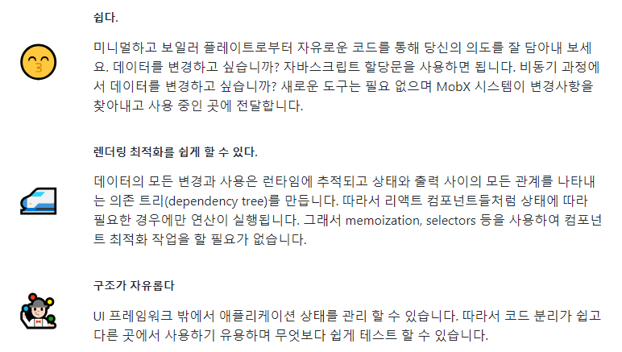
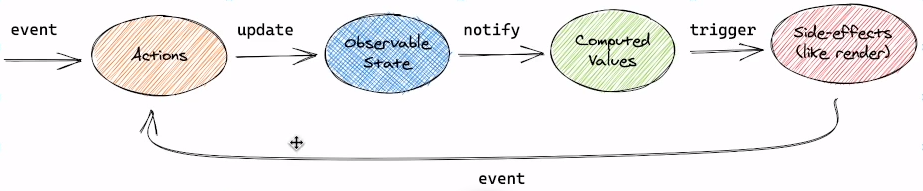

# Mobx를 이용한 간단한 앱 만들기

<details>
<summary>Mobx란?</summary>

### [Mobx란?](https://ko.mobx.js.org/README.html)
- react에서 redux 이후로 많이 사용되는 상태 관리 라이브러리이다.
- 간단하고 확장 가능한 상태 관리가 가능하며, 쉽고 확장성 있게 만들어 주는 검증된 라이브러리이다.

### 특징


#### 원래는 @데코레이터를 사용했지만 mobx 6부터는 데코레이터 사용을 지양하는 중이다.

### mobx 작동 원리

```javascript
import React from "react";
import ReactDOM from "react-dom";
import { makeAutoObservable } from "mobx";
import { observer } from "mobx-react";

class Timer {
  secondPassed = 0 // observable state 변경

  constructor() {
    makeAutoObservable(this)
  };

  increase() { // 액션 Triggered
    this.secondPassed += 1
  };

  reset() {
    this.secondsPassed = 0
  }
}

const myTimer = new Timer()

// observable state를 사용하는 사용자 인터페이스를 구축합니다.
const TimerView = observer(({ timer }) => ( // 변경사항에 따른 리 렌더링
  <button onClick={() => timer.reset()}>Second passed: {timer.secondPassed}</button>
))

ReactDOM.render(<TimerView timer={myTimer} />, document.body)

// 매초마다 Seconds passed: X를 업데이트 한다. 
setInterval(() => { // 이벤트 발생
  myTimer.increase()
}, 1000)
```
- 모든 이벤트(onClic, setInterval)는 observable state(myTimer.secondsPassed)를 변경시키는 action(myTimer.increase, myTimer.reset)을 호출한다. 
- observable state의 변경 사항은 모든 연산과 변경사항에 따라 달라지는 부수 효과(TimerView)에 전파된다.

### 애플리케이션 상태를 모델링
- observable : state를 저장하는 추적 가능한 필드를 정의한다.
- action : state를 수정하는 메서드를 표시한다.
- computed : state로부터 새로운 사실을 도출하고 그 결괏값을 캐시 하는 getter를 나타낸다.
- makeObservable : 속성(property),모든 객체, 배열, map과 set은 observable로 설정될 수 있다. 객체를 observable로 만드는 가장 기본적인 방법은 makeObservable를 사용하여 속성마다 주석을 지정하는 것이다.

```javascript
constructor() {
  makeObservable(this, {
    count: observable,
    isNegative: computed,
    increase: action,
    decrease: action
  })
};

get isNegative() {
  return this.count < 0 ? 'Yes' : 'No'
}

increase() {
  this.count += 1;
}

decrease() {
  this.count -= 1;
}
```

#### observer
- Observer HoC는 렌더링 중에 사용되는 모든 Observable에 React 구성 요소를 자동으로 구독한다. 결과적으로 관련 observable 항목이 변경되면 Component가 자동으로 다시 렌더링된다.
- 또한 관련 변경 사항이 없을 때 Component가 다시 렌더링되지 않도록 한다.
- 따라서 Component에서 액세스할 수 있지만 실제로 읽지 않는 Observable은 다시 렌더링되지 않는다.
- 그리고 observer를 사용하기 위해선 mobx-react나 mobx-react-lite를 설치해줘야 한다.
</details>

<details>
<summary>Mobx로 카운터 앱 만들기(데코레이터 사용해보기)</summary>

### 데코레이터를 사용하여 카운터 앱 만들기
- Mobx 6 이전에는 observable, computed, action을 표시하기 위해 Es.next 데코레이터를 사용하도록 권장했다.
- 그러나 데코레이터는 현재 ES 표준이 아니며 표준화 과정에도 오랜 시간이 소요되고 있다.
- 또한 표준화되는 데코레이터는 기존의 시행되었던 방식과 다를 것으로 보인다.
- Mobx 6 에서는 호환성을 위해 데코레이터에서 벗어나 makeObservable / makeAutoObservable을 사용할 것을 권장한다.
- 그러나 기존의 많은 코드베이스와 온라인 문서 및 튜토리얼 자료에서 데코레이터를 상하고 있다.
- observable, action, computed와 같이 makeObservable의 주석으로 사용할 수 있는 것은 무엇이든 데코레이터로 사용할 수 있다는 것이 규칙이다.
  - Mobx 6 부터 데코레이터 사용을 지양하지만, 이미 너무 많은 코드베이스와 튜토리얼이 데코레이터를 사용하기에 mobx 6에서 데코레이터 사용법을 익혀두면 좋다.

### [데코레이터](https://ko.mobx.js.org/enabling-decorators.html) 지원 활성화하기
- Mobx를 사용하는 새로운 코드베이스는 언어의 공식 파트가 될 때까지 데코레이터를 사용하는 것을 권자앟지 않지만, 사용할 수는 있다.
- 변환을 위한 설정이 필요하므로 Babel 또는 Typescript를 사용해야 한다.
</details>