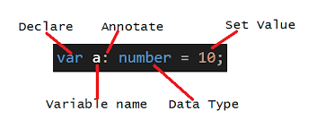

# Next.js로 블로그 만들기

<details>
<summary>Next JS란?</summary>

### Next JS란?
- React의 SSR(Server Side Rendering)을 쉽게 구현할 수 있게 도와 주는 간단한 프레임워크이다.
- 리액트로 개발할 때 SPA(Single Page Application)을 이용하면 CSR(Client Side Rendering)을 하기 때문에 좋은 점도 있지만 단점도 있는데 그 부분이 바로 검색엔진 최적화(SEO) 부분이다.
- CSR을 하면 첫 페이지에서 빈 html을 가져와 js 파일을 해석하여 화면을 구성하기 때문에 포털 검색에 거의 노출 될 일이 없다.
- 하지만 Next.js에서는 Pre-Rendering을 통해 페이지를 미리 렌더링 하여 완성된 HTML을 가져오기 때문에 사용자와 검색 엔진 크롤러에게 바로 렌더링 된 페이지를 전달할 수 있게 된다.
- 리액트에서도 SSR을 지원하면서 이를 구현하기에 굉장히 복잡하기 때문에 Next.js를 통해 이 문제를 해결해주게 된다.


#### Server Side Rendering
- 클라이언트 대신 서버에서 페이지를 준비하는 원리이다.
- 원래 리액트에서는 클라이언트 사이드 렌더링하기 때문에 서버에 영향을 미치지 않고, 서버에서 클라이언트로 응답해서 보낸 html도 거의 비어있다.
  - 이러한 방식은 서버에서 데이터를 가져올 때 지연 시간 발생으로 UX 측면에서 좋지 않을 수 있다.
  - 검색 엔진에 검색 시 웹크롤링이 동작할 때 내용을 제대로 가져와 읽을 수 없기에 검색엔진 최적화에 문제가 된다.
- Next.js에서는 서버 사이드 렌더링을 이용하므로 사용자와 검색 엔진 크롤러에게 바로 렌더링 된 페이지를 전달 할 수 있어서 검색엔진 최적화에 좋은 영향을 준다.

#### 설치 방법
```bash
# npm
npx create-next-app@latest

# yarn
yarn create next-app
```

</details>

<details>
<summary>NextJS 기본 파일 구조</summary>

### pages
- 이 폴더 안에 페이지들을 생성한다.
- index.tsx가 처음 "/" 페이지로 된다.
- _app.tsx는 공통되는 레이아웃을 작성한다. 모든 페이지에 공통으로 들어가는 걸 넣어주려면 여기에 넣어주면 된다.
  - url을 통해 특정 페이지에 진입하기 전 통과하는 인터셉터 페이지이다.
- 만약 about이라는 페이지를 만들 경우 pages 폴더 안에 about.tsx를 생성해주면 된다.

### public
- 이미지 같은 정적(static) 에셋들을 보관한다.

### styles
- 말 그대로 스타일링을 처리해주는 폴더이다.
- 모듈(module) css는 컴포넌트 종속적으로 스타일링하기 위한 것이며, 확장자 앞에 module을 붙여줘야 한다.

### next.config.js
- NextJS는 웹팩을 기본 번들러로 사용한다.
- 그래서 웹팩에 관한 설정들을 이 파일에서 해줄 수 있다.
</details>

<details>
<summary>Pre-rendering</summary>

### NextJS는
- 모든 페이지를 pre-rendering한다. 
- 이 pre-rendering한다는 의미는 모든 페이지를 위한 HTML을 Client 사이드에서 자바스크립트로 처리하기 전 사전에 생성한다는 것이다.
- 이렇게 하기 때문에 SEO 검색엔진 최적화가 좋아진다.

#### Pre-render 테스트
1. [자바스크립트 Disable](https://developer.chrome.com/docs/devtools/javascript/disable)
2. [보통 React 사이트 들어가기](https://create-react-app.examples.vercel.com/)
3. [NextJS 사이트 들어가기](https://next-learn-starter.vercel.app/)


</details>

<details>
<summary>Data Fetching</summary>

### NextJS에서 데이터를 가져오는 방법
- NextJS에서 데이터를 가져오는 방법은 여러가지가 있는데 애플리케이션의 사용 용도에 따라 다른 방법을 사용해야 한다.
- 보통 리액트에서는 데이터를 가져올 때 useEffect안에서 가져온다. 
- 하지만 NextJS에서는 다른 방법을 사용해서 가져오는데 하나씩 살펴보면
  - getStaticProps : Static Generation으로 빌드(build)할 때 데이터를 불러온다.(미리 만들어준다.)
  - getStaticPaths : Static Generation으로 데이터를 기반하여 pre-render 시 특정한 동적 라우팅을 구현한다.(pages/post/[id].js)
  - getServerSideProps : Server Side Rendering으로 요청이 있을 때 데이터를 불러온다.

#### getStaticProps
```typescript
export async function getStaticProps(context) {
  return {
    props: {}, // will be passed to the page component as props
  }
}
```

- getStaticProps 함수를 async로 export하면, getStaticProps에서 리턴되는 props를 가지고 페이지를 pre-render한다.
- build time에 페이지를 렌더링 한다.

```typescript
function Blog({posts}) {
  return (
    <ul>
      {posts.map((post) => (
        <li>{post.title}</li>
      ))}
    </ul>
  )
};

export async function getStaticProps() {
  const res = await fetch('https://.../posts')
  const posts = await res.json()

  return {
    props: {
      posts,
    }
  }
}
```

##### getStaticProps를 사용해야 할 때 
- 페이지를 렌더링하는 데 필요한 데이터는 사용자의 요청보다 먼저 build 시간에 필요한 데이터를 가져올 때
- 데이터는 Headless CMS에서 데이터를 가져올 때
- 데이터를 공개적으로 캐시할 수 있을 때(사용자별 X)
- 페이지는 미리 렌더링되어야 하고(SEO의 경우) 매우 빨라야할 때(getStaticProps는 성능을 위해 CDN에서 캐시할 수 있는 HTML 및 JSON 파일을 생성한다.)

#### getStaticPaths
```typescript
export async function getStaticPaths() {
  return {
    paths: [
      {params: { ... }}
    ],
    fallback: true // false or 'blocking'
  }
}
```
- 동적 라우팅이 필요할 때 getStaticPaths로 경로 리스트를 정의하고, HTML에 build 시간에 렌더된다.
- NextJS는 pre-render에서 정적으로 getStaticPaths에서 호출하는 경로들을 가져온다.

<br/>

- paths
  - 어떠한 경로가 pre-render될지를 결정한다.
  - 만약 pages/posts/[id].js 이라는 이름의 동적 라우팅을 사용하는 페이지가 있다면 아래와 같이 된다.
  - 빌드하는 동안 /posts/1과 /posts/2를 생성하게 된다.
```typescript
return {
  paths: [
    { params: { id: '1' } },
    { params: { id: '2' } },
  ],
  fallback: ...
}
```

<br/>

- params
  - 페이지 이름이 pages/posts/[postId]/[commentId]라면, params은 postId와 commentId이다.
  - 만약 페이지 이름이 pages/[...slug]와 같이 모든 경로를 사용한다면, params는 slug가 담긴 배열이어야 한다.
  - ['postId', 'commentId']

<br/>

- fallback 
  - false라면 getStaticPaths로 리턴되지 않는 것은 모두 404페이지가 뜬다.
  - true라면 getStaticPaths로 리턴되지 않는 것은 404로 뜨지 않고, fallback 페이지가 뜨게 된다.
```typescript
if (router.isFallback) {
  return <div>Loading...</div>
}
```
```typescript
// pages/posts/[id].js

function Post({ post }) {
  // Rendering post...

}

// This function gets called at build time
export async function getStaticPaths() {
  const res = await('https://.../posts')
  const posts = await res.json()

  // Get the paths we want to pre-render based on posts
  const paths = posts.map((post) => ({
    params: { id: post.id },
  }))

  // We'll pre-render only these paths at build time.
  // { fallback: false } means other routes should 404
  return { paths, fallback: false }
};

// This also gets called at build time
export async function getStaticProps({ params }) {
  // params contains the post 'id'.
  // If the route is like /posts/1, then params.id is 1
  const res = await fetch(`https://.../posts/${params.id}`)
  const post = await res.json()

  // Pass post data to the page via props
  return { props: { post } }
}

export default Post
```

#### getServerSideProps
```typescript
export async function getServerSideProps(context) {
  return {
    props: {}, // will be passed to the page component as props
  }
}
```
- getSErverSideProps 함수를 async로 export 하면, Next는 각 요청마다 리턴되는 데이터를 getServerSideProps로 pre-render한다.

```typescript
function Page({ data }) {
  // Render data...
}

// This gets called on every request
export async function getServerSideProps() {
  // Fetch data from external API
  const res = await fetch('https://.../data')
  const data = await res.json()

  // Pass data to the page via props
  return { props: { data } }
}

export default Page
```

##### getServerSideProps를 사용해야 할 때
- 요청할 때 데이터를 가져와야하는 페이지를 미리 렌더해야 할 때 사용한다.
- 서버가 모든 요청에 대한 결과를 개선하고, 추가 구성없이 CDN에 의해 결과를 캐시할 수 없기 때문에 첫번째 바이트까지의 시간은 getStaticProps보다 느리다.
</details>

<details>
<summary>TypeScript란?</summary>

### TypeScript가 나오게 된 배경
- JavaScript는 원래 클라이언트 측 언어로 도입되었다. 그런데 Node.js의 개발로 인해 Javascript를 클라이언트 측 뿐 아닌 서버 측 기술로도 활용되게 만들었다.
- 그러나 Javascript 코드가 커질수록 소스 코드가 더 복잡해져서 코드를 유지 관리하고 재사용하기가 어려워졌다.
- 더욱이 Type 검사 및 컴파일 시 오류 검사의 기능을 수용하지 못하기 때문에 Javascript가 본격적인 서버 측 기술로 엔터프라이즈 수준에서 성공하지 못한다.
- 이 간극을 매우기 위해 Typescript가 제시되었다.

### TypeScript란?
- 타입스크립트는 자바스크립트에 타입을 부여한 언어이다.
- 자바스크립트의 확장된 언어라고 볼 수 있다.
- 타입스크립트는 자바스크립트와 달리 브라우저에서 실행하려면 파일을 한번 변환해주어야 한다.
- 이 변환 과정을 우리는 컴파일(compile)이라고 부른다.

### Type System
- 개발 환경에서 에러 잡는 것을 도와준다.
- type annotations를 사용해서 코드를 분석할 수 있다.
- 오직 개발 환경에서만 활성화 된다.
- 타입 스크립트와 성능 향상과는 관계가 없다.

### TypeScript 사용하는 이유?
- TypeScript는 JavaScript 코드를 단순화하여 더 쉽게 읽고 디버그할 수 있도록 한다.
- TypeScript는 오픈 소스이다.
- TypeScript는 정책 검사와 같은 JavaScript IDE 및 사례를 위한 매우 생산적인 개발 도구를 제공한다.
- TypeScript를 사용하면 코드를 더 쉽게 읽고 이해할 수 있다.
- TypeScript를 사용하면 일반 JavaScript보다 크게 개선할 수 있다.
- TypeScript는 ES6(ECMAScript 6)의 모든 이점과 더 많은 생산성을 제공한다.
- TypeScript는 코드 유형 검사를 통해 JavaScript를 작성할 때 개발자가 일반적으로 겪는 고통스러운 버그를 피하는 데 도움이 될 수 있다.

</details>

<details>
<summary>Typescript Type</summary>

### Typescript Type
- In Typescript, a type is a convenient way to refer to the different properties and functions that a value has.
- 타입이란, 그 value가 가지고 있는 프로퍼티나 함수를 추론할 수 있는 방법이다.
- TypeScript는 JavaScript에서 기본으로 제공하는 기본 제공 유형(built-in types)을 상속한다.
- TypeScript 유형은 다음과 같이 분류된다.
  - Primitive Types
  - Object Types

#### Primitive Types
- string : 문자열
- number : 숫자 값
- boolean : true와 false
- null : 하나의 값을 가진다 - null
- undefined : 하나의 값을 가진다 - undefined(초기화되지 않은 변수의 기본값)
- symbol : 고유한 상수 값을 나타냄

#### Object Types
- function : 함수
- array : 배열
- classes : 클래스
- object : 객체
</details>

<details>
<summary>Typescript 추가 제공 타입</summary>

### 추가 제공 타입
#### Any
  - 애플리케이션을 만들 때 잘 알지 못하는 타입을 표현해야 할 수가 있다. 
  - 이 값들은 사용자로부터 받은 데이터나 서드 파티 라이브러리 같은 동적인 컨텐츠에서 올 수도 있다. 
  - 이 경우 타입 검사를 하지 않고, 
  - 그 값들이 컴파일 시간에 검사를 토오가하길 원한다. 
  - 이를 위해 any 타입을 사용할 수 있다.
  - 하지만 이 타입을 최대한 쓰지 않는 것이 좋다.
  - 그래서 noImplicitAny라는 옵션을 주면 any를 썻을 때 오류가 나오게 할 수 있다. 
```typescript
let something: any = "Hello World!";
something = 23;
something = true;

let arr: any[] = ["John", 212, true];
arr.push("Smith");
console.log(arr); // Output : ['John', 212, true, 'Smith']
```

<br/>

#### Union
  - Typescript를 사용하면 변수 또는 함수 매개변수에 대해 둘 이사으이 데이터 유형을 사용할 수 있다.
  - 이것을 유니온타입이라고 한다.
```typescript
let code: (string | number);
code = 123; // ok
code = "ABC" // ok
code = false; //Compiler Error
```

<br/>

#### Tuple
  - TypeScript에서는 배열 타입을 보다 특수한 형태로 사용할 수 있는 tuple 타입을 지원한다.
  - tupe에 명시적으로 지정된 형식에 따라 아이템 순서를 설정해야 되며, 추가되는 아이템 또한 tuple에 명시된 타입만 사용 가능하다.
```typescript
var employee: [number, string] = [1, "Steve"];
var person: [number, string, boolean] = [1, "Steve", true];

var user: [number, string, boolean, number, string]; // declare tuple variable
user = [1, "Steve", true, 20, "Admin"] // initialize tuple variable

// 배열 Tuple
var employee: [number, string][];
employee = [[1, "Steve"], [2, "Bill"]]

// Tuple에 요소 추가
var employee: [number, string] = [1, "Steve"]
employee.push(2, "Bill");
console.log(employee); // Output: [1, 'Steve', 2, 'Bill']

// 에러가 나는 경우
employee.push(true);
```

<br/>

#### Enum
  - enum은 enumerated type(열거형)을 의미한다.
  - enum은 값들의 집합을 명명하고 이를 사용하도록 만든다.
  - 여기서는 PrintMedia라 불리는 집합을 기억하기 어려운 숫자 대신 친숙한 이름으로 사용하기 위해 enum을 활용할 수 있다.
  - 열거된 각 PrintMedia는 별도의 값이 설정되지 않은 경우 기본적으로 0부터 시작한다.
```typescript
enum PrintMedia {
  Newspaper,  // 0
  Newsletter, // 1
  Magazine,   // 2
  Book        // 3
}
```
- 아래 코드에서 mediaType 변수에 할당된 값은 3이다. 설정된 PrintMedia 열거형 데이터의 Book의 값이 숫자 3이기 때문이다.
```typescript
let mediaType: number = PrintMedia.Book // 3
```

- enum에 설정된 아이템에 값을 할당할 수도 있다. 값이 할당되지 않은 아이템은 이전 아이템의 값에 +1된 값이 설정된다.
```typescript
enum PrintMedia {
  Newspaper = 1,
  Newsletter = 30, 
  Magazine = 45,    
  Book // 45 + 1        
}
```

- enum 타입의 편리한 기능으로 숫자 값을 통해 enum 값의 멤버 이름을 도출할 수 있다.
```typescript
let type: string = PrintMedia[45] // 'Magazine'
```

- 또한 어떠한 언어 코드를 정의하는 코드를 작성할 때 언어의 집합을 만들 때도 enum을 사용할 수 있다.
```typescript
export enum LanguageCode {
  korean = 'ko',
  english = 'en',
  japanese = 'ja',
  chinese = 'zh',
  spanish = 'es',
}

const code: LanguageCode = LanguageCode.english
```
- 이렇게 enum을 이용해서 언어 집합을 만들어주면 어떠한 코드가 어떠한 나라의 언어 코드가 무엇인지 알지 못해도 쉽게 코드를 작성해줄 수 있고 코드를 읽는 사람 입장에서도 가독성이 높아지게 된다.

##### enum과 객체의 차이점
- object는 코드 내에서 새로운 속성을 자유롭게 추가할 수 있지만, enum은 선언할 때 이후에 변경할 수 없다.
- object의 속성값은 JS가 허용하는 모든 타입이 올 수 있지만, enum의 속성 값으로는 문자열 혹은 숫자만 허용된다.

<br/>

#### Void
  - Java와 같은 언어와 유사하게 데이터가 없는 경우 void가 사용된다. 
  - 예를 들어 함수가 값을 반환하지 않으면 반환 유형으로 void를 지정할 수 있다.
  - 타입이 없는 상태이며, any와 반대의 의미를 가진다.
  - void 소문자로 사용해야하며, 주로 함수의 리턴이 없을 때 사용하면 된다.
```typescript
function sayHi(): void {
  console.log("Hi!");
}

let speech: void = sayHi();
console.log(speech); // Output: undefined
```

<br/>

#### Never
  - TypeScript는 절대 발생하지 않을 값을 나타내는 새 Type never를 도입했다.
  - Nerver 유형은 어떤 일이 절대 일어나지 않을 것이라고 확신할 때 사용된다.
  - 일반적으로 함수의 리턴 타입으로 사용된다.
  - 함수의 리턴 타입으로 never가 사용될 경우, 항상 오류를 리턴하거나 리턴 값을 절대로 내보내지 않음을 의미한다.
    - 이는 무한 루프(loop)에 빠지는 것과 같다.
```typescript
function throwError(errorMsg: string): never {
  throw new Error(errorMsg);
}

function keepProcessing(): never {
  while(true) {
    console.log('I always does something and never ends.')
  }
}
```

##### Void와 Never의 차이
- Void 유형은 값으로 undefined나 null 값을 가질 수 있지만 Never는 어떠한 값도 가질 수 없다.

```typescript
let something: void = null;
let nothing: never = null; // Error: Type 'null' is not assignable to type 'never'
```

- TypeScript에서 값을 Return하지 않는 함수는 실제로 undefined를 반환한다.
```typescript
function sayHi(): void {
  console.log("Hi!");
}

let speech: void = sayHi();
console.log(speech); // Output: undefined
```
- 위의 예에서 볼 수 있듯이 sayHi 함수는 반환 유형이 void인 경우에도 내부적으로 undefined를 반환하기 때문에 speech는 undefined가 된다.
- Never 유형을 사용하는 경우 void는 Never에 할당할 수 없기 때문에 speech:never는 컴파일 시간 오류를 발생시킨다.

</details>

<details>
<summary>type annotation, type inference</summary>

### Type Annotation과 Type Inference


#### Type Annotation
- 개발자가 타입을 타입스크립트에게 직접 말해주는 것
```typescript
const rate: number = 5 // number 타입 지정
```

#### Type Inference
- 타입스크립트가 알아서 타입을 추론하는 것
```typescript
const rate = 5 // **변수 선언과 동시에 초기화할 경우** 타입을 알아서 추론한다.
```

### 타입을 추론하지 못해서 타입 annotation을 꼭 해줘야 하는 경우
#### any 타입을 리턴하는 경우
- coordinates에 hover해보면 const coordinates: any라고 뜨는 것을 볼 수 있을 것이다.
- JSON.parse는 json을 파싱해주는데 인풋으로 들어가는 json을 확인하면 개발자는 어떤 타입이 리턴될지 예상할 수 있지만, 타입스크립트는 여기까지 지원하지 않는다.
- 리턴 타입이 일정하지 않으므로 any를 리턴한다고 추론해버린다.
- 그러므로 이러한 경우에는 타입 애노테이션을 해주어야 한다.
```typescript
const json = '{"x": 4, "y": 7}'
const coordinates = JSON.parse(json)
console.log(coordinates)
```

#### 변수 선언을 먼저하고 나중에 초기화하는 경우
- 변수 선언과 동시에 초기화하면 타입을 추론하지만, 선언을 먼저하고 나중에 값을 초기화할 때에는 추론하지 못한다.
```typescript
let greeting
greeting = 'hello' // let greeting: any
```

#### 변수에 대입될 값이 일정치 못하는 경우
- 여러 타입이 지정되어야 할 때는 | (or statement)로 여러 타입을 애노테이션 해준다.
```typescript
let num = [-7, -2, 10]
let numAboveZero: boolean | number = false

for(let i = 0; i < num.length; i++) {
  if(num[i] > 0) {
    numAboveZero = num[i]
  }
}
```

</details>

<details>
<summary>Type Assertion</summary>

### TypeAssertion이란?
- TypeScript에서는 시스템이 추론 및 분석한 타입 내용을 우리가 원하는 대로 얼마든지 바꿀 수 있다.
- 이때 "타입 표명(Type Assertion)"이라 불리는 메커니즘이 사용된다.
- TypeScript의 타입 표명은 프로그래머가 컴파일러에게 내가 너보다 타입에 더 잘 알고 있고, 나의 주장에 대해 의심하지 말라고 하는 것과 같다.
- Type Assertion을 사용하면 값의 type을 설정하고 컴파일러에 이를 유추하지 않도록 지시할 수 있다.
- 이것은 프로그래머로서 TypeScript가 자체적으로 추론할 수 있는 것보다 변수 유형에 대해 더 잘 이해하고 있을 때이다.
```typescript
var foo = {};
foo.bar = 123; // 오류: 속성 'bar'가 '{}'에 존재하지 않음
foo.bas = 'hello'; // 오류: 속성 'bas'가 '{}'에 존재하지 않음
```

<br/>

- 컴파일러는 foo type이 속성이 없는 {}라고 가정하기 때문에 위의 예에서는 컴파일러 오류가 발생한다.
- 그러나 아래와 같이 type assertion을 사용하면 이러한 상황을 피할 수 있다.
```typescript
interface Foo {
  bar: number;
  bas: string;
}

var foo = {} as Foo;
foo.bar = 123;
foo.bas = 'hello';
```

### as Foo, <Foo>
- 타입 표명은 위에 두 가지 방식으로 표현할 수 있다.
- 하지만 리액트를 사용할 때는 <Foo> 키워드는 JSX의 문법과 겹치기 때문에 as Foo를 공통적으로 사용하는게 추천된다.
```typescript
import fs from 'fs'
import path from 'path'
import matter from 'gray-matter'

const postDirectory = path.join(process.cwd(), 'posts')

export function getSortedPostsData() {
  const fileNames = fs.readDirSync(postsDirectory)

  const allPostsData = fileNames.map(fileName => {
    const id = fileName.replace(/\.md$/, '')

    const fullPath = path.join(postsDirectory, fileName)
    const fileContents = fs.readFileSync(fullPath, 'utf-8')

    const matterResult = matter(fileContents)

    return {
      id, 
      ...(matterResult.data as {date: string; title: string})
    }
  })

  return allPostsData.sort((a, b) => {
    if (a.date < b.date) {
      return 1
    } else {
      return -1
    }
  })
}
```
</details>

<details>
<summary>포스트 자세히 보기 페이지로 이동(file system 기반의 라우팅)</summary>

### 파일기반 네비게이션 기능
- 리액트에서는 route를 위해서 react-router라는 라이브러리를 사용하지만 Next.js에는 페이지 개념을 기반으로 구축된 파일 시스템 기반 라우터가 있다.
- 파일이 페이지 디렉토리에 추가되면 자동으로 경로로 사용할 수 있다.
- 페이지 디렉토리 내의 파일은 가장 일반적인 패턴을 정의하는 데 사용할 수 있다.

#### 파일 생성 예시
> pages/index.js -> /
> pages/blog/index.js -> /blog
>
> pages/blog/first-post.js → /blog/first-post
> pages/dashboard/settings/username.js → /dashboard/settings/username
>
> pages/blog/[slug].js → /blog/:slug (/blog/hello-world)
> pages/[username]/settings.js → /:username/settings (/foo/settings)
> pages/post/[...all].js → /post/* (/post/2020/id/title)

</details>

<details>
<summary>포스트 데이터를 가져와서 보여주기(remark)</summary>

### getStaticPaths
- 동적 라우팅이 필요할 때 getStaticPaths로 경로 리스트를 정의하고, HTML에  build 시간에 렌더 된다.
- Nextjs는 pre-render에서 정적으로 getStaticPaths에서 호출하는 경로들을 가져온다.

#### Post 데이터를 가져와야 하는 경로 목록을 가져오기
```typescript
export const getStaticPaths: GetStaticPath = async() => {
  const paths = getAllPostIds()
  console.log('paths', paths)

  return {
    paths,
    fallback: false
  }
}
```

### fallback
- false라면 getStaticPaths로 리턴되지 않는 것은 모두 404페이지가 뜬다.
- true라면 getStaticPaths로 리턴되지 않는 것은 404로 뜨지 않고, fallback 페이지가 뜨게 된다.
```typescript
export function getAllPostIds() {
  const fileNames = fs.readDirSync(postsDirectory)
  return fileNames.map(fileName => {
    return {
      params: {
        id: fileName.replace(/\.md$/, '')
      }
    }
  })
}
```

#### 전달받은 아이디를 이용해서 해당 포스트의 데이터 가져오기
```typescript
export const getStaticProps: GetStaticProps = async({ params }) => {
  console.log('params', params);
  const postData = await getPostData(params.id as string)
  return {
    props: {
      postData
    }
  }
}
```
```typescript
export async function getPostData(id: string) {
  const fullPath = path.join(postsDirectory, `${id}.md`)
  const fileContents = fs.readFileSync(fullPath, 'utf-8')

  const matterResult = matter(fileContents)

  const processedContent = await remark()
    .use(html)
    .process(matterResult.content)
  const contentHtml = processedContent.toString()

  return {
    id,
    contentHtml,
    ...(matterResult.data as {date: string; title: string})
  }
}
```

#### 가져온 데이터 화면에서 보여주기
```typescript
export default function Post({
  postData
} : {
  postData: {
    title: string
    date: string
    contentHtml: string
  }
}) {
  return (
    <div>
      <Head>
        <title>{postData.title}</title>
      </Head>
      <article>
        <h1 className={homeStyles.headingXl}>{postData.title}</h1>
        <div className={homeStyles.lightText}>
          {postData.date}
        </div>
        <div dangerouslySetInnerHTML = {{ __html: postData.contentHtml }} />
      </article>
    </div>
  )
}
```
</details>