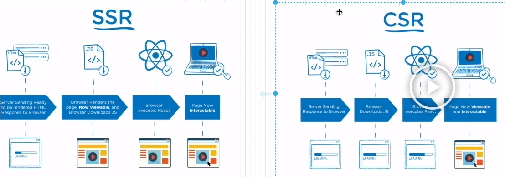
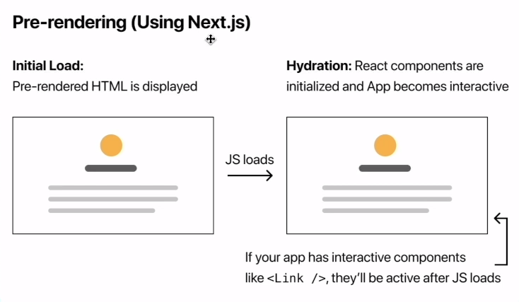
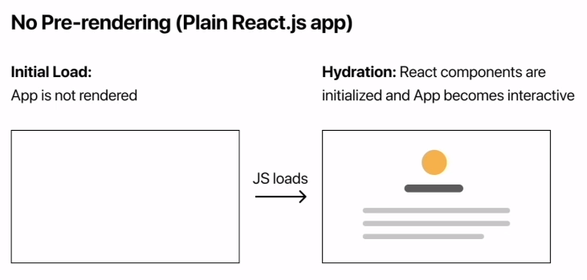

# Next.js로 블로그 만들기

<details>
<summary>Next JS란?</summary>

### Next JS란?
- React의 SSR(Server Side Rendering)을 쉽게 구현할 수 있게 도와 주는 간단한 프레임워크이다.
- 리액트로 개발할 때 SPA(Single Page Application)을 이용하면 CSR(Client Side Rendering)을 하기 때문에 좋은 점도 있지만 단점도 있는데 그 부분이 바로 검색엔진 최적화(SEO) 부분이다.
- CSR을 하면 첫 페이지에서 빈 html을 가져와 js 파일을 해석하여 화면을 구성하기 때문에 포털 검색에 거의 노출 될 일이 없다.
- 하지만 Next.js에서는 Pre-Rendering을 통해 페이지를 미리 렌더링 하여 완성된 HTML을 가져오기 때문에 사용자와 검색 엔진 크롤러에게 바로 렌더링 된 페이지를 전달할 수 있게 된다.
- 리액트에서도 SSR을 지원하면서 이를 구현하기에 굉장히 복잡하기 때문에 Next.js를 통해 이 문제를 해결해주게 된다.



#### Server Side Rendering
- 클라이언트 대신 서버에서 페이지를 준비하는 원리이다.
- 원래 리액트에서는 클라이언트 사이드 렌더링하기 때문에 서버에 영향을 미치지 않고, 서버에서 클라이언트로 응답해서 보낸 html도 거의 비어있다.
  - 이러한 방식은 서버에서 데이터를 가져올 때 지연 시간 발생으로 UX 측면에서 좋지 않을 수 있다.
  - 검색 엔진에 검색 시 웹크롤링이 동작할 때 내용을 제대로 가져와 읽을 수 없기에 검색엔진 최적화에 문제가 된다.
- Next.js에서는 서버 사이드 렌더링을 이용하므로 사용자와 검색 엔진 크롤러에게 바로 렌더링 된 페이지를 전달 할 수 있어서 검색엔진 최적화에 좋은 영향을 준다.

#### 설치 방법
```bash
# npm
npx create-next-app@latest

# yarn
yarn create next-app
```

</details>

<details>
<summary>NextJS 기본 파일 구조</summary>

### pages
- 이 폴더 안에 페이지들을 생성한다.
- index.tsx가 처음 "/" 페이지로 된다.
- _app.tsx는 공통되는 레이아웃을 작성한다. 모든 페이지에 공통으로 들어가는 걸 넣어주려면 여기에 넣어주면 된다.
  - url을 통해 특정 페이지에 진입하기 전 통과하는 인터셉터 페이지이다.
- 만약 about이라는 페이지를 만들 경우 pages 폴더 안에 about.tsx를 생성해주면 된다.

### public
- 이미지 같은 정적(static) 에셋들을 보관한다.

### styles
- 말 그대로 스타일링을 처리해주는 폴더이다.
- 모듈(module) css는 컴포넌트 종속적으로 스타일링하기 위한 것이며, 확장자 앞에 module을 붙여줘야 한다.

### next.config.js
- NextJS는 웹팩을 기본 번들러로 사용한다.
- 그래서 웹팩에 관한 설정들을 이 파일에서 해줄 수 있다.
</details>

<details>
<summary>Pre-rendering</summary>

### NextJS는
- 모든 페이지를 pre-rendering한다. 
- 이 pre-rendering한다는 의미는 모든 페이지를 위한 HTML을 Client 사이드에서 자바스크립트로 처리하기 전 사전에 생성한다는 것이다.
- 이렇게 하기 때문에 SEO 검색엔진 최적화가 좋아진다.

#### Pre-render 테스트
1. [자바스크립트 Disable](https://developer.chrome.com/docs/devtools/javascript/disable)
2. [보통 React 사이트 들어가기](https://create-react-app.examples.vercel.com/)
3. [NextJS 사이트 들어가기](https://next-learn-starter.vercel.app/)



</details>

<details>
<summary>Data Fetching</summary>

### NextJS에서 데이터를 가져오는 방법
- NextJS에서 데이터를 가져오는 방법은 여러가지가 있는데 애플리케이션의 사용 용도에 따라 다른 방법을 사용해야 한다.
- 보통 리액트에서는 데이터를 가져올 때 useEffect안에서 가져온다. 
- 하지만 NextJS에서는 다른 방법을 사용해서 가져오는데 하나씩 살펴보면
  - getStaticProps : Static Generation으로 빌드(build)할 때 데이터를 불러온다.(미리 만들어준다.)
  - getStaticPaths : Static Generation으로 데이터를 기반하여 pre-render 시 특정한 동적 라우팅을 구현한다.(pages/post/[id].js)
  - getServerSideProps : Server Side Rendering으로 요청이 있을 때 데이터를 불러온다.

#### getStaticProps
```typescript
export async function getStaticProps(context) {
  return {
    props: {}, // will be passed to the page component as props
  }
}
```

- getStaticProps 함수를 async로 export하면, getStaticProps에서 리턴되는 props를 가지고 페이지를 pre-render한다.
- build time에 페이지를 렌더링 한다.

```typescript
function Blog({posts}) {
  return (
    <ul>
      {posts.map((post) => (
        <li>{post.title}</li>
      ))}
    </ul>
  )
};

export async function getStaticProps() {
  const res = await fetch('https://.../posts')
  const posts = await res.json()

  return {
    props: {
      posts,
    }
  }
}
```

##### getStaticProps를 사용해야 할 때 
- 페이지를 렌더링하는 데 필요한 데이터는 사용자의 요청보다 먼저 build 시간에 필요한 데이터를 가져올 때
- 데이터는 Headless CMS에서 데이터를 가져올 때
- 데이터를 공개적으로 캐시할 수 있을 때(사용자별 X)
- 페이지는 미리 렌더링되어야 하고(SEO의 경우) 매우 빨라야할 때(getStaticProps는 성능을 위해 CDN에서 캐시할 수 있는 HTML 및 JSON 파일을 생성한다.)

#### getStaticPaths
```typescript
export async function getStaticPaths() {
  return {
    paths: [
      {params: { ... }}
    ],
    fallback: true // false or 'blocking'
  }
}
```
- 동적 라우팅이 필요할 때 getStaticPaths로 경로 리스트를 정의하고, HTML에 build 시간에 렌더된다.
- NextJS는 pre-render에서 정적으로 getStaticPaths에서 호출하는 경로들을 가져온다.

<br/>

- paths
  - 어떠한 경로가 pre-render될지를 결정한다.
  - 만약 pages/posts/[id].js 이라는 이름의 동적 라우팅을 사용하는 페이지가 있다면 아래와 같이 된다.
  - 빌드하는 동안 /posts/1과 /posts/2를 생성하게 된다.
```typescript
return {
  paths: [
    { params: { id: '1' } },
    { params: { id: '2' } },
  ],
  fallback: ...
}
```

<br/>

- params
  - 페이지 이름이 pages/posts/[postId]/[commentId]라면, params은 postId와 commentId이다.
  - 만약 페이지 이름이 pages/[...slug]와 같이 모든 경로를 사용한다면, params는 slug가 담긴 배열이어야 한다.
  - ['postId', 'commentId']

<br/>

- fallback 
  - false라면 getStaticPaths로 리턴되지 않는 것은 모두 404페이지가 뜬다.
  - true라면 getStaticPaths로 리턴되지 않는 것은 404로 뜨지 않고, fallback 페이지가 뜨게 된다.
```typescript
if (router.isFallback) {
  return <div>Loading...</div>
}
```
```typescript
// pages/posts/[id].js

function Post({ post }) {
  // Rendering post...

}

// This function gets called at build time
export async function getStaticPaths() {
  const res = await('https://.../posts')
  const posts = await res.json()

  // Get the paths we want to pre-render based on posts
  const paths = posts.map((post) => ({
    params: { id: post.id },
  }))

  // We'll pre-render only these paths at build time.
  // { fallback: false } means other routes should 404
  return { paths, fallback: false }
};

// This also gets called at build time
export async function getStaticProps({ params }) {
  // params contains the post 'id'.
  // If the route is like /posts/1, then params.id is 1
  const res = await fetch(`https://.../posts/${params.id}`)
  const post = await res.json()

  // Pass post data to the page via props
  return { props: { post } }
}

export default Post
```

#### getServerSideProps
```typescript
export async function getServerSideProps(context) {
  return {
    props: {}, // will be passed to the page component as props
  }
}
```
- getSErverSideProps 함수를 async로 export 하면, Next는 각 요청마다 리턴되는 데이터를 getServerSideProps로 pre-render한다.

```typescript
function Page({ data }) {
  // Render data...
}

// This gets called on every request
export async function getServerSideProps() {
  // Fetch data from external API
  const res = await fetch('https://.../data')
  const data = await res.json()

  // Pass data to the page via props
  return { props: { data } }
}

export default Page
```

##### getServerSideProps를 사용해야 할 때
- 요청할 때 데이터를 가져와야하는 페이지를 미리 렌더해야 할 때 사용한다.
- 서버가 모든 요청에 대한 결과를 개선하고, 추가 구성없이 CDN에 의해 결과를 캐시할 수 없기 때문에 첫번째 바이트까지의 시간은 getStaticProps보다 느리다.
</details>

<details>
<summary>TypeScript란?</summary>

### TypeScript가 나오게 된 배경
- JavaScript는 원래 클라이언트 측 언어로 도입되었다. 그런데 Node.js의 개발로 인해 Javascript를 클라이언트 측 뿐 아닌 서버 측 기술로도 활용되게 만들었다.
- 그러나 Javascript 코드가 커질수록 소스 코드가 더 복잡해져서 코드를 유지 관리하고 재사용하기가 어려워졌다.
- 더욱이 Type 검사 및 컴파일 시 오류 검사의 기능을 수용하지 못하기 때문에 Javascript가 본격적인 서버 측 기술로 엔터프라이즈 수준에서 성공하지 못한다.
- 이 간극을 매우기 위해 Typescript가 제시되었다.

### TypeScript란?
- 타입스크립트는 자바스크립트에 타입을 부여한 언어이다.
- 자바스크립트의 확장된 언어라고 볼 수 있다.
- 타입스크립트는 자바스크립트와 달리 브라우저에서 실행하려면 파일을 한번 변환해주어ㅑㅇ 한다.
- 이 변환 과정을 우리는 컴파일(compile)이라고 부른다.

### Type System
- 개발 환경에서 에러 잡는 것을 도와준다.
- type annotations를 사용해서 코드를 분석할 수 있다.
- 오직 개발 환경에서만 활성화 된다.
- 타입 스크립트와 성능 향상과는 관계가 없다.

### TypeScript 사용하는 이유?
- TypeScript는 JavaScript 코드를 단순화하여 더 쉽게 읽고 디버그할 수 있도록 한다.
- TypeScript는 오픈 소스이다.
- TypeScript는 정책 검사와 같은 JavaScript IDE 및 사례를 위한 매우 생산적인 개발 도구를 제공한다.
- TypeScript를 사용하면 코드를 더 쉽게 읽고 이해할 수 있다.
- TypeScript를 사용하면 일반 JavaScript보다 크게 개선할 수 있다.
- TypeScript는 ES6(ECMAScript 6)의 모든 이점과 더 많은 생산성을 제공한다.
- TypeScript는 코드 유형 검사를 통해 JavaScript를 작성할 때 개발자가 일반적으로 겪는 고통스러운 버그를 피하는 데 도움이 될 수 있다.

</details>