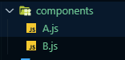
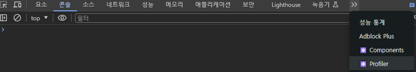
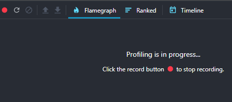
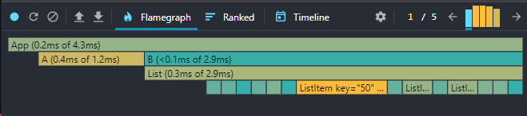
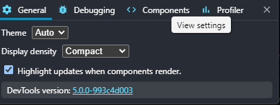
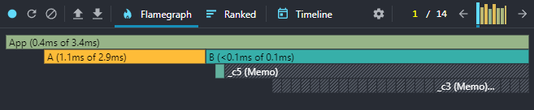
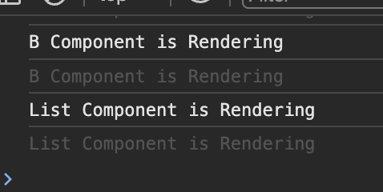

# 리액트 앱 성능 개선하는 방법

<details>
<summary>React Profiler</summary>

### 리액트 프로파일러란?

- React-Profilers는 React16.5에서 새로운 DevTools 프로파일러 플러그인에 대한 지원을 추가한다.
- 이 플러그인은 React의 Profiler API를 사용하여 React 애플리케이션의 성능 병목 현상을 식별하기 위해 렌더링되는 각 구성 요소에 대한 타이밍 정보를 수집한다.

#### 리액트 프로파일러를 이용한 성능 측정하기

- React Profilers를 이용하여 성능을 측정하기 위해 두 개의 컴포넌트를 생성 후 성능 비교를 해보자
  
- A.js : 모든 요소를 하나의 컴포넌트에
- B.js : 여러 컴포넌트로 나눠주기

```javascript
// A.js
import React from 'react'

const A = ({message, posts}) => {
  return (
    <div>
        <h1>A Component</h1>
        <p>{message}</p>
        <ul>
            {posts.map(post => {
                return (
                    <li key={post.id}>
                        <p>{post.title}</p>
                    </li>
                )
            })}
        </ul>
    </div>
  )
}

export default A

// B.js
import React from 'react'

const Message = ({message}) => {
    return (
        <p>{message}</p>
    )
}

const ListItem = ({post}) => {
    return (
        <li key={post.id}>
            <p>{post.title}</p>
        </li>
    )
}

const List = ({posts}) => {
    return (
        <ul>
            {posts.map(post => (
                <ListItem key={post.id} post={post}/>
            ))}
        </ul>
    )
}

const B = ({message, posts}) => {
  return (
    <div>
        <h1>B Component</h1>
        <Message message={message}/>
        <List posts={posts}/>/
    </div>
  )
}

export default B
```

#### 가짜 데이터 가져오기

- 성능을 측정하기 위해 어느 정도 많은 데이터가 있을 시에 측정이 가능하기 때문에 가짜 데이터를 전달해주는 곳에 요청을 보내서 데이터를 받아온다.

```javascript
useEffect(() => {
  fetch("https://jsonplaceholder.typicode.com/posts")
    .then((response) => response.json())
    .then((posts) => setPosts(posts));
}, []);
```

- Response는 HTTP 응답 전체를 나타내는 객체로, JSON 본문 콘텐츠를 추출하기 위해서는 json()(en-US)메서드를 호출해야 한다.

#### useEffect

- 컴포는트가 랜더링될 때 특정 작업을 실행할 수 있도록 하는 Hook
- 여기서 App 컴포넌트가 한번 렌더링 된 후 jsonplaceholder라는 곳의 서버에 비동기 요청을 보내어 posts 데이터를 가져오기 위해 사용되었다.
- 현재는 profiler를 살펴보는 부분에 집중하기 위해 나중에 더 자세히 알아보도록 하자.

#### fetch() 메소드

- 원격 API에 요청을 보내기 위해 사용할 수 있는 메소드
- 전역 fetch() 메소드는 네트워크에서 리소스를 가져오는 프로세스를 시작하여 Response응답을 사용할 수 있게 되면 이행된 Promise 약속을 Return한다.

#### jsonplaceholder

- JSONPlaceholder는 가짜 데이터가 필요할 때마다 사용할 수 있는 무료 온라인 REST API
- posts, users, photos 등 여러 가지 가짜 데이터를 가져올 수 있다.
</details>
<details>
<summary>React Profiler로 앱 성능 측정하기</summary>

- 성능을 측정하기 위해 크롬 개발자 도구를 열고 Profiler 탭으로 이동
  

- 여기서 프로파일링을 수행하여 성능 데이터를 기록하고 측정할 수 있다.
- 프로 파일링을 수행하려면 레코드 버튼을 클릭한다.
- Profiler는 컴포넌트가 재렌더링이 될 때마다 성능을 기록한다.
  

- hello 입력했을 때 비교
  

- A보다 B의 처리 시간이 더 느린 것을 확인할 수 있음
</details>
<details>
<summary>React.memo를 이용한 성능 최적화</summary>



- 해당 설정을 사용할 경우 랜더링되는 부분을 하이라이팅해주어 바로 확인할 수 있다.

### 현재 앱에서 B 컴포넌트의 문제점

- 현재 B 컴포넌트는 B, List, ListItem, Message 컴포넌트로 나눠져 있다.
- 이렇게 나눠준 이유는 재사용성을 위해서도 있지만 각 컴포넌트의 렌더링 최적화를 위해서 이기도 하다.
  - 예를 들어 input에서 글을 타이핑 할 때 원래는 Message 컴포넌트와 그 State 값을 가지고 있는 App 컴포넌트만 렌더링 되어야 하는데 현재는 상관이 없는 부분까지 렌더링되고 있다.

### React.memo 적용으로 문제 해결

- 위의 문제를 해결하기 위해 React.memo로 감싸주면 된다.

```javascript
import React from "react";

const Message = React.memo(({ message }) => {
  return <p>{message}</p>;
});

const ListItem = React.memo(({ post }) => {
  return (
    <li key={post.id}>
      <p>{post.title}</p>
    </li>
  );
});

const List = React.memo(({ posts }) => {
  return (
    <ul>
      {posts.map((post) => (
        <ListItem key={post.id} post={post} />
      ))}
    </ul>
  );
});

const B = ({ message, posts }) => {
  return (
    <div>
      <h1>B Component</h1>
      <Message message={message} />
      <List posts={posts} />/
    </div>
  );
};

export default B;
```



- React.memo 적용 결과 이 전과는 다르게 A 컴포넌트보다 B 컴포넌트가 랜더링 속도가 빨라진 것을 볼 수 있음

### React.memo()란?

- React는 먼저 컴포넌트를 렌더링한 후 이전에 렌더링 된 결과와 비교하여 DOM 업데이트를 결정한다.
- 만약 렌더링 결과가 이전과 다르다면, React는 DOM을 업데이트한다.
- 이 과정에서 만약 컴포넌트가 React.memo()로 둘러 쌓여 있다면, React는 컴포넌트를 렌더링하고 결과를 메모이징(Memoizing)한다.
- 그리고 다음 렌더링이 일어날 때 렌더링하는 컴포넌트의 props가 같다면, React는 메모이징(Memoizing)된 내용을 재사용한다.
  - props가 같다면 결과 값이 같은 것이기 때문에 굳이 다시 만들지 않고 재사용한다.

#### 메모이제이션(Memoization)이란?

- 메모이제이션은 주어진 입력값에 대한 결과를 저장함으로써 같은 입력값에 대해 함수가 한 번만 실행되는 것을 보장한다.
- 처음 렌더링할 때 결과를 메모이징 하고 다음 렌더링 시 props가 같기 때문에 메모이징 된 내용을 재사용한다.

### React.memo가 props를 비교하는 방법은?

- React.memo()는 props 혹은 props의 객체를 비교할 때 얕은(shallow)비교를 한다.

### React.memo props 비교 방식 수정하기

- 비교 방식을 원하는 대로 수정하고 싶다면 React.memo()의 두 번째 매개변수로 비교함수를 넣어주면 된다.

```javascript
// Example
React.memo(Component, [compareFunction(prevProps, nextProps)]);

function compareFunction(prevProps, nextProps) {
  return prevProps.a === nextProps.a && prevProps.b === nextProps.b;
}
```

### React.memo 사용을 지양해야 하는 상황

- 렌더링 될 때 props가 다른 경우가 대부분인 컴포넌트를 생각해보면 메모이제이션 기법의 이점을 얻기 힘들다.
- props가 자주 변하는 컴포넌트를 React.memo()로 래핑 할지라도, React는 두 가지 작업을 리 렌더링 할 때마다 수행하게 된다.
  - 이전 props와 다음 props의 동등 비교를 위해 비교 함수를 수행
  - 비교 함수는 거의 항상 false를 반환할 것이기 때문에, React는 이전 렌더링 내용과 다음 렌더링 내용을 비교
  - 비교 함수의 결과는 대부분 false를 반환하기에 props 비교는 불필요하게 된다.

### React.memo()는 리 렌더링을 막기 위한 도구보다 성능 개선의 도구

- React에서는 성능 개선을 위한 하나의 도구로 메모이제이션을 사용한다.
- 대부분의 상황에서 React는 메모이징 된 컴포넌트의 리 렌더링을 피할 수 있지만, 렌더링을 막기 위해 메모이제이션에 너무 의존하면 안된다.(버그 유발 가능성이 있음)

### 결론

- 리액트에서 렌더링 성능 최적화를 위해선 React 컴포넌트를 분리하며, React.memo를 사용하면 된다. 또한 React.memo 사용은 항상 좋은 것은 아니기에 profiler를 이용해서 성능상 이점이 있는지 확인 후 사용하는 것이 좋다.

</details>
<details>
<summary>얕은 비교(Shallow Equal)</summary>

### 얕은 비교 Shallow Compare 란?

- 숫자, 문자열 등 원시 자료형은 값을 비교한다.
- 배열, 객체 등 참조 자료형은 값 혹은 속성을 비교하지 않고, 참조되는 위치를 비교한다.

### 깊은 비교란?

- 얕은 비교와 달리 깊은 비교는 객체의 경우에도 값으로 비교한다.
- 깊은 비교 방법은 다음과 같다.
  - Object depth가 깊지 않은 경우 : JSON.stringify() 사용
  - Object depth가 긾은 경우 : lodash 라이브러리의 isEqual() 사용

```javascript
const obj1 = { a: 1, b: 2 };
const obj2 = { a: 1, b: 2 };

console.log(JSON.stringify(obj1) === JSON.stringify(obj2));
```

### 얕은 비교를 언제 사용하나?

- React.memo()에서 props를 비교할 때
- 리액트 컴포넌트가 리 렌더링을 하기 전
  - state 변경이 있을 때
  - 부모 컴포넌트가 렌더링될 때

#### 참조) 리액트가 리렌더링 되는 경우

- state 변경이 있을 때
- 부모 컴포넌트가 렌더링 될 때
- 새로운 props이 들어올 때
- shouldComponentUpdate에서 true가 반환될 때
- forceUpdate가 실행될 때
</details>

<details>
<summary>useCallback을 이용한 함수 최적화</summary>

- 원래 컴포넌트가 렌더링 될 때 그 안에 있는 함수도 다시 만들게 된다.
- 하지만 똑같은 함수를 컴포넌트가 리 렌더링 된다고 해서 계속 다시 만드는 것은 좋은 현상은 아니다.
- 그리고 이렇게 컴포넌트가 리 렌더링 될 때마다 함수를 계속 다시 만든다고 하면 만약 이 함수가 자식 컴포넌트에 props로 내려 준다면 함수를 포함하고 있는 컴포넌트가 리 렌더링 될 때마다 자식 컴포넌트도 함수가 새롭게 만들어지니 계속 리 렌더링하게 된다.

```javascript
const B = ({ message, posts }) => {
  console.log("B component is Rendering");
  const testFunction = () => {
    return (
      <div>
        <h1>B Component</h1>
        <Message message={message} />
        <List posts={posts} testFunction={testFunction} />
      </div>
    );
  };
};

const List = React.memo(({ posts, testFunction }) => {
  console.log("List component is Rendering");
  return (
    <ul>
      {posts.map((post) => (
        <ListItem key={post.id} post={post} />
      ))}
    </ul>
  );
});
```

- 원래는 React.memo로 감싸줘서 리 렌더링 되지 않던 컴포넌트들이 한 글자 입력 시마다 List 컴포넌트까지 다시 리 렌더링 되는 걸 볼 수 있음
  

### React.useCallback 적용으로 문제 해결

- useCallback은 메모이제이션된 함수를 반환하는 함수이다.
- useCallback 적용은 useCallback 안에 콜백함수와 의존성 배열을 순서대로 넣어주면 된다.

```javascript
const testFunction = useCallback(() => {}, []);
```

- 함수 내에서 참조하는 state, props가 있다면 의존성 배열에 추가해주면 된다.
- useCallback으로 인해 의존성 배열에 추가해준 state 혹은 props가 변하지 않는 다면 함수는 새로 생성되지 않는다.
- 새로 생성되지 않기에 메모리에 새로 할당되지 않고 동일 참조 값을 사용하게 된다.
- 의존성 배열에 아무것도 없다면 컴포넌트가 최초 렌더링 시에만 함수가 생성되며 그 이후에는 동일한 참조 값을 사용하는 함수가 된다.

</details>

<details>
<summary>useMemo를 이용한 결과 값 최적화</summary>

### Memoization 이란?

- 메모이제이션은 비용이 많이 드는 함수 호출의 결과를 저장하고 동일한 입력이 다시 발생할 때 캐시된 결과를 반환하여 컴퓨터 프로그램의 속도를 높이는 데 주로 사용되는 최적화 기술이다.

```javascript
function Component({ a, b }) {
  const result = compute(a, b);
  return <div>{result}</div>;
}
```

- 위와 같이 Component 내의 compute 함수가 만약 복잡한 연산을 수행하면 결과 값을 리턴하는데 오랜 시간이 걸리게 된다.
- 이럴 경우 컴포넌트가 계속 리 렌더링 된다면 연산을 계속 수행하는데 오랜 시간이 걸려 성능에 안 좋은 영향을 미치게 되며, UI 지연 현상도 일어날 수 있다.
- 이러한 현상을 해결해주기 위해서 사용하는 것이 useMemo 이다.
- compute 함수에 넘겨주는 a, b의 값이 이전과 동일하다면 컴포넌트가 리 렌더링 되더라도 연산을 다시 하지 않고 이전 렌더링 때 저장해두었던 값을 재활용하게 된다.

### useMemo 적용하기

- useMemo로 감싸준 후 첫번째 인수에 의존성 배열에 compute 함수에서 사용하는 값을 넣어준다.

```javascript
function Component({ a, b }) {
  const result = useMemo(() => compute(a, b), [a, b]);
  return <div>{result}</div>;
}
```

</details>
