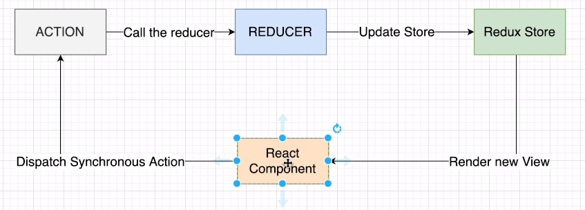
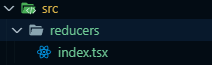
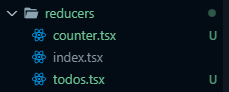
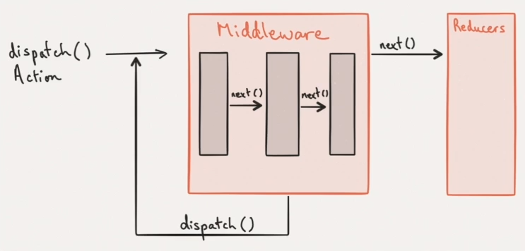
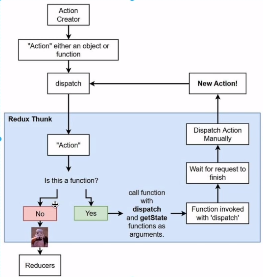

# Redux를 이용한 간단한 앱 만들기(미들웨어 없이 리덕스 카운터 앱 만들기)

<details>
<summary>리덕스(Redux)란?</summary>

### 리덕스(Redux)란?
- Redux is a predictable state container for JavaSciprt apps.
- 자바스크립트 애플리케이션을 위한 상태 관리 라이브러리이다.

### Props vs State
1. Props
   - properties의 줄임말
   - Props는 구성 요소가 서로 통신하는 방법이다.
   - Props는 상위 구성 요소에서 아래쪽으로 흐른다.
   - 해당 값을 변경하려면 자식 관점에서 Props을 변경 할 수 있는지? -> 부모는 내부 상태를 변경해야 한다.
```javascript
<ChatMessages
    message={message}
    currentMember={member}
/>
```

2. State
   - parent component에서 child component로 data를 보내는게 아닌 그 component 안에서 데이터를 전달하려면? State 활용
     - 예를 들어 검색 창에 글을 입력할 때 글이 변하는 것은 state를 바꿈
   - State가 변하면 re-render 된다.
```javascript
state = {
    message: '',
    attachFile: undefined,
    openMenu: false,
}
```

#### React는 State를 관리하는 것
- redux를 활용하면 store에 상태를 저장하고 이 것을 가져와 사용하면서 상태 관리를 보다 효율적으로 할 수 있다.

### Redux 데이터 Flow(strict unidirectional data flow)

- ACTION : ACTION은 간단한 JavaScript 객체이다. 여기에는 우리가 수행하는 작업의 유형을 지정하는 'type' 속성이 있으며 선택적으로 redux 저장소에 일부 데이터를 보내는 데 사용되는 'payload' 속성을 가질 수도 있다.
```json
{ type: 'LIKE_ARTICLE', articleId: 42}
{ type: 'FETCH_USER_SUCCESS', response: { id: 3, name: 'Mary' }}
{ type: 'ADD_TODO', text: 'Read the Redux docs.' }
```
- REDUCER : 리듀서는 애플리케이션 상태의 변경 사항을 결정하고 업데이트된 상태를 반환하는 함수이다. 그들은 인수로 조치를 취하고 store 내부의 상태를 업데이트 한다.
```javascript
{previousState, action} => nextState
```
- 이전 State와 action object를 받은 후에 next state를 return 한다.

#### Reducer는 pure function이기에 reducer 내부에서 하지 말아야 할 것들!!
- Mutate its arguments
- Perform side effects like API calls and routing transitions
- Call non-pure function, e.g. Data.now() or Math.random().

<br/>
-Redux Store : 이들을 하나로 모으는 객체 저장소는 애플리케이션의 전체 상대 트리를 보유한다. 내부 상태를 변경하는 유일한 방법은 해당 상태에 대한 Action을 전달하는 것이다. Redux Store는 클래스가 아니며, 몇 가지 Methods가 있는 객체일 뿐이다.
</details>

<details>
<summary>미들웨어 없이 리덕스 카운터 앱 만들기</summary>

### Reducer 생성

```typescript
const counter = (state = 0, action: { type: string }) => {
  switch (action.type) {
    case "INCREMENT":
      return state + 1;
    case "DECREMENT":
      return state - 1;
    default:
      break;
  }
};

export default counter;
```

### Store 생성 및 Action 전달
- CreateStore()
  - 앱의 전체 상태 트리를 보유하는 Redux 저장소를 만든다.
  - 앱에는 하나의 스토어만 있어야 한다.
```typescript
import React from 'react';
import ReactDOM from 'react-dom/client';
import './index.css';
import App from './App';
import reportWebVitals from './reportWebVitals';
import {createStore} from 'redux';
import counter from './reducers'

const root = ReactDOM.createRoot(
  document.getElementById('root') as HTMLElement
);

const store = createStore(counter);

root.render(
  <React.StrictMode>
    <App />
  </React.StrictMode>
);

reportWebVitals();
```

- [getState()](https://redux.js.org/api/store#getstate)
  - 애플리케이션의 현재 상태 트리를 반환한다. 스토어의 리듀서가 반환한 마지막 값과 같다.
```typescript
const render = () => ReactDOM.render(
  <React.StrictMode>
    <App
      value={store.getState()}
      onIncrement={() => store.dispatch({ type:'INCREMENT' })}
      onDecrement={() => store.dispatch({ type:'DECREMENT' })}
    />
  </React.StrictMode>
  document.getElementById('root')
);

render()
store.subscribe(render)
```
- [subscribe()](https://redux.js.org/api/store#subscribelistener)
  - change listener를 추가한다.
  - 작업이 전달될 때마다 호출되며 상태트리의 일부가 잠재적으로 변경되었을 수 있다.
  - 그런 다음 getState()를 호출하여 콜백 내부의 현재 상태 트리를 읽을 수 있다.
</details>

<details>
<summary>combineReducers</summary>

### ToDo 기능 추가
- 현재까지 만든 Counter 앱에 ToDo 앱을 추가해보자

#### root reducer와 sub reducer
- 현재까지 counter 리듀서만 있는데 하나를 더 추가해주려면 Root 리듀서를 만들어 그 아래 counter와 todos라는 서브(sub) 리듀서를 넣어주면 된다. 
- Root 리듀서를 만들 때 사용하는 것이 combineReducers이다.



</details>

<details>
<summary>Redux Provider</summary> 

### Provider란?
- <Provider> 구성 요소는 Redux Store 저장소에 액세스해야 하는 모든 중첩 구성 요소에서 Redux Store 저장소를 사용할 수 있도록 한다.
- React Redux 앱의 모든 React 구성 요소는 저장소에 연결할 수 있으므로 대부분의 응용 프로그램은 전체 앱의 구성 요소 트리가 내부에 있는 최상위 수준에서 <Provider>를 렌더링 한다.
- 그런 다음 Hooks 및 연결 API는 React의 컨텍스트 메커니즘을 통해 제공된 저장소 인스턴스에 액세스할 수 있다.

#### Provider를 렌더링
- React Redux 앱의 모든 React 구성 요소는 저장소에 연결할 수 있으므로 대부분의 응용 프로그램은 전체 앱의 구성 요소 트리가 내부에 있는 최상위 수준에서 <Provider>를 렌더링한다.
```typescript
const store = createStore(rootReducer)
store.dispatch({
  type: 'ADD_TODO',
  text: 'USE REDUX'
})

ReactDOM.render(
  <React.StrictMode>
    <Provider store={store}>
      <App
        onIncrement={() => store.dispatch({ type: 'INCREMENT' })}
        onDecrement={() => store.dispatch({ type: 'DECREMENT' })}
      />
    </Provider>
  </React.StrictMode>
  document.getElementById('root')
)
```
</details>

<details>
<summary>useSelector & useDispatch</summary>

### Provider로 둘러 쌓인 컴포넌트에서 store 접근하는 방법
- 리액트에 Hooks가 있듯이 리덕스에도 Hooks가 있다.
  - 그것이 바로 useSelector와 useDispatch이다.
  - 이 두개를 이용해서 provider로 둘러싸인 컴포넌트에서 store에 접근 가능하다.

### useSelector
- useSelector Hooks를 이용해서 스토어의 값을 가져올 수 있다.
```typescript
const result:any = useSelector(selector: Function, equalityFn?: Function)

// Example
const counter = useSelector((state) => state.counter)
```

### useDispatch
- store에 있는 dispatch 함수에 접근하는 hooks이다.
```typescript
const addTodo = (e: React.FormEvent<HTMLFormElement>) : void => {
  e.preventDefault();
  dispatch({ type: 'ADD_TODO', text: todoValue })
  setTodoValue("");
}
```
</details>

<details>
<summary>리덕스 미들웨어</summary>

### 리덕스 미들웨어란?
- Redux 미들웨어는 액션을 dispatch에 전달하고 리듀서에 도달하는 순간 사이에 사전에 지정된 작업을 실행할 수 있게 해주는 중간자이다.
- 로깅, 충돌 보고, 비동기 API와 통신, 라우팅 등을 위해 Redux 미들웨어를 사용한다.

### 리덕스 로깅 미들웨어 생성해보기
- 리덕스를 이용할 때 나오는 로그를 찍어주는 미들웨어를 생성해보자
```typescript
const loggerMiddleware = (store) => (next) => (action) => {
  // your code
}

// 위 함수를 풀어 표현하면 아래와 같다.
const loggerMiddleware = function (store) {
  return function(next) {
    return function (action) {
      // your code
    }
  };
}
```

#### 미들웨어 함수를 applyMiddleware 함수에 넣어주기
```typescript
const loggerMiddleware = (store: any) => (next: any) => (action: any) => {
  console.log("store", store);
  console.log("action", action);
  next(action);
}

const middleware = applyMiddleware(loggerMiddleware);
```
- applyMiddleware는 하나 혹은 더 많은 미들웨어를 받은 후 함수를 리턴하는 함수이다.

</details>

<details>
<summary>Redux Thunk</summary>

### Redux Thunk란?
- 리덕스를 사용하는 앱에서 비동기 작업을 할 때 많이 사용하는 방법이 Redux-Thunk이다.
- 이것도 앞서 만들어본 logger 미들웨어 처럼 리덕스 미들웨어이며, 리덕스를 갭라한 Dan Abramov가 만들었다.

### Thunk 용어는?
- "thunk"라는 단어는 "일부 지연된 작업을 수행하는 코드 조각"을 의미하는 프로그래밍 용어이다.
- 지금 일부 논리(logic)을 실행하는 대신 나중에 작업을 수행하는 데 사용할 수 있는 함수 본문이나 코드를 작성할 수 있다.
```javascript
// calculation of 1 + 2 is immediate
let x = 1 + 2

// calculation of 1 + 2 is delayed
// function can be called later to perform the calculation
// function is a thunk!
let testFunction = () => 1 + 2
```

#### 비동기 작업을 해야 할 때는?
- 여러 경우가 있지만 대표적으로 서버에 요청을 보내서 데이터를 가져올 때 주로 비동기 요청을 보낸다.
- 비동기로 https://jsonplaceholder.typicode.com 에 요청을 보내면 Dummy 데이터를 받을 수 있는데 이를 활용해 포스트를 만들어 보자.

1. axios 모듈 생성(npm install axios --save)
2. posts 리듀서 생성
```javascript
enum ActionType {
  FETCH_POSTS = "FETCH_POSTS",
  DELETE_POSTS = "DELETE_POSTS"
}

interface Post {
  userId: number;
  id: number;
  title: string;
}

interface Action {
  type: ActionType;
  payload: Post[];
}

const posts = (state=[], action: Action) => {
  switch(action.type) {
    case "FETCH_POSTS" :
      return [...state, ...action.payload]
    default:
      return state
  }
}

export default posts;
```



### 결론
- Redux Thunk를 사용함으로써 액션 생성자가 그저 하나의 액션 객체를 생성할 뿐 아니라 그 내부 안에서 여러 가지 작업도 할 수 있게 만들 수 있다.
</details>

<details>
<summary>리덕스 툴킷(Redux Toolkit)</summary>


</details>