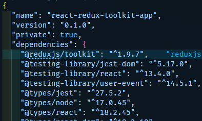
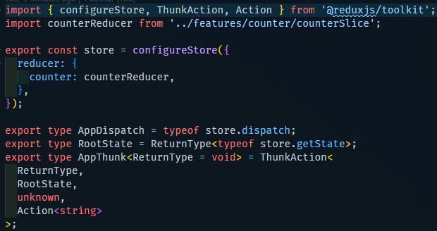

# Redux-Toolkit App 만들어보기

<details>
<summary>리덕스 툴킷(Redux Toolkit)</summary>

### 리덕스 툴킷
- 리덕스 툴킷은 리덕스 로직을 작성하기 위한 공식 권장 접근 방식이다.
- 리덕스 코어를 둘러싸고 있으며 리덕스 앱을 빌드하는 데 필수적이라고 생각하는 패키지와 기능이 포함되어 있다.
- 리덕스 툴킷은 제안된 모범 사례를 기반으로 하여 대부분의 리덕스 작업을 단순화하고 일반적인 실수를 방지하고 리덕스 애플리케이션을 더 쉽게 작성할 수 있도록 한다.

[* 리덕스 툴킷으로 만들어진 카운터 앱 살펴보기](https://redux-toolkit.js.org/tutorials/quick-start)

#### 구성 방법
```bash
npx create-react-app my-app --template redux-typescript
```


```bash
npm install @reduxjs/toolkit react-redux
```

### Store 생성하기
```typescript
import {configureStore} from '@reduxjs/toolkit'

export const store = configureStore({
    reducer: {},
})
```


### React에 Redux 스토어 제공
- 저장소가 생성되면 src/index.js에서 애플리케이션 주위에 React-Redux<Provider>를 배치하여 React 구성 요소에서 사용할 수 있도록 할 수 있다.
- 방금 만든 Redux 저장소를 가져오고 주위에 <Provider>를 배치하고 저장소를 prop으로 전달한다.
```typescript
import App from './App'
import { store } from './app/store'
import { Provider } from 'react-redux'

ReactDOM.render(
    <Provider store={store}>
        <App />
    </Provider>
    document.getElementById('root')
)
```

### Redux State Slice 생성(Reducer)
- src/features/counter/counterSlice.js라는 새 파일을 추가한다.
- 해당 파일에서 Redux Toolkit의 createSlice API를 가져온다.

### 스토어에 Slice Reducer 추가
- 다음으로 카운터 슬라이스에서 리듀서 함수를 가져와서 스토어에 추가해야 한다.
- 리듀서 매개변수 내부에 필드를 정의함으로써 스토어에 이 슬라이스 리듀서 함수를 사용하여 해당 상태에 대한 모든 업데이트를 처리하도록 지시한다.

### React 컴포넌트에서 Redux State 및 Action 사용
- useSelector : useSelector를 사용하여 저장소에서 데이터를 읽는다.
- useDipatch : useDispatch를 사용하여 Action을 전달할 수 있다.
</details>

<details>
<summary>리덕스 툴킷 더 자세히 알아보기(APIs)</summary>

### Store 생성
```typescript
// 기존 Redux
const reduxStore = createStore(rootReducer);


// Toolkit
const toolkitStore = configureStore({ reducer: rootReducer });
```

### Action 생성
```typescript
// 기존 Redux : 액션 타입 상수와 액션 생성자 함수를 분리 선언
const INCREMENT = 'counter/increment';

function increment(amount: number) {
    return {
        type: INCREMENT,
        payload: amount,
    }
}

const action = increment(10)


// Toolkit : 액션 타입 상수와 액션 생성자 함수 생성을 createAction 함수 하나로 처리
import { createAction } from '@reduxjs/toolkit';

const increment = createAction<number>{'counter/increment'} // createAction은 type만 넣으면 자동으로 해당 type을 가진 aciton create 함수를 생성한다.
// 생성된 함수를 호출할 때 인수를 추가로 넣어준다면 이 값은 payload 프로퍼티의 값으로 들어가게 된다.

const action = increment(10)
```

### Reducer 생성
```typescript
// 기존 Redux : switch 문으로 이루어진 리듀서 함수
const initialState = { value: 0 }

function counterReducer(state = initialState, action) {
    switch (action.type) {
        case 'increment': 
            return { ...state, value: state.value + 1 }
        case 'decrement': 
            return { ...state, value: state.value - 1 }
        case 'incrementByAmount':
            return { ...state, value: state.value + action.payload }
        default:
            return state
    }
}


// Toolkit : createReducer 활용
import { createAction, createReducer } from '@reduxjs/toolkit'

interface CounterState {
    value: number
}

const increment = createAction('counter/increment')
const decrement = createAction('counter/decrement')
const incrementByAmount = createAction('counter/incrementByAmount')

const initialState = { value: 0 } as CounterState

const counterReducer = createReducer(initialState, {builder} => {
    builder
        .addCase(increment, (state, action) => {
            state.value++
        })
        .addCase(decrement, (state, action) => {
            state.value--
        })
        .addCAse(incrementByAmount, (state, action) => {
            state.value += action.payload
        })
})
```
- createReducer에서 Aciton을 처리하기 위해 케이스 리듀서를 정의하는 두 가지 다른 형태인 "빌더 콜백(Builder Callback)" 표기법과 "맵 객체(Map Object)" 표기법을 지원한다.
- 둘 다 동일하지만 "빌더 콜백" 표기법이 타입 스크립트와의 호환성을 위해 더 선호되고 있다. (위의 예제의 경우 빌더 콜백 방식으로 작성되었다.)
  - builder callback -> createReducer(initialState, builderCallback)
    - builder.addCase(actionCreator, reducer) : 액션 타입과 정확히 맵핑되는 케이스 리듀서를 추가하여 액션을 처리한다. addMatcher 또는 addDefaultCase 메서드 보다 먼저 작성되어야 한다.
    - builder.addMatcher(matcher, reducer) : 새로 들어오는 모든 액션에 대해 주어진 패턴과 일치하는지 확인하고 리듀서를 실행한다.
    - builder.addDefaultCase(reducer) : 다른 케이스 리듀서나 매치 리듀서가 실행되지 않았다면, 기본 케이스 리듀서가 실행된다.
  - map object -> createReducer(initialState, actionMap, actionMatchers, defaultCaseReducer)
    - initialState : 리듀서를 처음 호출할 때 사용해야 하는 초기 상태 값
    - actionsMap : 액션 타입이 케이스 리듀서에 맵핑되어 있는 객체
    - actionMatchers : {matcher, reducer} 형식으로 정의된 배열로 케이스 리듀서가 일치하는지 여부에 관계없이 모든 일치하는 리듀서가 순서대로 실행된다.
    - defaultCaseReducer : 이 작업에 대해 케이스 리듀서 및 매처 리듀서가 실행되지 않은 경우 실행되는 "기본 케이스" 리듀서이다.
```typescript
// map object 방식
const isStringPayloadAction = (action) => typeof action.payload === 'string'

const lengthOfAllStringsReducer = createReducer(
    { strLen: 0, nonStringActions: 0 }, // initial state
    { // normal reducers
        increment: (state, action) => state + action.payload,
        decrement: (state, action) => state - action.payload
    },
    [ // array of matcher reducers(actionMatchers)
        {
            matcher: isStringPayloadAction,
            reducer(state, action) {
                state.strLen += action.payload.length
            },
        },
    ],
    // default reducer
    (state) => {
        state.nonStringActions++
    }
)

```

### Prepare 콜백함수를 사용해서 Action Contents 커스터마이즈 하기
- 일반적으로 액션 생성자 함수를 호출해서 액션을 생성할 때 아래 예제와 같이 단일 인자를 받아서 action.payload 값을 생성한다.
```typescript
import { createAction } from '@reduxjs/toolkit'

const increment = createAction<number>('counter/increment')

const action = increment(10);
```

- 이 때 payload에 사용자 정의 값을 추가하고 싶다면 아래와 같이 prepare callback 함수를 이용하면 된다.
```typescript
import { createAction, nanoid } from '@reduxjs/toolkit'

const addTodo = createAction('todos/add', function prepare(text) { // prepare callback 활용하여 커스터마이징 하기
    return {
        payload: {
            text,
            id: nanoid(),
            createdAt: new Date().toISOString(),
        },
    }
});

console.log(addTodo('Write more docs'));
/*
{
    type: 'todos/add',
    payload: {
        text: 'Write more docs',
        id: 'AJjaoeijfiaodjfioj',
        createdAt: '2023-12-27T09:35:581Z'
    }
}
*/
```

### createSlice()
- 이 API는 Redux Logic을 작성하기 위한 표준 접근 방식이다.
- createSlice 내부에서는 지금까지 배운 createAction과 createReducer를 사용하고 있다.
- createSlice 함수는 리듀서 함수의 대상인 초기 상태(initial state)와 "slice 이름"을 받아 리듀서와 상태에 해당하는 액션 생성자와 액션 타입을 자동으로 생성하는 함수이다.
```typescript
import { createSlice } from '@reudxjs/toolkit'

const initialState = { value: 0 }

const counterSlice = createSlice({ // createSlice는 단일 구성 객체 매개변수를 가진다.
    name: 'counter',
    initialState,
    reducers: { // case reducer 함수들의 객체로 이 객체의 key 이름은 action type 상수를 생성하는데 사용된다.
        increment(state) {
            state.value++
        },
        decrement(state) { // counter/decrement라는 action type 상수가 생성된다. 그리고 이에 상응하는 액션 타입을 가진 액션이 디스패치 되면 리듀서가 실행된다.
            state.value--
        },
        incrementByAmount(state, action) {
            state.value += action.payload
        }
    }
})

export const { increment, decrement, incrementByAmount } = counterSlice.actions
export default counterSlice.reducer

/* --------------------------- */

const todoSlice = createSlice({
    name: 'todos',
    initialState: [],
    reducers: {
        addTodo: {
            reducer: (state, action) => {
                state.push(action.payload)
            },
            prepare: (text) => {
                const id = nanoid()
                return { payload: { id, text }}
            }
        }
    }
})
```

### extraReducers
- extraReducers를 사용하면 createSlice가 생성한 action type 외에 다른 aciton type에 응답할 수 있다.
- extraReducers로 지정된 케이스 리듀서는 "외부" 액션을 참조하기 위한 것이므로, 그들은 slice.actions에서 생성된 액션을 가지지 않을 것이다.
```typescript
const incrementBy = createAction('incrementBy')
const decrementBy = createAction('decrementBy')

const counter = createSlice({
    name: 'counter',
    initialState: 0,
    reducers: {
        increment: (state) => state + 1,
        decrement: (state) => state - 1,
    },
    // builder callback api 활용해야 함
    extraReducers: (builder) => {
        builder.addCase(incrementBy, (state, action) => {
            return state + action.payload
        })
        builder.addCase(decrementBy, (state, action) => {
            return state - action.payload
        })
    }
})
```

### createAsynceThunk
- createAction의 비동기 버전이다.
- createAction + Asynce => createAsyncThunk
```typescript
// createAction
function createAction(type, prepareAction?)


// createAsyncThunk
function createAsyncThunk(type, payloadCreator, options)
/*
1. type : 비동기 요청의 생명 주기를 나타내는 추가 Redux action type 상수를 생성하는 데 사용되는 문자열
예를 들어 'users/requestStatus' type 인수는 다음 action type을 생성한다.
    - pending : 'users/requestStatus/pending'
    - fulfilled : 'users/requestStatus/fulfilled'
    - refected : 'users/requestStatus/rejected'

2. payloadCreator : Promise를 반환하는 콜백 함수
*/

// 사용 예제
const fetchUserById = createAsyncThunk(
    'users/fetchByIdStatus',
    async (userId, thunkAPI) => {
        const response = await userAPI.fetchById(userId)
        return response.data
    }
)

const userSlice = createSlice({
    reducers: {
        // standard reducer logic
    },
    extraReducers: (builder) => {
        builder.addCase(fetchUserById.pending, (state, action) => {}),
        builder.addCase(fetchUserById.fulfilled, (state, action) => {
            state.entities.push(action.payload)
        }),
        builder.addCase(fetchUserById.rejected, (state, action) => {})
    }
})

dispatch(fetchUserById(123))
```
- function createAsyncThunk(type, payloadCreator, options) 에서 2번째 매개변수는
  - function payloadCreator(arg, thunkAPI)와 같고
  - 해당 함수의 2번째 매개변수는 일반적으로 Redux Thunk 함수에 전달되는 모든 매개변수와 추가 옵션을 포함하는 객체이다.
    - dispatch : Redux 스토어 dispatch 메서드
    - getState : Redux 스토어 getState 메서드
    - extra : 설정 시 Thunk 미들에ㅜ어에 제공되는 "추가 인수" (사용 가능한 경우)
    - requestId : 이 요청 시퀀스를 식별하기 위해 자동으로 생성된 고유 문자열 ID 값
    - signal : 앱 로직의 다른 부분이 이 요청을 취소가 필요한 것으로 표시했는지 확인하는 데 사용할 수 있는 AbortController.signal 개체이다.
    - rejectWithValue(value, [meta]) : rejectWithValue는 정의된 페이로드 및 메타와 함께 거부된 응답을 반환하기 위해 작업 생성자에서 반환(또는 throw) 할 수 있는 유틸리티 함수입니다. 그것은 당신이 어떤 값을 주든 전달하고 거부된 작업의 페이로드에 반환한다. 메타도 전달하면 기존의 rejectAction.meta와 병합된다.
    - fulfillWithValue(value, meta) : fulfillWithValue는 fulfilledAction.meta에 추가할 수 있는 기능을 가지고 있는 동안
```typescript
const updateUser = createAsyncThunk(
    'users/update',
    async(userData, { rejectWithValue }) => {
        const { id, ...fields } = userData
        try {
            const response = await userAPI.updateById(id, fields)
            return response.data.user
        } catch(err) {
            return rejectWithValue(err.response.data)
        }
    }
)

builder.addCase(fetchUserById.rejected, (state, action) => {
    state.error = action.payload
})
```

### cancellation
1. thunk 실행 중 취소하기
```typescript
import React, { useEffect } from "react";
import { useAppDispatch } from "../../app/hooks";
import { incrementAsync } from "./counterSlice";

const Test = () => {
  const dispatch = useAppDispatch();

  useEffect(() => {
    const promise = dispatch(incrementAsync(10));
    return () => {
      // clear up
      promise.abort(); // 
    };
  }, []);
  return <div>Test</div>;
};

export default Test;

```
- Toggle 버튼을 눌러서 Test 컴포넌트가 더 이상 사용되지 않는 Unmount될 때 clean up 부분이 호출되므로 promise.abort() 메소드가 호출되어서 thunk가 실행 중에 중지가 되게 된다.
- 이렇게 되면 'thunkName/rejected" action이 dispatch된다.

2. abort 이벤트 발생 시 request 취소하기
```typescript
export const fetchUserAsync = createAsyncThunk(
    'counter/fetchUsers',
    async() => {
        await axios.get("https://jsonplaceholder.typicode.com/users");
    }
);

React.useEffect(() => {
    const promise = dispatch(fetchUsersAsync());
    return () => {
        promise.abort();
    }
})

export const fetchUsersAsync = createAsyncThunk(
    'counter/fetchUsers',
    async(_, thunkAPI) => {
        const controller = new AbortController();

        thunkAPI.signal.addEventListener('abort', () => {
            controller.abort()
        })
        await axios.get("https://jsonplaceholder.typicode.com/users", {
            signal: controller.signal
        })
    }
)
```
</details>

<details>
<summary>Disney 앱에 Redux 적용하기</summary>
🚗[Go to react-disney-plus-app](https://github.com/Dahoonkk/Studying_React/tree/main/react/react-disney-plus-app)
</details>

<details>
<summary>Redux-Persist</summary>

- 리덕스 스토어에 있는 State들은 페이지를 새로고침 하면 초기화되는 것을 볼 수 있다.
- 하지만 Redux Persist를 이용하면 페이지 새로고침 후에도 상태를 유지할 수 있게 된다.

```bash
npm i redux-persist
```

#### SerializableCheck
- action에 직렬화가 불가능한 값(non-serializable value)를 전달했기에 나오는 에러
  - 직렬화(serialize) : object 값을 string 값으로 변환(JSON.stringify)
  - 역직렬화(deserialize) : string 값을 object 값으로 변환(JSON.parse)
- Redux는 state, action에 직렬화가 불가능한 값을 전달할 수 없는데 전달하려고 하니 나온 에러
- 그래서 직렬화가 불가능한 값 전달을 허락하면 된다.

#### React로 직렬화 가능 값만 허용하는 이유
- 리덕스는 예상한대로 UI에 반영되게 하거나 Time Travel 기능( 복원 기능)이나 올바른 디버깅을 위해서 직렬화 가능한 값만 저장하는 걸 추천한다.
</details>