# CSS Framework 공부하기 - Tailwind CSS

<details>
<summary>Tailwind CSS에 대해서</summary>

### [Tailwind CSS](https://tailwindcss.com/)란 무엇인가?
- HTML 안에서, CSS 스타일을 만들 수 있게 해주는 CSS 프레임워크이다.

#### CSS 프레임워크란?
- CSS 프레임워크는 레이아웃 및 여러 컴포넌트 구성, 브라우저 호환성을 보장하는데 소요되는 시간을 최소화하기 위해 여러 웹 개발 / 디자인 프로젝트에 적용할 수 있는 CSS 파일 모음이다.
- CSS Framework 종류 for React JS
  - Material UI / React Bootstrap / Semantic UI / Ant Design / Materialize ...

### Tailwind CSS의 장점
- Tailwind CSS는 부트스트랩과 비슷하게 m-1, flex와 같이 미리 세팅된 Utility Class를 활용하는 방식으로 HTML에서 스타일링이 가능하다.
- 그렇기 때문에 빠른 스타일링 작업이 가능하며
- class 혹은 id 명을 작성하기 위한 고생을 하지 않아도 된다.
- 유틸리티 클래스가 익숙해지는 시간이 필요할 수 있지만 IntelliSense 플러그인이 제공돼서 금방 익숙해지는게 가능하다.

</details>

<details>
<summary>CRA(Create-React-App) 리액트 앱에 Tailwind CSS 적용하기</summary>

### [CRA(Create-React-App)에 Tailwind CSS 적용하기](https://tailwindcss.com/docs/guides/create-react-app)
- npm을 통해 Tailwind CSS 및 해당 종속성을 설치한 다음 init 명령을 실행하여 tailwind.config.js 및 postcss.config.js를 모두 생성한다.

```bash
npm install -D tailwindcss postcss autoprefixer

npx tailwindcss init -p
```

<br />

- 템플릿 경로 구성 : tailwind.config.js 파일에 모든 템플릿 파일의 경로를 추가한다.
```javascript
/** @type {import('tailwindcss').Config} */
module.exports = {
  content: [
    "./src/**/*.{js,jsx,ts,tsx}",
  ],
  theme: {
    extend: {},
  },
  plugins: [],
}
```

<br />

- Taiwind의 각 레이어에 대한 @tailwind 지시문을 ./src/index.css 파일에 추가한다.
```css
@tailwind base;
@tailwind components;
@tailwind utilities;
```

### 전체 구조 생성하기
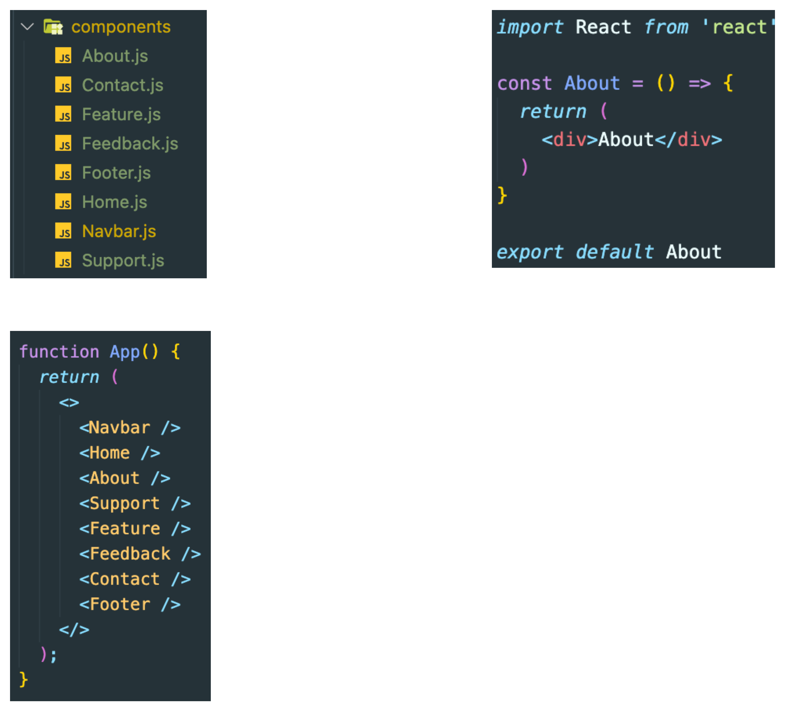

### 필요한 에셋 가져오기
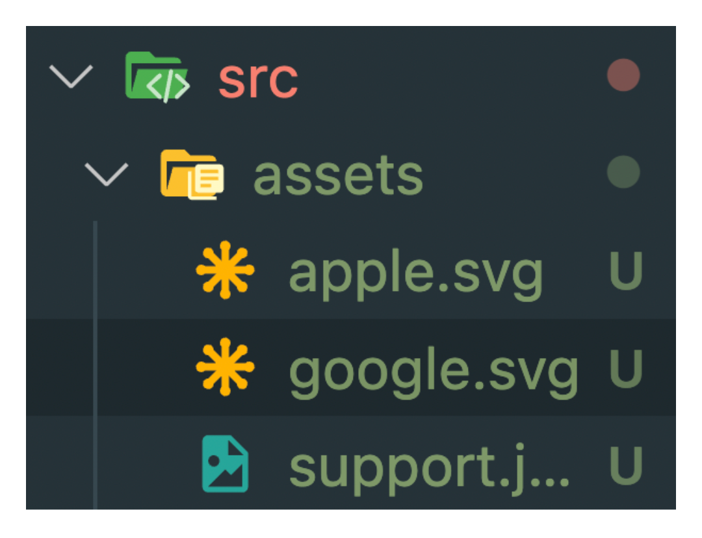

### [React/icons](https://react-icons.github.io/react-icons/) 설치
```bash
npm install react-icons --save
```

</details>

<details>
<summary>PostCSS & AutoPrefixer</summary>

### PostCSS & AutoPrefixer
- JavaScript로 CSS를 변환하는 도구
- PostCSS는 쉽게 말해 해당 툴 안에서 플러그인들을 사용할 수 있게 해주는 툴이다.
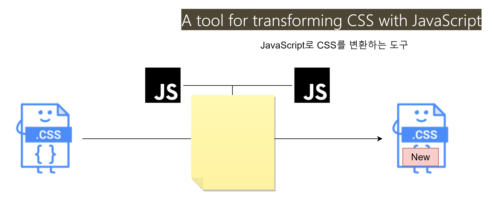

#### Increase code readability (코드 가독성 향상)
- [Can I Use](https://caniuse.com/) 사이트의 값을 사용하여 CSS 규칙에 공급업체(provider) 접두사(prefixes)를 추가한다.
- AutoPrefixer는 현재 브라우저 인기도 및 속성 자원을 기반으로 데이터를 사용하여 접두사를 적용한다.
- 따라서 특정 브라우저를 위한 css 따로 작성하지 않아도 된다.
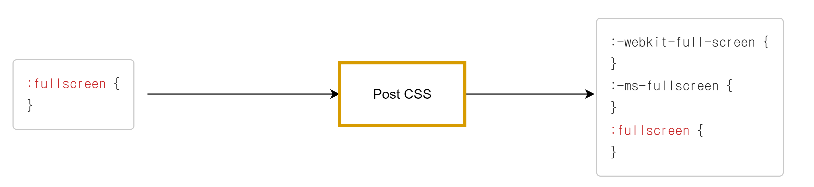

#### Use tomorrow's CSS Today!
- [PostCSS Preset Env](https://preset-env.cssdb.org/)를 사용하여 최신 CSS를 대부분의 브라우저가 이해할 수 있는 것으로 변환하고 cssdb를 사용하여 대상 브라우저 또는 런타임 환경에 따라 필요한 풀 리필을 결정할 수 있다.
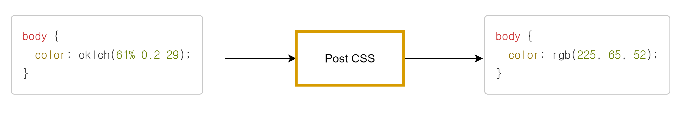
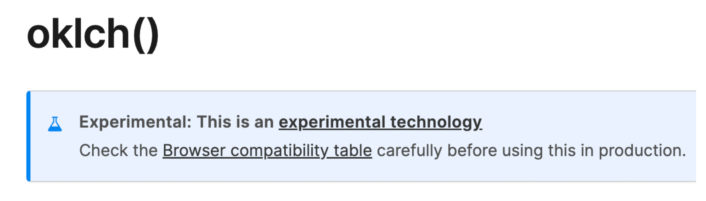

#### The end of global CSS
- [CSS 모듈](https://github.com/css-modules/css-modules)을 사용하면 이름이 너무 일반적이지 않을까, 중복되지 않을까 걱정할 필요가 없다. 가장 적절한 이름을 사용할 수 있도록 해준다.
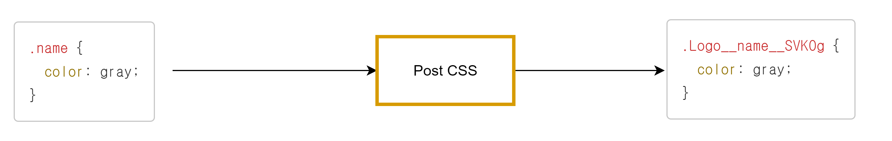

- CSS 모듈은 기본적으로 모든 클래스 이름과 애니메이션 이름의 범위가 로컬로 지정되는 CSS 파일이다.
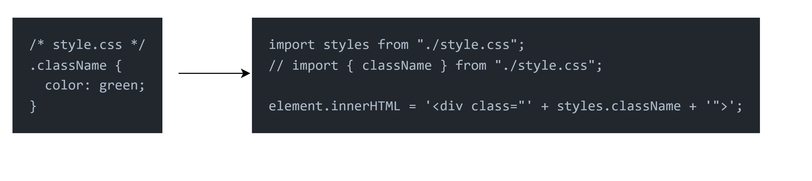

#### Avoid errors in your CSS
- 최신 CSS 린터인 [styleint](https://stylelint.io/)를 사용하여 일관된 규칙을 적용하고 스타일 시트의 오류를 방지할 수 있다.
- SCSS와 같은 CSS와 유사한 구문뿐 아니라 최신 CSS 구문을 지원한다.
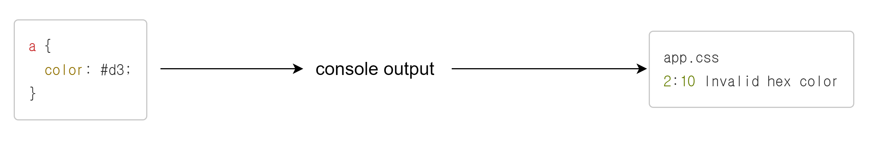

### AutoPrefixer
- PostCSS 플러그인 중 하나이다.
- CSS를 파싱하고 vendor prefixes를 추가한다.
- Can I Use로부터 얻은 결과를 이용한다.
```css
// 적용 전
::placeholder {
  color: blue;
}

// 적용 후
::-moz-placeholder {
  color: blue;
}
:-ms-input-placeholder {
  color: blue;
}
::placeholder {
  color: blue;
}
```

</details>

<details>
<summary>Navbar 컴포넌트 생성하기</summary>

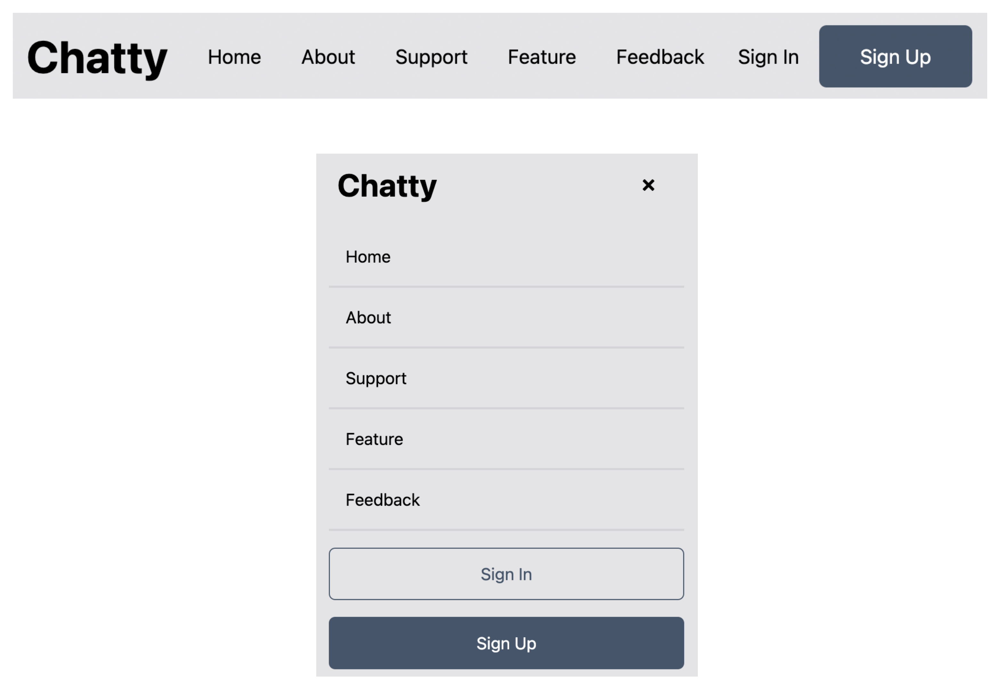

</details>

<details>
<summary>Home 컴포넌트 생성하기</summary>


</details>

<details>
<summary>About 컴포넌트 생성하기</summary>

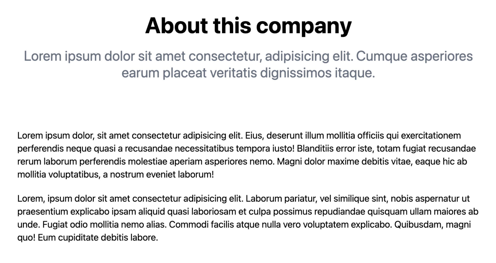

</details>

<details>
<summary>Support 컴포넌트 생성하기</summary>

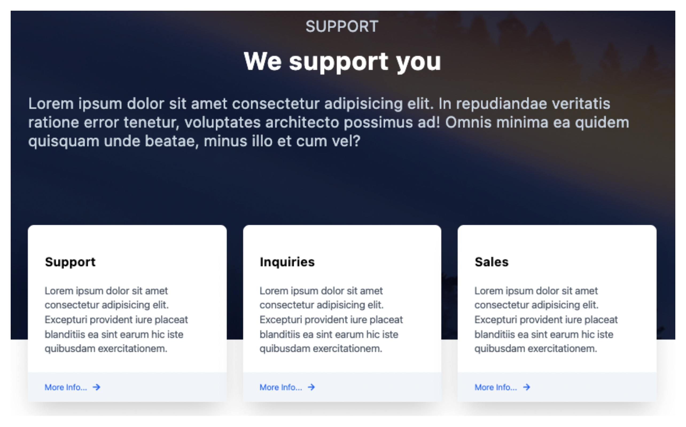

</details>

<details>

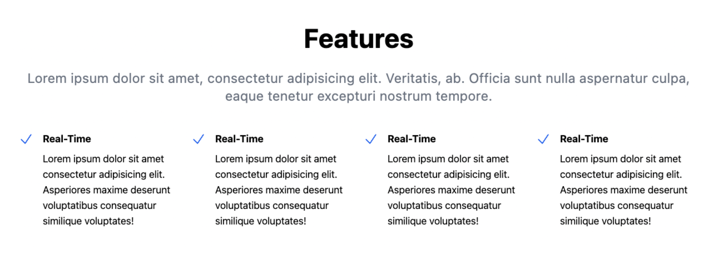

</details>

<details>
<summary>Feedback 컴포넌트 생성하기</summary>


</details>

<details>
<summary>Contact 컴포넌트 생성하기</summary>

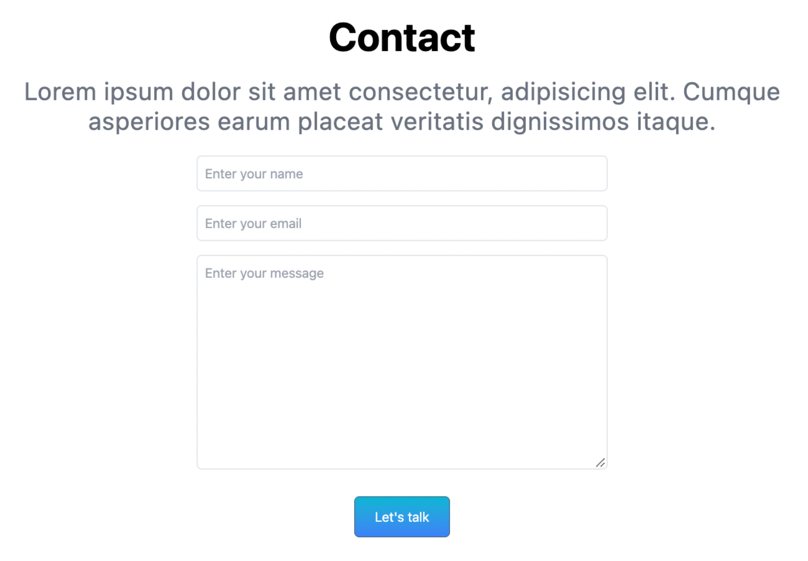

</details>

<details>
<summary>Footer 컴포넌트 생성하기</summary>

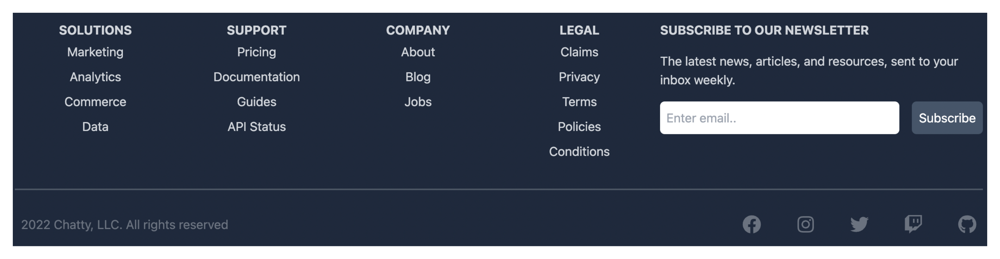

</details>

<details>
<summary>React Scroll</summary>

> 수직 스크롤 애니메이션을 위한 React 컴포넌트;

#### 모듀 설치
```bash
npm install react-scroll
```

#### 모듈 사용해보기
- [Link1](https://codesandbox.io/s/basic-6t84k?file=/src/index.js:1917-1920)
- [Link2](https://6t84k.csb.app/)

</details>

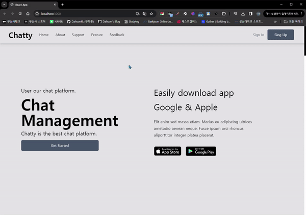