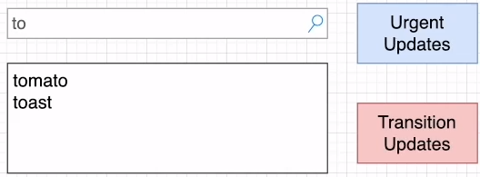

# React Version 18

### 리액트 18 버전
- 리액트 18에는 무엇이 있나?
- 리액트 18로 어떻게 업그레이드 할 수 있나?

### 리액트 18 버전에 새로운 것은 무엇인가?
- Automatic batching
- Suspense on the server
- New APIs for app and library developers
- Transition

#### Automatic Batching
- 배칭(batching)은 업데이트 대상이 되는 상태값들을 하나의 그룹으로 묶어서 한번의 리렌더링에 업데이트가 모두 진행될 수 있게 해주는 것을 의미한다.
- 한 함수 안에서 setState를 아무리 많이 호출시키더라도 리렌더링은 단 한번만 발생한다.
```javascript
function handleClick() {
    setCount(c => c + 1);
    setFlag(f => !f);
};
```
- 함수의 끝에서 업데이트가 되며 리액트는 마지막에 한번만 리렌더링 한다.
  - 이것은 여러번 리렌더링을 하는 것을 막기 때문에 성능상 좋은 영향을 준다.
- batch update를 사용함으로 불필요한 리렌더링을 줄일 수 있어서 퍼포먼스적으로 큰 이점을 얻을 수 있다.
  - 이전 버전에서도 이런 batch update가 지원되었지만 클릭과 같은 브라우저 이벤트에서만 적용이 가능하고 api 호출이 콜백으로 넣은 함수나 timeouts 함수에서는 작동하지 않았다.

```javascript
function handleClick() {
    fetchSomething().then(() => {
        setCount(c => c + 1);  // 리렌더링 1번
        setFlag(f => !f);  // 리렌더링 2번
    })
}

setTimeout(() => {
    setCount(c => c + 1);  // 리렌더링 1번
    setFlag(f => !f);  // 리렌더링 2번
}, 1000);
```

#### batch 처리하지 않으려면 어떻게 해야하나?
- 일반적으로 일괄 처리는 안전하지만 일부 코드는 상태 변경 직후 DOM에서 무언가를 읽는데 의존할 수 있다.
- 이러한 사용 사례의 경우 ReactDOM.flushSync()를 사용하여 일괄 처리를 옵트아웃할 수 있다.

```javascript
import { flushSync } from 'react-dom';

function handleClick() {
    flushSync{() => {
        setCount(count + 1);
    }}
    // 리액트가 바로 DOM 업데이트(re-render)

    flushSync{() => {
        setClicked(true);
    }}
    // 리액트가 바로 DOM 업데이트(re-render)
};
```

#### 리액트 18 버전에서 Automatic Batching은
- 더 나은 성능을 위한 더 적은 리렌더링을 한다.
- 이벤트 핸들러 밖에서도 작동한다.
- 필요할 때는 제외할 수 있다.

<br />

### Suspense on the server

#### 서버 사이드 렌더링
- 리액트의 서버사이드 렌더링은 다음의 스텝으로 이뤄진다.
  1. 서버에서 전체 앱에 대한 데이터를 가져온다.
  2. 그런 다음 서버에서 전체 앱을 HTML로 렌더링하고 응답으로 보낸다.
  3. 그 후 클라이언트에서 전체 앱에 대한 Javascript 코드를 로드한다.
  4. 클라이언트에서 Javascript 논리를 전체 앱에 대해 서버 생성 HTML에 연결한다.(hydration)
    - Hydration은 Dry한 HTML에 수분을 공급하는 것
  
#### 여기서 문제점은 무엇인가?
- 핵심 부분은 다음 단계가 시작되기 전에 각 단계가 전체 앱에 대해 한 번에 완료되어야 한다는 것이다. (동기 방식 및 Waterfall 방식)
- 거의 모든 중요하지 않은 앱의 경우와 같이 앱의 일부가 다른 부분보다 느린 경우 이는 효율적이지 않다.
- 왜냐면 한 페이지에 여러 컴포넌트가 있을 때 HTML 생성이 오래 걸리는 컴포넌트가 있고, 그렇지 않은 컴포넌트가 있는데 빨리 생성된 컴포넌트가 다른 컴포넌트를 위해서 계속 기다려야 하기 때문에 비효율적이게 된다.

#### 리액트 18에서 Suspense로 문제 해결하기
- React 18을 사용하면 <Suspense />를 사용하여 앱을 더 작은 독립 단위로 나눌 수 있다.
- 이 단위는 서로 독립적으로 이러한 단계를 거치며 앱의 나머지 부분을 차단하지 않는다.
- 결과적으로 앱 사용자는 콘텐츠를 더 빨리 보고 훨씬 빠르게 상호 작용할 수 있다.
- 앱에서 가장 느린 부분은 빠른 부분을 끌어내리지 않는다.
- 이러한 개선 사항은 자동이며 작동하기 위해 특별한 조정 코드를 작성할 필요가 없다. 

<br />

### Transition

#### [startTransition](https://react.dev/reference/react/startTransition)
- 리액트 18에서는 업데이트 중에도 앱의 응답성을 유지하는 데 도움이 되는 새로운 API를 도입한다. 
- 이 새로운 API를 사용하면 특정 업데이트를 'Transition'으로 표시하여 사용자 상호 작용을 크게 개선할 수 있다.
- React를 사용하면 상태 전환 중에 시각적 피드백을 제공하고 전환이 발생하는 동안 브라우저의 응답성을 유지할 수 있다.
- 이 기능은 리액트에서 어떠한 업데이트가 Urgent하며 어떠한게 그러하지 않은지 알려준다. 그래서 상태 업데이트를 하는데 우선순위를 주게 된다.

- 대표적으로 검색 기능을 구현할 때 검색하는 Input은 이벤트에 따라서 리렌더링이 해당 화면에 업데이트 되어야 한다.
- 하지만 그 아래 검색 결과도 이에 따라 업데이트가 되는데 검색 결과 리스트가 많지 않더라도 내부적으로 검색 결과를 가져오는데 많은 작업을 진행할 수 있기에 검색창에 타이핑을 하는 것에 따라 바로 바로 검색 결과도 업데이트를 하면 성능에 문제가 생길 수 있다.
- 그러하기에 이 부분은 검색 창과 결과 창 두 부분으로 나눌 수 있으며, 유저가 타이핑하는 것에 따라 즉각 반영되기를 기대하는 검색창, 그리고 검색 창보다는 UI 업데이트가 느린 것에 자연스럽게 받아들여져야 하는 결과 창으로 나눌 수 있다.
  - Urgent Updates 검색 창 : 버튼 클릭, 키보드 입력과 같이 직관적으로 보았을 때 업데이트가 즉각적으로 일어나는 것을 기대하는 상태 값들을 대상으로 한다.
  - Transition Updates 결과 창 : 사용자가 상태 값의 변화에 따른 모든 업데이트가 뷰에 즉각적으로 일어나는 것을 기대하지 않는다.
```javascript
// Urgent : Show whqt was typed
setInputValue(input);

// Not Urgent : Show the results
setSearchQuery(input);
```

#### 어떻게 이러한 문제점을 개선할 수 있나?
- 새로운 startTransition API는 업데이트를 "Transition"으로 표시할 수 있는 기능을 제공하여 이 문제를 해결한다.
- 이 API로 리액트에게 상태 업데이트하는데 우선 순위를 정해주는 것이다.
```javascript
import { startTransition } from 'react';

setInputValue(input);

startTransition(() => {
    setSearchQuery(input);
})
```
- startTransition에 래핑된 업데이트는 긴급하지 않은 것으로 처리되며 클릭이나 키 누름과 같은 더 긴급한 업데이트가 들어오는 경우 중단된다.
- 전환이 사용자에 의해 중단되면(ex. 여러 문자를 연속으로 입력) React는 다음을 throw한다. 완료되지 않은 오래된 렌더링 작업을 제거하고 최신 업데이트만 렌더링 한다.
- Transition을 사용하면 UI가 크게 변경되더라도 대부분의 상호 작용을 빠르게 유지할 수 있다.
- 또한 더 이상 관련없는 콘텐츠를 렌더링하는 데 시간을 낭비하지 않아도 된다.

#### Transition이 보류 중인 동안 어떻게 해야 하나?
- 검색 창에 타이핑을 했을 때 startTransition API로 인해 결과 창에는 UI 업데이트 우선순위가 밀려서 업데이트 보류가 일어날 때는 아래와 같이 isPending이 true로 되기에 isPending이 true일 시에 Spinner 같은 컴포넌트를 보여주면 된다.
```javascript
import { useTransition } from 'react';

const [isPending, startTransition] = useTransition();

{isPending && <Spinner />}
```

#### 리액트 18 이전에는 어떻게 이러한 문제를 처리했나?
- startTransition이 없을 때는
  - State를 두 개로 나눠서 따로 처리를 해주거나 (state가 두 개니 업데이트 처리 방법을 다르게 해 줌)
  - debounce을 이용해서 처리하거나
  - setTimeout을 이용해서 처리했다.
- debounce를 이용하거나 setTimeout을 이용하는 것은 결국 모든 이벤트가 Schedule 되어 있고 뒤로 밀리는 것이기 때문에 이벤트가 끝나도 계속 결과를 표출하게 된다.
```javascript
onChange = {(e, nextValue) => {
    setValue(nextValue);

    setTimeout(() => {
        onChange=(nextValue);
    }, 0)
}}
```