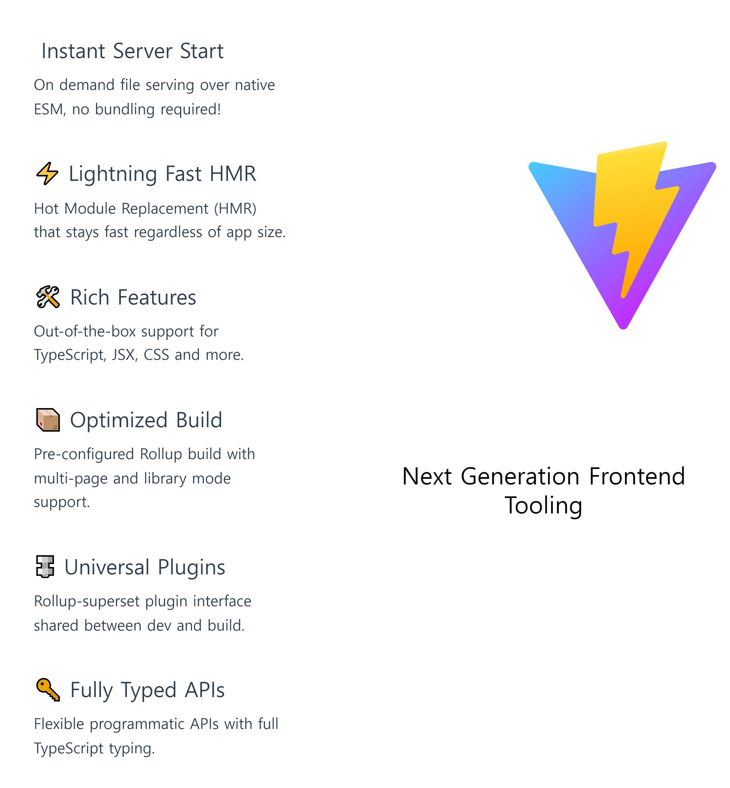
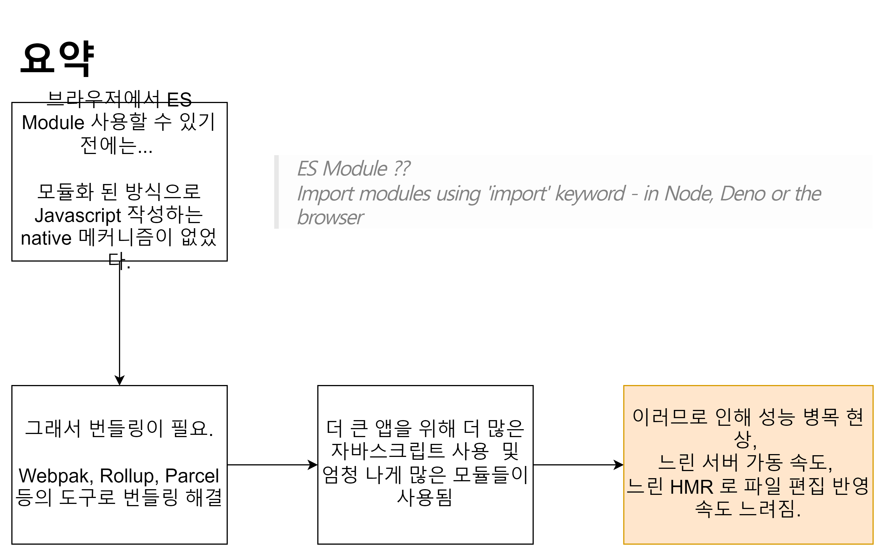
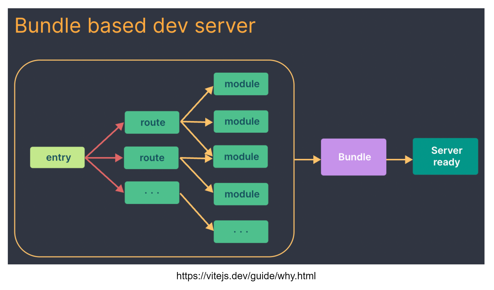
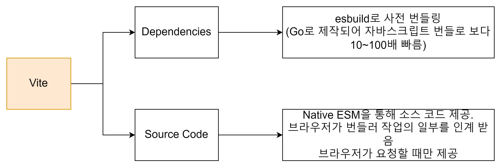
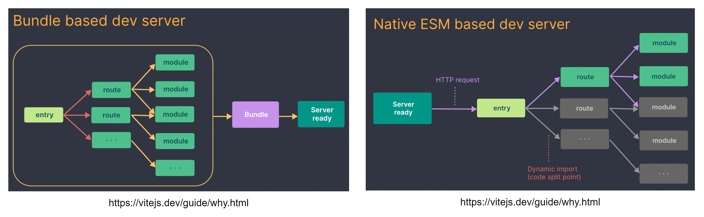

# Vite vs Create-React-App

Vite란?

### [Vite란?](https://vitejs.dev/)

- Vite는 Vue.js의 창시자인 Evan You가 작성하고 Vue 및 React 프로젝트 템플릿에 기본적으로 사용되는 로컬 개발 서버이다. 
- TypeScript 및 JSX를 지원한다. 
- 번들링을 위해 내부적으로 Rollup과 esbuild를 사용한다.

#### Vite를 사용하는 이유
- vite의 가장 큰 장점은 빌드 속도나 새로운 코드를 적용했을 때의 반영 속도 같은 Feedback 속도의 엄청난 개선이다.
- 브라우저에서 ES 모듈을 사용할 수 있기 전에는 개발자에게 모듈화된 방식으로 Javascript를 작성하는 기본 메커니즘이 없었다.
  - 이것이 우리가 소스 모듈을 브라우저에서 실행할 수 있는 파일로 크롤링, 처리 및 연결하는 도구를 사용하는 번들링의 개념에 익숙한 이유이다.
- 시간이 지남에 따라 webpack, Rollup 및 Parcel과 같은 도구를 통해 프론트엔드 개발자의 개발 경험이 크게 향상되었다.
- 그러나 점점 더 큰 애플리케이션을 구축하기 시작하면서 처리하는 JavaScript의 양도 기하급수적으로 증가했다.
- 대규모 프로젝트에서 수천 개의 모듈을 포함하는 것은 드문 일이 아니며 Javasciprt 기반 도구에 대한 성능 병목 현상이 발생하기 시작했다.
- 개발 서버를 가동하는 데 종종 부당하게 오랜 시간(때로는 최대 몇 분)이 걸릴 수 있으며 HMR을 사용하더라도 파일 편집이 반영되는 데 몇 초가 걸릴 수 있다.
- 브라우저에서 느린 패드백 루프는 개발자의 생산성과 행복에 큰 영향을 줄 수 있다.
- 따라서 Vite는 생태계의 새로운 발전을 활용하여 이러한 문제를 해결하는 것을 목표로 하고 있다.

#### Vite를 이용해서 속도 개선을 하는 방법
- 개발 서버를 스타트할 때 번들러 기반 빌드 설정은 서비스를 제공하기 전에 전체 애플리케이션을 열심히 크롤링하고 빌드해야 한다.

> 💢 느린 서버 시작 속도
> - Vite는 먼저 애플리케이션의 모듈을 종속성과 소스 코드의 두 가지 범주로 나누어 개발 서버 시작 시간을 개선한다.
> - Dependencies는 대부분 개발 중에 자주 변경되지 않는 일반 JavaScript이다. 일부 큰 종속성(예. 수백 개의 모듈이 있는 구성 요소 라이브러리)도 처리하는 데 비용이 많이 든다. 종속성은 다양한 모듈 형식(예. ESM 또는 CommonJS)으로 제공될 수도 있다.
> - Vite는 esbuild를 사용하여 종속성을 사전 번들로 제공한다. esbuild는 Go로 작성되었으며 JavaScript 기반 번들러보다 10 ~ 100배 더 빠르게 종속성을 사전 번들링한다.
> - Source Code에는 변환이 필요한 일반 JavaScript가 아닌 경우가 많으며(예. JSX, CSS 또는 Vue/Svelte 구성 요소) 매우 자주 편집된다. 또한 모든 소스 코드를 동시에 로드할 필요는 없다.(예. 경로 기반 코드 분할)
> - Vite는 기본 ESM을 통해 소스 코드를 제공한다. 이것은 본질적으로 브라우저가 번들러 작업의 일부를 인계받게 하는 것이다. Vite는 브라우저가 요청할 때 요청에 따라 소스 코드를 변환하고 제공하기만 하면 된다. 조건부 동적 가져오기 뒤에 있는 코드는 현재 화면에서 실제로 사용되는 경우에만 처리된다.

> 💢 느린 서버 업데이트 속도
> - 번들러 기반 빌드 설정에서 파일을 편집할 때 명백한 이유로 전체 번들을 다시 빌드하는 것은 비효율적이다. 업데이트 속도는 앱 크기에 따라 선형적으로(linearly) 저하된다.
> - 일부 번들러에서 개발 서버는 파일이 변경될 때 모듈 그래프의 일부만 무효화하면 되지만 전체 번들을 다시 구성하고 웹 페이지를 다시 로드해야 하도록 메모리에서 번들링을 실행한다. 번들을 재구성하는 데 비용이 많이 들 수 있으며 페이지를 다시 로드하면 애플리케이션의 현재 상태가 손상된다. 이것이 일부 번들러가 핫 모듈 교체(HMR)를 지원하는 이유이다. 페이지의 나머지 부분에 영향을 주지 않고 모듈 자체를 "Hot Module Replacement"할 수 있다. 이것은 DX (developer experience)를 크게 향상시킨다. 그러나 실제로 HMR 업데이트 속도도 응용 프로그램의 크기가 증가함에 따라 크게 저하된다는 것을 발견했다.

### HMR(Hot Modeul Replace)란?
- 파일을 편집할 때 전체 번들을 다시 빌드하는 것이 아닌 페이지의 나머지 부분에 영향을 주지 않고 변경된 모듈 자체를 교체해서 빠르게 화면에 반영되게 하는 것이다.
- Vite에서 HMR은 기본 ESM을 통해 수행된다. 파일이 편집될 때 Vite는 편집된 모듈과 가장 가까운 HMR 경계(대부분의 경우 모듈 자체만) 사이의 체인을 정확하게 무효화하면 애플리케이션의 크기에 관계없이 HMR 업데이트가 일관되게 빠르게 빨라진다.
- Vite는 또한 HTTP 헤더를 활용하여 전체 페이지 다시 로드 속도를 높인다(다시 말하지만 브라우저가 더 많은 작업을 수행하도록 한다). 소스 코드 모듈 요청은 304 Not Modified를 통해 조건부로 이루어지며 종속성 모듈 요청은 Cache-Control: max-age=31536000, immutable을 통해 강력하게 캐시된다. 그래서 한 번 캐시되면 서버에 다시 도달하지 않는다.

### Typescript Transpiling 속도
- Vite을 이용하면 기본적으로 Typescript 사용을 지원하며, esbuild (go로 쓰여있기 때문에 훨씬 빠름)를 이용해서 transpiling 하기 때문에 훨씬 빠른 속도로 할 수 있다.
  - 하지만 타입 checking 기능은 없다. 
  - 그 이유는 이미 에디터 내에서 다른 것들이 타입 체킹을 하기 때문에 transpiling 만 제공한다.

