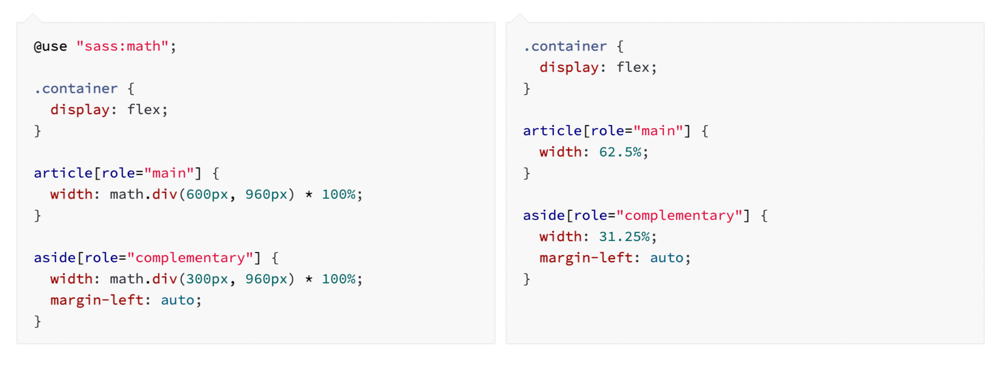
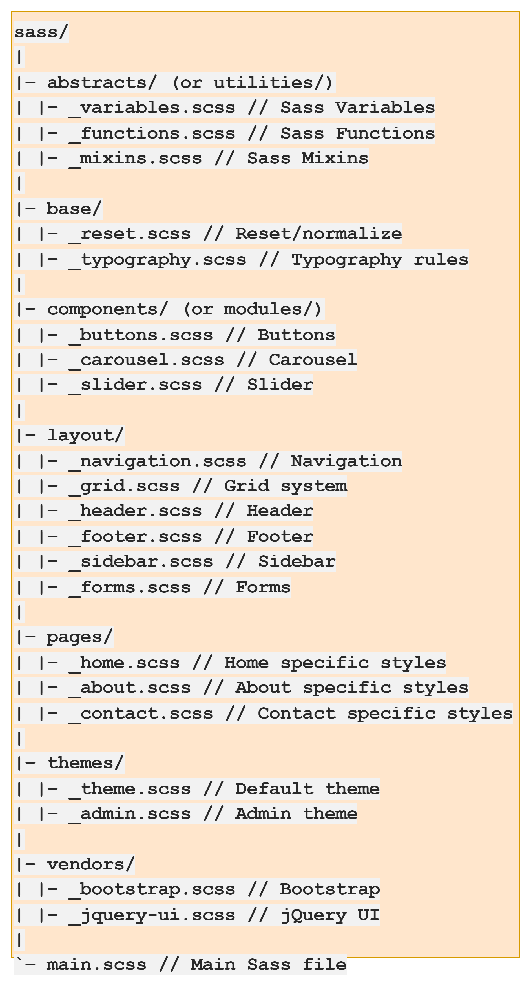

# CSS Framework 공부하기 - SCSS & SASS (Youtube Clone)

<details>
<summary>Sass란?</summary>

> "Sass"는 기능이 뛰어나고 안정적인 CSS 확장 언어이다.;

### [Sass(Syntactically Awesom Style Sheets)](https://sass-lang.com/)란?
- CSS를 사용하는 것 만으로 많은 앱을 스타일링 할 수 있지만 만약 스타일시트가 점점 더 커지고 복잡해지면 유지 관리하기 어려워지게 된다.
- 이러한 상황에서 SASS가 도움이 될 수 있다.
- SASS에는 중첩, 믹스인, 상속 및 강력하고 유지 관리 가능한 CSS를 작성하는 데 도움이 되는 기타 유용한 기능들과 같이 아직 CSS에는 존재하지 않는 기능들도 있다.
- SASS로 작업을 시작하면 사전 처리된  Sass 파일을 웹사이트에서 사용할 수 있는 일반 CSS 파일로 저장한다.
- [sass for cra(create-react-app)](https://create-react-app.dev/docs/adding-a-sass-stylesheet/)


### SASS와 SCSS

- SASS는 CSS로 컴파일되거나 해석되는 전처리기(pre-processor) 스크립팅 언어이다.
- SassScript는 그 자체가 스크립팅 언어인 반면 SCSS는 기존 CSS 구문 위에 구축되는 SASS의 기본문법으로 CSS와 같은 세미콜론과 대괄호를 사용한다.
- Sass는 실제로 수학 및 변수 지원을 통해 CSS를 더욱 강력하게 만든다.

#### SASS vs SCSS
- SASS는 원본 구문이 필요할 때 사용되며 SCSS에는 코드 구문이 필요하지 않는다.
- SASS는 엄격한 들여쓰기를 따르지만 SCSS에는 엄격한 들여쓰기가 없다.
- SASS는 공백이 있고 세미콜론이 없는 느슨한 구문을 가지고 있지만 SCSS는 CSS 스타일에 더 가깝고 세미콜론과 중괄호의 사용은 필수이다.
- SASS 파일 확장자는 .sass이고 SCSS파일 확장자는 .scss이다.
- SASS에는 SCSS보다 더 많은 개발자 커뮤니티와 지원이 있다.
- SASS는 문서 추가를 위해 SassDoc을 지원하는 반면 SCSS는 인라인 문서를 허용한다.
- SASS는 CSS로 사용할 수 없으며 그 반대의 경우도 마찬가지이지만 유효한 CSS 코드도 유효한 SCSS 코드이다.
- SASS는 기존 CSS 프로젝트에 추가하기 어려운 반면 SCSS는 새 코드를 추가하는 것만으로 기존 CSS 프로젝트에 쉽게 추가할 수 있다.

#### 요약
- SASS : 코드를 CSS로 해석하는 전처리기 + 문법
- SCSS : 문법
- SCSS 문법을 기반으로 작성하면 SASS 전처리기를 통해 CSS로 해석하게 된다.

</details>

<details>
<summary>Sass 특징</summary>

### [Sass 특징](https://sass-lang.com/guide/)
#### Variables
- 변수를 스타일시트 전체에서 재사용하려는 정보를 저장하는 방법으로 생각할 수 있다.
- 색상, 글꼴 스택 또는 재사용하고 싶은 CSS 갑소가 같은 항목을 저장할 수 있다.
- Sass는 $ 기호를 사용하여 무언가를 변수로 만든다.


#### Nesting
- Sass를 사용하면 HTML의 동일한 시각적 계층 구조를 따르는 방식으로 CSS 선택기를 중첩할 수 있다.


#### Partials
- 다른 Sass 파일에 포함할 수 있는 CSS의 작은 조각이 포함된 부분 Sass 파일을 만들 수 있다.
- 이것은 CSS를 모듈화하고 유지 관리를 더 쉽게 유지하는 데 도움이 되는 좋은 방법이다.
- 부분 파일은 앞에 밑줄이 붙은 이름의 Sass 파일이다. 
  - _partial.scss와 같은 이름을 지정할 수 있다.
- 밑줄을 사용하면 파일이 부분(partial) 파일일 뿐이며 CSS 파일로 생성되어서는 안 된다는 것을 Sass가 알 수 있다.
- Sass 부분은 @use 규칙과 함께 사용된다.

#### Modules
- @use를 사용하여 가져온 스타일시트를 모듈(Module)이라고 부른다.
- 단일 파일에 모든 Sass를 작성할 필요는 없다.
- @use 규칙을 사용하여 원하는 대로 분할할 수 있다.
- 이 규칙은 다른 Sass 파일을 모듈로 로드한다. 즉, 파일 이름을 기반으로 하는 네임스페이스를 사용하여 Sass 파일의 변수, mixins 및 function을 참조할 수 있다.

- styles.css 파일에서 @use 'base'를 사용하고 있다.
- 파일을 사용할 때 파일 확장자를 포함할 필요가 없다.
- Sass가 알아서 파악할 수 있다.

#### Mixins
- CSS의 일부 항목은 계속 반복해서 작성하는 부분이 있다.
- mixin을 사용하면 사이트 전체에서 재사용하려는 CSS 선언 그룹을 만들 수 있다.
- Sass를 DRY하게 유지하는 데 도움이 된다.
- 믹스인을 보다 유연하게 만들기 위해 값을 전달할 수도 있다.

- 믹스인을 생성하려면 @mixin 지시문을 사용하고 이름을 지정한다.
- mixin 테마의 이름을 지정했다.
- 또한 괄호 안에 변수 $theme를 사용하여 원하는 주제를 전달할 수 있다.
- 믹스인을 생성한 후 @include로 시작하고 믹스인 이름이 뒤따르는 CSS 선언으로 사용할 수 있다.

#### Extend / Inheritance
- @extend를 사용하면 한 선택기에서 다른 선택기로 CSS 속성 집합을 공유할 수 있다.
- 이 예제에서는 extend, placeholder 클래스와 함께 사용되는 도 다른 기능을 사용하여 오류, 경고 및 성공에 대한 간단한 일련의 메시징을 만든다.
- placeholder 클래스는 확장될 때만 print하는 특수 유형의 클래스이며 컴파일된 CSS를 깔끔하고 깨끗하게 유지하는 데 도움이 될 수 있다.

- 위의 코드가 하는 일은 .message, .success, .error 및 .warning이 %message-shared처럼 작동하도록 지시하는 것이다.
- 즉, %message-shared가 표시되는 모든 위치에 .message, .success, .error 및 .warning도 표시된다.
- Sass의 placeholder 클래스 외에 대부분의 간단한 CSS 선택기를 확장할 수 있지만 placeholder를 사용하는 것이 스타일의 다른 곳에 중첩된 클래스를 확장하지 않도록 하는 가장 쉬운 방법이다.
- %equal-heights는 확장되지 않으므로 %equal-heights의 CSS는 생성되지 않는다.

#### Operators
- Sass에는 +, -, *, math.div() 및 %와 같은 소수의 표준 수학 연산자를 사용할 수 있다.

- Sass의 연산을 사용하면 픽셀 값을 가져와서 많은 번거로움 없이 백분율로 변환하는 것과 같은 작업을 수행할 수 있다.

#### mixins vs extend
- mixin은 소스코드 간의 중복을 막기 위해 사용하고, extend, %placeholder는 연관성 있는 규칙을 만들기 위해 사용한다.
- 선택자간의 연광성이 존재한다면 extend를 사용하고, 연관성은 없지만 코드가 겹치는 선택자들이라면 mixin으로 소스코드의 중복을 없애기 위해 사용해야 한다.

</details>

<details>
<summary>Sass 파일 구조</summary>

### 보편적인 Sass 파일 구조

- Abstracts : Sass 도구, helper 파일, 변수, 함수, 믹스인 및 기타 구성 파일을 보유한다. 이 파일은 컴파일할 때 CSS를 출력하지 않는 도우미일뿐이다.
- vendor : Normalize, Bootstrap, jQeuryUI 등과 같은 외부 라이브러리 및 프레임워크의 모든 타사 코드를 포함한다.
- 참고 : 가져올 때 _ 또는 .scss 파일 확장자를 포함할 필요가 없다.

### 만드는 앱을 위한 Scss 구조


</details>

<details>
<summary>@use, @forward를 이용한 partial 구현</summary>


- Sass 팀은 @import 규칙을 계속 사용하는 것을 권장하지 않는다.
- Sass는 향후 몇 년 동안 점차적으로 이를 단계적으로 제거하고 결국 언어에서 완전히 제거할 것이다.
- 대신 @use 규칙을 사용을 권장한다. (현재 Dart Sass만 @use를 지원한다. 다른 구현의 사용자는 대신 @import 규칙을 사용해야 한다.)

### @import 보다 @use를 사용해야 하는 이유
- @import는 모든 변수, 믹스인 및 함수를 전역적으로 액세스할 수 있도록 한다.
  - 이로 인해 어떠한 것이 어디에 정의되었는지 위치를 말하기가 어렵다.
- 모든 것이 전역적이기 때문에 라이브러리는 이름 충돌을 피하기 위해 모든 멤버에 접두사를 붙여야 한다.
- @extend 규칙도 전역적이므로 어떤 스타일 규칙이 확장될지 예측하기 어렵다.
- 각 스타일시트는 @import할 때마다 실행되고 CSS가 내보내지므로 컴파일 시간이 늘어나고 출력이 부풀려진다.
- 새로운 모듈 시스템과 @use 규칙은 이러한 모든 문제를 해결한다.

### @import에서 @use로 변환하기


</details>

<details>
<summary>Grid를 이용한 Layout</summary>


</details>

<details>
<summary>스크롤바 스타일링</summary>


```scss
body {
  &::-webkit-scrollbar {
    width: 16px;
  }

  &::-webkit-scrollbar-track {
    background-color: $bg-color;
    box-shadow: inset 0 0 200px $bg-color;
    -webkit-box-shadow: inset 0 0 200px $bg-color;
  }

  &::-webkit-scrollbar-thumb {
    background: rgb(151, 151, 151);
    border: 4.5px solid $bg-color;
    border-radius: 10px;
    -webkit-border-radius: 10px;
    box-shadow: inset 0 0 20px rgba(0, 0, 0, 0);
    -webkit-box-shadow: inset 0 0 20px rgba(0, 0, 0, 0);
  }
}
```

### -webkit 이란?
- 웹킷은 웹 브라우저를 만드는 데 기반을 제공하는 오픈 소스 응용 프로그램 프레임워크이다.
- -webkit-이라는 표준화가 되지 않은 새로운 기능들의 속성일 경우 -webkit-이라는 prefix를 이용해서 사용한다.
  - -webkit- : 구글, 사파리 브라우저에 적용
  - -moz- : 파이어폭스 브라우저에 적용
  - -ms- : 익스플로러에 적용
  - -o- : 오페라 브라우저에 적용

</details>