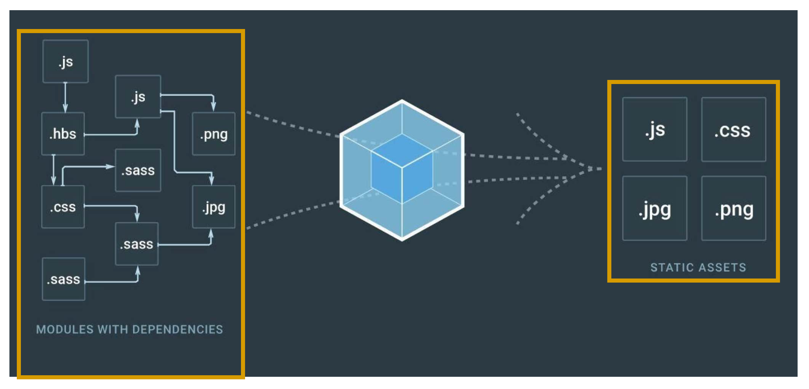
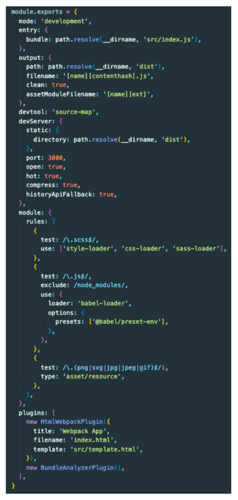
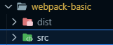
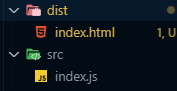
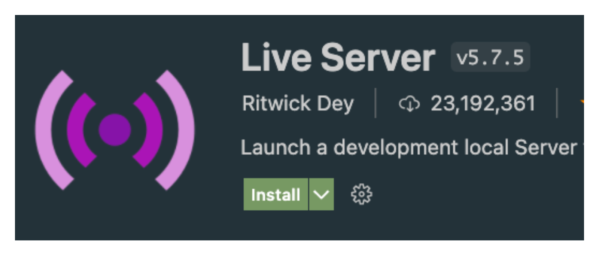
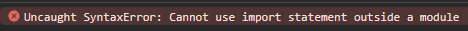

# Studying Webpack

<details>
<summary>Webpack이란?</summary>

### 웹팩이란 무엇인가?
- 웹팩은 오픈 소스 자바스크립트 모듈 번들러로써 여러개로 나누어져 있는 파일들을 하나의 자바스크립트 코드로 압축하고 최적화하는 라이브러리이다.

#### 웹팩의 장점은?
- 여러 파일의 자바스크립트 코드를 압축하여 최적화할 수 있기 때문에 로딩에 대한 네트워크 비용을 줄일 수 있다.
- 모듈 단위로 개발이 가능하여, 가독성과 유지보수가 쉽다.
- 많은 자바스크립트 파일과 module, sass 파일이든지 이미지 에셋들을 배포를 위한 정적인 에셋들로 만들어 준다.


#### Create-React-App 패키지를 이용하면
- 리액트를 설치할 때 내부에서 이미 웹팩을 사용해서 Development Environment 개발 환경을 생성한다.
- 그래서 리액트를 사용할 때 아무런 설정없이 다른 파일에 있는 함수를 import하고 이미지를 사용할 수 있고 CSS 그리고 소스 코드를 적용하면 바로 반영이 되는 등의 효과를 가져올 수 있다.
  - SnowPack and Parser와 같은 대체제도 있음

#### 이번 프로젝트에서는 
- Create-React-App을 이용하지 않고 웹팩을 처음부터 이용해서 개발환경을 만들어 보자


- Entry
  - 의존성 그래프의 시작점을 웹팩에서는 엔트리(Entry)라고 한다.
  - 웹팩은 엔트리를 통해서 필요한 모듈을 로딩하고 하나의 파일로 묶는다.
  - 여러 개의 엔트리가 존재할 수 있다.
- Output
  - 엔트리에 설정한 자바스크립트 파일을 시작으로 하나로 묶는다.
  - 그 후 번들된 결과물을 처리할 위치를 output에 기록한다.
- Loader
  - 웹팩은 오직 JavaScript와 Json만 이해할 수 있다.
  - 로더는 다른 Type의 파일(img, font, stylesheet 등)을 웹팩이 이해하고 처리 가능한 모듈로 변환시키는 작업을 한다.
- Plugin
  - 로더가 파일 단위로 처리하는 반면 플러그인은 번들된 결과물을 처리한다.
  - 로더가 변환하는 동안 플러그인은 bundle optimization, asset management and injection of environment 같은 일을 진행할 수 있다.
- Module
  - 프로그램을 구성하는 구성 요소의 일부 관련된 데이터와 함수들이 묶여서 모듈을 형성하고 파일 단위로 나뉘는 것이 일반적이다.
  - 모듈화 프로그래밍은 기능별로 파일을 나눠가며 프로그래밍을 하는 것으로 유지보수가 쉽다는 장점이 있다.


### Babel이란 무엇인가?
- 최신 자바스크립트 문법을 지원하지 않는 브라우저들을 위해서 최신 자바스크립트 문법을 구형 브라우저에서도 돌 수 있게 변환 시켜주는 라이브러리

```javascript
// Babel Input: ES6(ES2015) arrow function
[1,2,3].map((n) => n+1);

// Babel Output: ES5 equivalent
[1,2,3].map(function(n) {
    return n+1;
})
```

</details>

<details>
<summary>폴더 및 파일 구조 생성</summary>


#### dist
- src에 들어 있는 코드들이 배포를 위해서 정적인 에셋들로 모이게 되는 공간이다.
- react를 사용할 때는 npm run build 명령어를 사용해서 나오는 폴더와 같은 공간이다.
- 결국은 dist에 있는 파일을 이용해서 화면에 UI나 기능들이 보이게 된다.

#### src
- 애플리케이션을 위해 작성해야하는 코드는 이 source 폴더 안으로 들어간다.



#### Live Server 확장 프로그램으로 브라우저로 실행하기

> 나중에는 live server 없이 webpack을 이용해서 실행을 해줍니다.


</details>

<details>
<summary>import 하는 방법</summary>

> webpack 설치 없이 함수나 클래스 등을 import하게 되면 다음과 같은 에러가 발생하게 된다.
> 

### 위 문제를 해결하기 위해 webpack 설치
```bash
npm init -y

npm i -D webpack webpack-cli

npm run build
```
</details>