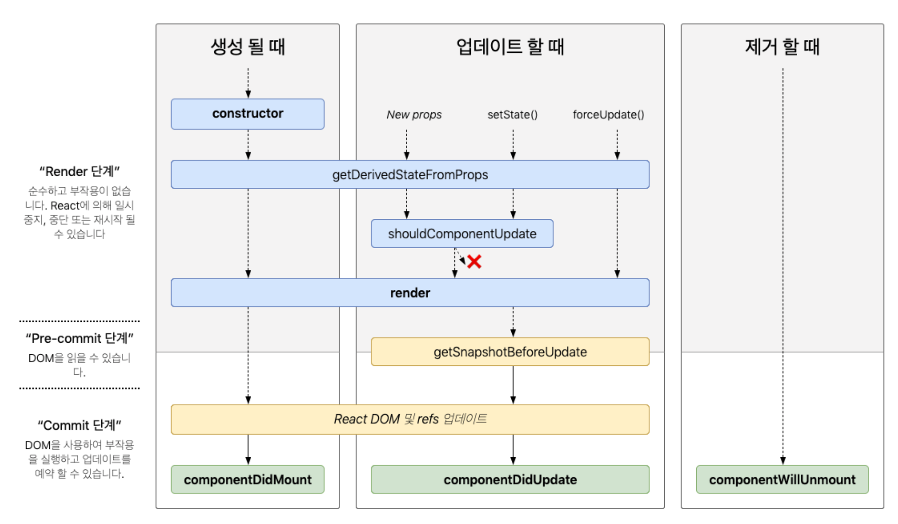

# Getting First React Project - TICTACTOE

<details>
<summary><strong>SPA(Single Page Application)이란?</strong></summary>

- 현재 App.js 파일의 소스 코드를 변경하면 변경한 부분이 화면에 바로 적용됨
  - 이러한 변화가 어떠한 순서로 실행되고 있는지 알아보면


#### ◇ public/index.html
- div 엘리먼트의 id를 root로 해놓았음
```html
<!DOCTYPE html>
<html lang="en">
  <head>
    <meta charset="utf-8" />
    <link rel="icon" href="%PUBLIC_URL%/favicon.ico" />
    <meta name="viewport" content="width=device-width, initial-scale=1" />
    <meta name="theme-color" content="#000000" />
    <meta
      name="description"
      content="Web site created using create-react-app"
    />
    <link rel="apple-touch-icon" href="%PUBLIC_URL%/logo192.png" />
    <link rel="manifest" href="%PUBLIC_URL%/manifest.json" />
    <title>React App</title>
  </head>
</html>
```

### ◇ src/index.js
- 자바스크립트의 시작점
- 여기서 위의 root id를 가진 div 엘리먼트를 잡아 줌
  - 그래서 엘리먼트 안에서 화면을 꾸밀 수 있게 된다.
```javascript
const root = ReactDOM.createRoot(document.getElementById('root'));
root.render(
    <React.StrictMode>
        <App />
    </React.StrictMode>
)
```
### Single Page Application(SPA)
- 여기서 한 가지 의문점이 생길 수 있다.
- 그것은 index.html 템플릿이 하나면 한 개의 페이지를 만들 때는 괜찮은데 두 개 이상의 페이지를 만들 때는 어떤식으로 해야할까?
- 기존에는 a 페이지를 만들면 a.html b 페이지를 만들면 b.html과 같은 방식으로 만들었다.
  - 이와 같은 방식은 전통적인 웹 사이트를 만들 때 사용하는 Multi Page Application(MPA)이다.
- 하지만 요즘에는 웹 사이트의 전체 페이지를 하나의 페이지에 담아 동적으로 화면을 바꿔가며 표현한다.(Single Page Application; SPA)

### SPA에서 화면 변경은 어떻게 일어나나?
- 전통적인 웹 사이트의 경우 a page에서 b page로 페이지 전환할 때 a.html을 보여주다가 b.html을 보여 주면 됐지만 index.html 밖에 없는 SPA에서는 어떻게 페이지 전환(브라우징)을 해줄까?
  - 이는 HTML 5의 History API를 사용해서 가능하게 만든다.
  - 자바스크립트 영역에서 History API를 이용해서 현재 페이지 내에서 화면 이동이 일어난 것처럼 작동하게 해준다.
  - React-Router-Dom -> History API 사용

### History API
- History.back() : 세션 기록의 바로 뒤 페이지로 이동하는 비동기 메서드로 브라우저의 뒤로 가기를 누르는 것과 같은 효과를 낸다.
- History.forward() : 세션 기록의 바로 앞 페이지를 이동하는 비동기 메서드로 브라우저의 앞으로 가기를 누르는 것과 같은 효과를 낸다.
- History.go() : 특정한 세션 기록으로 이동하게 해 주는 비동기 메서드, 1을 넣어 호출하면 바로 앞 페이지로, -1을 넣어 호출하면 바로 뒤 페이지로 이동한다.
- History.pushState() : 주어진 데이터를 세션 기록 스택에 넣는다. 직렬화 가능한 모든 Javascript 객체를 저장하는 것이 가능하다.
- History.replaceState() : 최근 세션 기록 스택의 내용을 주어진 데이터로 교체한다.

</details>
<details>
<summary><strong>JSX 알아보기(Javascript Syntax Extension)</strong></summary>

- JSX는 자바스크립트의 확장 문법이다. 리액트에서는 이 JSX를 이용해서 화면에서 UI가 보이는 모습을 나타내줍니다.

```javascript
const simple = <h1>Hello World!</h1>;
```
- JSX를 이용하면 UI를 나타낼 때 자바스크립트(logic)와 HTML 구조(markup)를 같이 사용할 수 있기 때문에 기본 UI에 데이터가 변하는 것들이나 이벤트들이 처리되는 부분을 더욱 쉽게 구현할 수 있다.

### 리액트에서 JSX 사용은 의무인가?
- 의무는 아니지만 자바스크립트 안에서 UI 작업을 하는게 매우 편리하기 때문에 React를 사용할 때는 거의 모든 사람이 JSX를 사용한다.

### JSX사용하지 않을 경우 리액트에서 화면을 그리는 방식
- React.createElement API를 사용하여 엘리먼트를 생성한 후(객체가 됨) 이 엘리먼트를 In-Memory에 저장한다. 그리고 ReactDOM.render 함수를 사용하여 실제 웹 브라우저에 그려준다.

### JSX는 createElement를 쉽게 사용하기 위해 사용
- 모든 UI를 만들 때마다 createElement를 사용하여 컴포넌트를 만들 수는 없다. 그러기에 JSX를 사용한 후 그걸 바벨이 다시 createElement로 바꿔 사용한다.

### JSX를 사용 시 주의해야 할 기본적인 규칙
- JSX를 사용하면서 지켜줘야 할 규칙들이 있다.
- 가장 기본적인 것으로 JSX는 컴포넌트에 여러 엘리먼트 요소가 있다면 반드시 부모 요소 하나로 감싸줘야 한다.

```javascript
// 잘못된 코드
function hello() {
    return (
        <div>Hello World!</div>
        <div>Whatr are you doing?</div>
    )
}

// 올바른 코드
function hello() {
    return (
        <div>
            <div>Hello World!</div>
            <div>What are you doing?</div>
        </div>
    )
}
```
</details>

<details>
<summary>Props를 통해 컴포넌트 간 데이터 전달하기</summary>

### Props란?
- Props란 Properties의 줄임말로 상속하는 부모 컴포넌트로부터 자녀 컴포넌트에 데이터 등을 전달하는 방법을 말한다.
- Props는 읽기 전용(immutable)으로 자녀 컴포넌트 입장에서는 변하지 않는다.
  - 변하게 하고자 하면 부모 컴포넌트에서 state를 변경시켜줘야 한다.

- 부모 Board 컴포넌트에서 자식 Square 컴포넌트 prop을 전달
```javascript
// Board.js
renderSquare(i) {
    return <Sqaure value={i}/>
}

// Square.js
export class Square extends Component {
    render() {
        return (
            <button className="square">
                {this.props.value}
            </button>
        )
    }
}
```
</details>

<details>
<summary>State 추가하기</summary>

### React State란 무엇인가?
- 컴포넌트의 랜더링 결과물에 영향을 주는 데이터를 갖고 있는 객체
- State가 변경되면 컴포넌트는 리랜더링(Re-rendering)된다. 
- 또한 State는 컴포넌트 안에서 관리된다.

### Constructor
- constructor(생성자)를 사용하면 인스턴스화된 객체에서 다른 메서드를 호출하기 전에 수행해야 하는 사용자 지정 초기화를 제공할 수 있다.
- 아래 코드를 예시로 들면 클래스를 new를 붙여 (new User("John")) 인스턴스 객체로 생성하면 넘겨받은 인수와 함께 constructor가 먼저 실행된다.
  - 이 때 넘겨받은 인수인 John이 this.name에 할당된다.
```javascript
class User {
  constructor(name) {
    this.name = name;
  }
  sayHi() {
    alert(this.name);
  }
}

let user = new User("John");
user.sayHi();
```

### TicTacToe State 사용해보기
```javascript
export class Square extends Component {
  // State 생성  
  constructor(props) {
    super(props);
    this.state = {
      value:null,
    };
  }
  
  render() {
    return (
      <button className="square" onClick={() => {this.setState({value:'X'})}}> // State 변경하기
        {this.state.value} // State 이용하기
      </button>
    )
  }
}
```
- React 컴포넌트는 생성자에 this.state를 설정하는 것으로 state를 가질 수 있다. 
- this.state는 정의된 React 컴포넌트에 대해 비공개로 간주해야 한다.

> ❗ 주의사항 <br>
> JavaScript 클래스에서 하위 클래스의 생성자를 정의할 때 항상 super를 호출해야 한다. 모든 React 컴포넌트 클래스는 생성자를 가질 때 super(props) 호출 구문부터 작성해야 한다.
</details>

<details>
<summary>super(props)란?</summary>

### 자바스크립트에서 super
- super 키워드는 자식 클래스 내에서 부모 클래스의 생성자를 호출할 때 사용
- super 키워드는 자식 클래스 내에서 부모 클래스의 메소드를 호출할 때 사용

```javascript
class Car {
  constructor(brand) {
    this.carname = brand;
  } // 부모 클래스의 생성자 호출
  present() {
    return "I have a " + this.carname;
  } // 부모 클래스의 메소드 호출
}

class Model extends Car {
  constructor(brand, mod) {
    super(brand);
    this.model = mod;
  }
  show() {
    return super.present() + ', it is a ' + this.model;
  }
}

let myCar = new Model("Ford", "Mustang");
myCar.show();
```

### super 이후에 this 키워드
- 새성자에서는 super 키워드 하나만 사용되거나 this 키워드가 사용되기 전에 호출되어야 한다.

```javascript
class Square extends React.Component {
  constructor(props) {
    super(props);
    this.state = { a: true };
  }
}
```

### super 이후에 this 키워드가 나와야 하는 이유
- 아래 소스 코드와 같이 부모 클래스의 생성자를 호출 하기 전 this.name을 사용하려고 하면 문제가 되기 때문이다.
- React에서 this.state를 생성자에서 정의할 때 super가 먼저와야 하는 이유도 이와 같다.
```javascript
class Person {
  constructor(name) {
    this.name = name;
  }
}

class PolitePerson extends Person {
  constructor(name) {
    this.greatColleagues(); // 여기서 문제가 발생
    super(name);
  }
  greatColleagues() {
    alert("My name is " + this.name + ", nice to meet you!");
  }
}
```

### React에서 Super에 props를 인자로 전달하는 이유
- React.Component 객체가 생성될 때 props 속성을 초기화하기 위해 부모 컴포넌트에게 props를 전달
- 생성자 내부에서도 this.props를 정상적으로 사용할 수 있도록 보장하기 위해

```javascript
class Component {
  constructor(props) {
    this.props = props;
  }
}

class Button1 extends React.Component {
  constructor(props) {
    super(); // 이렇게 사용할 경우
    // react에서 임의로 props를 할당
    // 하지만 constructor 내부에서는 this.props를 사용할 수 없음
    // 때문에 props를 넣어서 사용하는 것이 좋음
    console.log(props);
    console.log(this.props);
  }
}

class Button2 extends React.Component {
  constructor(props) {
    super(props);
    console.log(props);
    console.log(this.props);
  }
}
```
</details>

<details>
<summary>State와 Props 비교</summary>

|State|Props|
|:---:|:---:|
|1️⃣ 부모 컴포넌트에서 자녀 컴포넌트로 데이터를 보내는게 아닌 해당 컴포넌트 내부에서 데이터를 전달하려면?? State 사용</br>2️⃣ State는 변경 가능(mutable)</br>3️⃣ State가 변하면 re-render 된다.|1️⃣ Props는 Properties의 줄임말</br>2️⃣ Props는 상속하는 부모 컴포넌트에 데이터 등을 전달하는 방법</br>3️⃣ Props는 읽기 전용(immutable)으로 자녀 컴포넌트 입장에서는 변하지 않는다.(변하게 하고자 하면 부모 컴포넌트에서 state를 변경시켜줘야 함)|
</details>

<details>
<summary>부모 컴포넌트에서 state 보관하기</summary>

- 여러 개의 자식으로부터 데이터를 모으거나 두 개의 자식 컴포넌트들이 서로 통신하게 하려면 부모 컴포넌트에 공유 state를 정의해야 한다.
- 부모 컴포넌트는 props를 사용하여 자식 컴포넌트에 state를 다시 전달할 수 있다.
  - 이것은 자식 컴포넌트들이 서로 또는 부모 컴포넌트와 동기화하도록 만든다.

```javascript
// Board(부모 클래스)에 생성자를 추가하고 9개의 사각형에 해당하는 9개의 null 배열 초기 state로 설정
export class Board extends Component {
  constructor(props) {
    super(props);
    this.state = {
      squares: Array(9).fill(null),
    };
  }
}

// Sqaure 컴포넌트에 내려주는 Prop 값 변경해주기 
renderSquare(i) {
  return <Square value={this.state.squares[i]} />
}

// 내려받은 Props를 위한 Square 컴포넌트 변경
export class Square extends Component {
  render() {
    return (
      <button
        className="square"
        onClick={() => this.props.onClick()}>
        {this.props.value}
      </button>
    )
  }
}
```

### 현재 스퀘어 컴포넌트를 클릭할 때 발생하는 일들
1. 내장된 DOM <button> 컴포넌트에 있는 onClick prop은 React에게 클릭 이벤트 리스너를 설정하라고 알려줌
2. 버튼을 클릭하면 React는 Square의 render() 함수에 정의된 onClick 이벤틑 핸들러를 호출
3. 이벤트 핸들러는 this.props.onClick()를 호출함. Square의 onClick prop은 Board에서 정의도었음.
4. Board에서 Square로 onClick={() => this.handleClick(i)}를 전달했기 때문에 Square를 클릭하면 Board의 handleClick(i)를 호출함
</details>

<details>
<summary>리액트 불변성 지키기</summary>

### 리액트 불변성이란 무엇인가?
- 불변성이란 사전적 의미로는 값이나 상태를 변경할 수 없는 것을 의미
- 자세한 의미를 알아보기 위해 자바스크립트 타입을 통해서 알아보자

### 자바스크립트 타입을 통한 불변성 의미 살펴보기
- 원시 타입은 불변성(immutable)을 가지고 있고 참조 타입은 그렇지 않기 때문에(mutable) 둘을 비교하며 불변성의 의미를 더 자세히 알아보면
  - 원시 타입 : Boolean, String, Number, null, undefined, Symbol(불변성)
  - 참조 타입 : Object, Array
  - 기본적으로 Javascript는 원시 타입에 대한 참조 및 값을 저장하기 위해 Call Stack 메모리 공간을 사용하지만 참조 타입의 경우 Heap이라는 별도의 메모리 공간을 사용함. 이 경우 Call Stack은 개체 및 배열 값이 아닌 메모리에만 Heap 메모리 참조 ID를 값으로 저장

#### 한 눈에 보기(원시 / 참조 타입)
- 원시 타입 : 고정된 크기로 Call Stack 메모리에 저장(실제 데이터가 변수에 할당)
- 참조 타입 : 데이터 크기가 정해지지 않고 Call Stack 메모리에 저장(데이터의 값이 heap에 저장되며 변수에 heap 메모리의 주소값이 할당)

```javascript
/* 원시 타입
아래와 같이 username water를 john으로 대체한 것이 아닌
메모리 영역 a에 있는 water라는 값을 그대로 두고 메모리 영역 b에 john을 새로 할당한 것
(이렇게 불변성을 가지고 있기 때문에 리액트에서 불변성을 위해서 따로 신경 써주지 않아도 된다.) */
let username = "water"
username = "john"

/* 참조 타입
아래와 같이 배열에 대한 요소를 추가하거나 객체 속성 값을 변경할 때
Call Stack의 참조 ID는 동일하게 유지되고 Heap 메모리에서만 변경된다.
(이렇게 불변성이 유지되지 않기 때문에 리액트에서 따로 신경을 써줘야 한다.) */
let array = ['1', '2', '3']
array = ['4', '5', '6']
```

### 불변성을 지켜야 하는 이유?
1. 참조 타입에서 객체나 배열의 값이 변할 때 원본 데이터가 변경되기에 이 원본 데이터를 참조하고 있는 다른 객체에서 예상치 못한 오류가 발생할 수 있어 프로그래밍의 복잡도가 올라갈 수 있음
2. 리액트에서 화면을 업데이트할 때 불변성을 지켜 값을 이전 값과 비교해서 변경된 사항을 확인 후 없데이트하기 때문에 불변성을 지켜줘야 함

### 불변성을 지키는 방법은?
- 참조 타입에서는 값을 바꿨을 때 Call Stack 주소 값은 같은데 Heap 메모리 값만 바꿔주기에 불변성을 유지할 수 없었으므로 아예 새로운 배열을 반환하는 메소드를 사용하면 된다.
- spread operator, map, filter, slice, reduce
- 원본 데이터를 변경하는 메소드 => splice, push

```javascript
const array = [1, 2, 3, 4];
const sameArray = array;
sameArray.push(5);

console.log(array === sameArray); // true

const array = [1, 2, 3, 4];
const differentArray = [...array, 5];
console.log(array !== differentArray); // false
```
- 불변성의 진짜 의미는?
  - 메모리 영역에서 값이 변하지 않는다는 것!
  - 원시 타입의 경우 새로운 value가 새로운 매모리 영역에 등록되게 된다.
</details>

<details>
<summary>React Hooks란 무엇인가?</summary>

### React Hooks는 무엇인가?
- React Hooks는 ReactConf2018에서 발표된 class 없이 state를 사용할 수 있는 새로운 기능이다.

### React Hooks가 필요한 이유?
- React Hooks는 주로 Class Component로 사용되어온 React에서 느껴왔던 불편함이나 문제점들을 해결하기 위해 개발되었다.
- 원래 React는 주로 Class Component를 사용하고 React Hooks는 Functional Component를 사용하는데 이를 비교해보면
  - Class Component
    - 더 많은 기능 제공
    - 더 긴 코드
    - 더 복잡한 코드
    - 더딘 성능
```javascript
import React, { Component } from 'react'

export default class Hello extends Component {
  render() {
    return (
      <div>
        Hello My Project!
      </div>
    )
  }
}
```

  - Functional Component
    - 더 적은 기능 제공
    - 짧은 코드
    - 더 심플한 코드
    - 더 빠른 성능
```javascript
import React from 'react'

export default function Hello() {
  return (
    <div>
      Hello My Project!
    </div>
  )
}
```
### React 생명주기

- 이러한 생명주기를 함수형 컴포넌트에서는 사용을 못했기 때문에 함수형 컴포넌트가 더 간결하고 빠르더라도 클래스형 컴포넌트를 사용해왔지만
- React Hooks가 업데이트된 후부터 함수형 컴포넌트에서도 생명주기를 사용할 수 있게 되었고, 데이터를 가져오고 컴포넌트를 시작하자마자 API도 호출하고 많은 부분을 할 수 있게 되었다.

```javascript
// 기존 Class Component
import React, { Component } from 'react'
import Axios from 'axios'

export default class Hello extends Component {
  constructor(props) {
    super(props);
    this.state = { name: "" };

    componentDidMount() {
      Axios.get('/api/user/name')
        .then(response => {
          this.setState({ name : response.data.name })
        })
    }

    render() {
      return (
        <div>
          My name is {this.state.name}
        </div>
      )
    }
  }
}

// React Hooks 등장 이후 Functional Component
import React, { useEffect, useState } from 'react'
import Axios from 'axios'

export default function Hello() {
  const [Name, setName] = useState("")

  useEffect(() => {
    Axios.get('/api/user/name')
      .then(response => {
        setName(response.data.name)
      })
  }, [])

  return (
    <div>
      My name is {Name}
    </div>
  )
}
```

### Hooks로 인한 또 다른 이점은?
```javascript
// Hooks 이전
componentDidMount() {
  // 컴포넌트가 마운트 되면 updateLists 함수를 호출
  this.updateLists[this.props.id]
}
componentDidUpdate(prevProps) {
  if(prevProps.id !== this.props.id) {
    // updateLists 함수를 호출할 때
    // 사용되는 id가 달라지면 다시 호출
    this.updateLists(this.props.id)
  }
}
// updateLists 함수 정의
updateLists = (id) => {
  fetchLists(id)
    .then((lists) => this.setState({
      lists
    }))
}

// Hooks가 업데이트 된 후
useEffect(() => {
  fetchLists(id)
    .then((repos) => {
      setRepos(repos)
    })
}, [id])
```
- 위오 같이 선명하게 코드가 간결해진걸 확인할 수 있음
- 그 이유는 Class Component에서는 생명주기를 이용할 때 componentDidMount와 componentDidUpdate 그리고 componentWillUnmount 이렇게 다르게 처리하지만 리액트 훅을 사용할 때는 useEffect 안에서 다 처리 해줄수 있기 때문이다.

### Hooks로 인한 또 다른 장점
- HOC 컴포넌트를 Custom React Hooks로 대체해서 너무나 많은 Wrapper 컴포넌트를 줄일 수 있게 된다.

#### HOC(Higher Order Component)란?
- 화면에서 재사용 가능한 로직만을 분리해서 component로 만들고, 재사용 불가능한 UI와 같은 다른 부분은 parameter로 받아서 처리하는 방법
```javascript
function usersHOC(Component) {
  return class userHOC extends React.Component {
    state = {
      users: []
    }

    componentDidMount() {
      fetchUsers()
        .then(users => {
          this.setState({ users })
        })
    }

    render() {
      return (
        <Component
          {...this.props}
          {...this.state}
        />
      )
    }
  }
}

function Apage({users}) {
  // ...
}
export default userHOC(Apage)

function Bpage({users}) {
  // ...
}
export default userHOC(Bpage)
```
- 위와 같이 유저 리스트를 가져오는 공통적인 부분은 HOC 컴포넌트에 넣어주고 그 HOC 컴포넌트로 각각의 컴포넌트를 감싸주면 모든 컴포넌트에 따로 인증을 위한 부분은 넣어주지 않아도 된다.
- Hooks가 나오기 전에는 이러한 방법이 추천되었지만 너무나 많은 Wrapper 컴포넌트가 생길 수 있다는 문제가 있었다.(데이터 흐름을 파악하기 어려워짐)

#### 이러한 문제를 해결하는 방법은? Customs Hooks
```javascript
function useAuth() {
  const [users, setUsers] = useState([]);

  useEffect(() => {
    fetchUsers().then(users => {
      setUser(users);
    });
  }, []);

  return [users];
}

function Apage() {
  const [users] = useAuth();

  return (
    <div>
      A 페이지
      {users.map(({name, url}) => (
        <div key={name}>
          <p>{name}, {url}</p>
        </div>
      ))}
    </div>
  )
}
```

### ❗ Hooks 관련 문제들
1. HOC란 무엇인가요?
   - Higher Order Component의 약자로 컴포넌트를 인자로 받아서 새로운 리액트 컴포넌트를 리턴하는 함수입니다.
2. 너무나 많은 HOC를 사용하게 되면 Wrapper가 너무 많아지게 되는데 그걸 Hooks에서는 어떻게 처리하나요?
   - React Hooks에서는 HOC 대신 따로 Custom Hooks를 이용해서 컴포넌트를 만들어서 처리해줍니다. 그로인해 Wrapper가 많아지는 일을 방지할 수 있습니다.
3. 생명주기를 위해 Hooks에서는 어떠한 api를 사용하나요?
   - useEffect를 활용하여 처리해줍니다.
4. Hooks에서 state을 업데이트 해주려면 어떻게 해야 하나요?
   - state를 정의해줄 때 const [name, setName] = useState(""); 와 같이 해줍니다. 여기서 setName을 이용해서 state를 업데이트 시켜줄 수 있습니다.
</details>

<details>
<summary>전개 연산자(Spread Operator)</summary>

### 전개 연산자란 무엇인가?
- 전개 연산자는 ECMAScirpt6(2015)에서 새로벡 추가되었으며, 특정 객체 또는 배열의 값을 다른 객체, 배열로 복제하거나 옮길 때 사용한다.
- 연산자의 모양은 ...과 같이 생겼다.

### 배열 조합
```javascript
const arr1 = [1, 2, 3];
const arr2 = [4, 5, 6];
const arr3 = [7, 8, 9];
const wholeArr = [...arr1, ...arr2, ...arr3]

console.log(wholeArr) 
// [1, 2, 3, 4, 5, 6, 7, 8, 9]
```

### 객체 조합
```javascript
const obj1 = {
  a: 'A',
  b: 'B'
};
const obj2 = {
  c: 'C',
  d: 'D'
};
const wholeObj = {...obj1, ...obj2}

console.log(wholeObj)
/*
{
  a: 'A',
  b: 'B',
  c: 'C',
  d: 'D'
}
*/
```

### 기존 배열을 보존
```javascript
// case1 - 원본 배열까지 역순으로 변경됨
const arr1 = [1, 2, 3];
const arr2 = arr1.reverse();

console.log(arr1); // [3, 2, 1]
console.log(arr2); // [3, 2, 1]

// case2 - 원본 배열 유지
const arr1 = [1, 2, 3];
const arr2 = [...arr1].reverse();

console.log(arr1); // [1, 2, 3]
console.log(arr2); // [3, 2, 1]
```
</details>